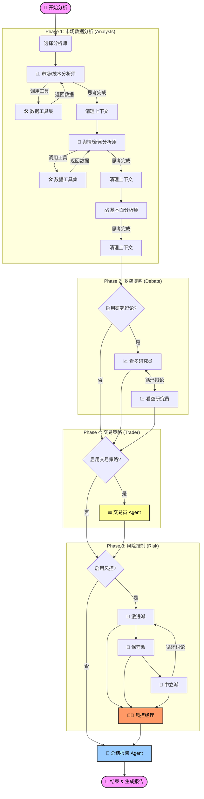

# TradingAgents 中文增强版 (社区维护版)

> ⚠️ **特别维护声明**
>
> 由于原作者 **hsliuping** 暂时失联，本项目现由 **BG8CFB** 个人维护与更新。
> - **开源承诺**: 永久免费，严格遵守开源协议。
> - **维护计划**: 计划每周更新，重大问题实时修复。
> - **未来规划**: 若原作者回归，将配合合并代码。
> - **交流反馈**: 欢迎加入文末的 QQ/微信群交流。

---

## 📖 项目简介

**TradingAgents-CN** 是一个面向中文用户的**多智能体与大模型股票分析学习平台**。它基于 [TradingAgents](https://github.com/TauricResearch/TradingAgents) 框架开发，旨在帮助用户系统化学习如何利用 AI Agent 进行合规的股票研究与策略实验。

**核心定位**:
- 🎯 **学习与研究**: 提供完整的 AI 金融分析实验环境。
- 🇨🇳 **中文本地化**: 全面适配中文语境，支持 A股/港股/美股 数据。
- 🤖 **多模型支持**: 集成 OpenAI、Google、Claude 及主流国产大模型。

## 🚀 最新版本: v1.0.0-preview

> **重磅发布**: v1.0.0-preview 版本已正式上线！采用全新的 **FastAPI + Vue 3** 架构，带来企业级的性能和体验。

### ✨ 核心特性升级

#### 1. 🏗️ 全新技术架构
- **后端**: 迁移至 **FastAPI**，提供高性能 RESTful API。
- **前端**: 重构为 **Vue 3 + Element Plus** 现代化单页应用。
- **数据**: **MongoDB + Redis** 双数据库架构，性能提升显著。
- **部署**: 完善的 **Docker** 支持（兼容 amd64/arm64）。

#### 2. 🎯 企业级功能体验
- **权限管理**: 完整的用户认证、角色管理与操作日志。
- **配置中心**: 可视化管理大模型配置、数据源及系统设置。
- **实时通知**: SSE + WebSocket 双通道推送，实时掌握分析进度。
- **批量分析**: 支持多只股票并发分析，大幅提升效率。

#### 3. 🤖 智能分析增强
- **动态模型**: 支持动态添加 LLM 供应商，根据任务自动匹配最佳模型。
- **多模型支持**: 完美支持 **DeepSeek**、**阿里百炼 (DashScope)**、**SiliconFlow**、**OpenRouter**、**Google Gemini** 等。
- **数据同步**: 统一管理 Tushare、AkShare、BaoStock 数据源。
- **专业报告**: 支持导出 Markdown/Word/PDF 格式的专业分析报告。

---

## 🤖 智能体工作流 (Agent Workflow)

本项目采用 **LangGraph** 构建了复杂的多智能体协作网络，整个分析过程分为四个核心阶段，用户可根据需求灵活开启或关闭特定阶段。

### 📈 流程详解

1.  **阶段 1 (分析师)**: 多个垂直领域的分析师（市场、新闻、基本面等）并行或串行工作，利用 MCP 工具集获取实时数据并生成初步分析。
2.  **阶段 2 (研究辩论)**: **看多 (Bull)** 和 **看空 (Bear)** 研究员基于阶段 1 的数据进行多轮辩论，挖掘潜在机会与风险。
3.  **阶段 4 (交易策略)**: **交易员 (Trader)** 综合多空双方观点，结合仓位管理原则，制定具体的交易计划（买入/卖出/持有）。
4.  **阶段 3 (风险控制)**: 风险团队（激进、保守、中立派）对交易计划进行压力测试和风险评估，最终由 **风控经理 (Risk Manager)** 拍板。
5.  **总结报告**: 最后由 **总结 Agent** 汇总所有信息，生成一份结构清晰、逻辑严密的投资分析报告。

---

## 📥 安装与部署

我们提供三种部署方式，满足不同场景需求：

| 部署方式 | 适用场景 | 难度 | 文档链接 |
|---------|---------|------|---------|
| 🟢 **绿色版** | Windows 用户、快速体验 | ⭐ 简单 | [绿色版安装指南](https://mp.weixin.qq.com/s/eoo_HeIGxaQZVT76LBbRJQ) |
| 🐳 **Docker版** | 生产环境、跨平台 | ⭐⭐ 中等 | [Docker 部署指南](https://mp.weixin.qq.com/s/JkA0cOu8xJnoY_3LC5oXNw) |
| 💻 **源码版** | 开发者、定制二开 | ⭐⭐⭐ 较难 | [本地安装指南](https://mp.weixin.qq.com/s/cqUGf-sAzcBV19gdI4sYfA) |

> ⚠️ **注意**: 分析股票前，请务必按文档要求完成数据同步，否则可能导致分析结果异常。

---

## 📚 使用指南与资源

建议优先阅读以下教程以快速上手：

- **入门视频**: [TradingAgents-CN v1.0.0-preview 快速入门](https://www.bilibili.com/video/BV1i2CeBwEP7/)
- **源码安装**: [源码安装视频教程](https://www.bilibili.com/video/BV1FxCtBHEte/)
- **详细文档**:
  - [v1.0.0-preview 使用指南](https://mp.weixin.qq.com/s/ppsYiBncynxlsfKFG8uEbw)
  - [Docker Compose 部署指南](https://mp.weixin.qq.com/s/JkA0cOu8xJnoY_3LC5oXNw)
  - [绿色版端口配置说明](https://mp.weixin.qq.com/s/o5QdNuh2-iKkIHzJXCj7vQ)

更多文档请查看 [docs/](./docs/) 目录。

---

## 🆚 中文增强版特色

相比原版 TradingAgents，本项目增加了以下特性：

- ✅ **智能新闻分析**: 多层次新闻过滤与质量评估。
- ✅ **国产化适配**: 完整支持 A股数据，集成通义千问、Kimi 等国产大模型。
- ✅ **体验优化**: 全中文界面，Web 配置管理，实时进度显示。
- ✅ **工程化落地**: Docker 一键部署，统一日志管理，成本优化策略。

---

## 📞 社区与联系

### 关注我们
获取项目最新进展和使用教程：

- **微信公众号**: `TradingAgents-CN`
- **项目维护者**: BG8CFB

  
  

### 问题反馈
- **GitHub Issues**: [提交 Bug 或建议](https://github.com/BG8CFB/TradingAgents-CN/issues)
- **原作者邮箱**: hsliup@163.com

---

## 🤝 贡献指南

欢迎参与社区贡献！
- **提交代码**: Fork 本仓库 -> 创建分支 -> 提交 PR。
- **贡献类型**: Bug 修复、新功能开发、文档改进、多语言翻译。
- **贡献者名单**: 详见 [CONTRIBUTORS.md](CONTRIBUTORS.md)

## 📄 许可证

本项目采用 **混合许可证** 模式：
- **Apache 2.0**: 适用于除 `app/` (后端) 和 `frontend/` (前端) 外的核心代码。
- **专有协议**: `app/` 和 `frontend/` 目录下的企业级功能组件需商业授权（个人学习研究可免费使用）。

详细说明请参阅 [LICENSE](LICENSE) 文件。

## 🙏 致谢

特别感谢 [Tauric Research](https://github.com/TauricResearch) 团队创造了 TradingAgents 这一优秀的开源框架，为我们提供了巨人的肩膀。

---

## ⚠️ 风险提示

**本项目仅供学习与研究使用，严禁用于非法用途。**
- AI 模型输出具有不确定性，不构成任何投资建议。
- 股市有风险，投资需谨慎。实盘交易请咨询专业持牌机构。

---

**🌟 如果这个项目对您有帮助，请点亮 Star 支持我们！**

[GitHub 仓库](https://github.com/BG8CFB/TradingAgents-CN)

