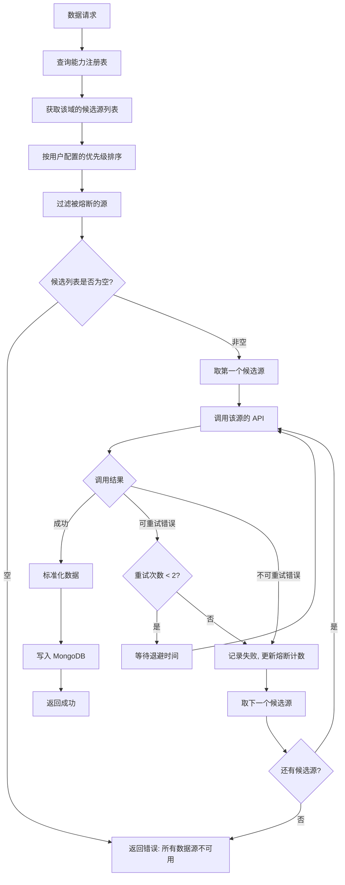
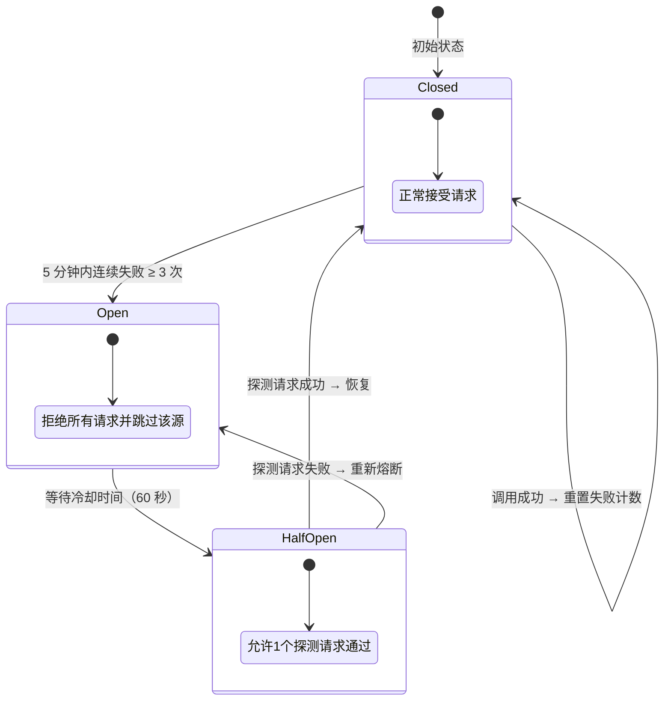
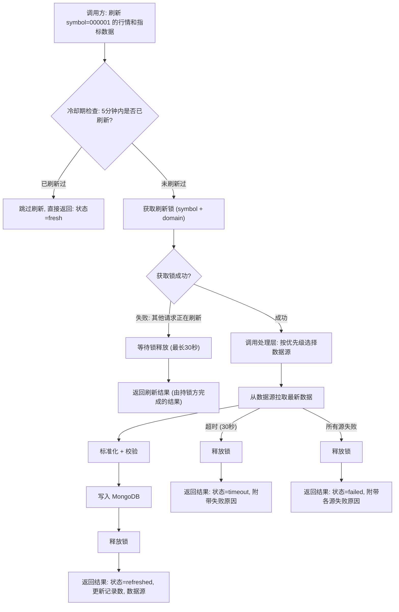
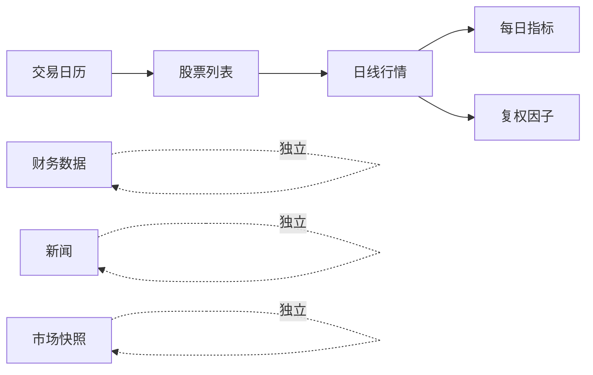

# A股数据架构设计文档

> **版本**: v3.0  
> **日期**: 2026-05-19  
> **范围**: 仅限 A 股股票，排除基金、债券、指数、期货、期权、ETF  
> **定位**: 面向实现的数据平台设计，允许完全重构现有代码  

---

## 目录

1. [设计目标与原则](#1-设计目标与原则)
2. [数据源能力矩阵](#2-数据源能力矩阵)
3. [总体架构](#3-总体架构)
4. [数据域划分](#4-数据域划分)
5. [统一存储标准](#5-统一存储标准)
6. [多源选择与回退机制](#6-多源选择与回退机制)
7. [按需刷新机制](#7-按需刷新机制)
8. [自动更新调度](#8-自动更新调度)
9. [用户优先级配置](#9-用户优先级配置)
10. [数据质量保障](#10-数据质量保障)
11. [前端数据管理](#11-前端数据管理)
12. [实施路线图](#12-实施路线图)
13. [附录](#13-附录)

---

## 1. 设计目标与原则

### 1.1 核心目标

构建一套 A 股数据平台，实现以下能力：

1. 从多个外部数据源拉取数据，标准化处理后统一存入 MongoDB，供分析引擎和前端消费
2. 支持按需刷新指定股票的最新数据，满足分析引擎对数据时效性的要求
3. 支持全自动定时增量更新，无需人工干预
4. 多数据源之间具备完整的回退机制，保证数据可用性
5. 用户可在前端配置数据源优先级，系统实时生效

### 1.2 设计原则

1. **实用优先**: 不引入不需要的抽象层，不为"可能的未来需求"预留过度复杂的设计
2. **统一标准**: 无论数据来自哪个数据源，写入 MongoDB 的字段名称、类型、单位完全一致
3. **读写分离**: 消费方只从 MongoDB 读取标准数据，不直接调用外部数据源 API
4. **接口级回退**: 某个数据源的某个接口失败，只影响该接口的回退，不牵连该数据源的其他接口
5. **幂等写入**: 所有写入操作均为 upsert，同一数据重复写入不产生副作用
6. **增量为主**: 日常同步以增量方式进行，全量同步仅用于初始化和异常修复

### 1.3 非目标

1. 分钟级实时行情与高频撮合数据
2. 券商交易、账户持仓、回测引擎
3. 基金、可转债、期货、期权等非 A 股品种
4. 原始数据存档（Raw 层）— 本项目不需要原始响应回放能力

---

## 2. 数据源能力矩阵

### 2.1 数据源概览

| 维度 | Tushare | AKShare | BaoStock |
|------|---------|---------|----------|
| 性质 | 积分制/商业化 | 免费开源 | 免费开源 |
| 注册 | 需要 Token | 无需注册 | 无需注册 |
| 稳定性 | 高 | 中 | 中 |
| 限流 | 200 次/分钟 | 无硬限制（建议 0.5s 间隔） | 按会话，约 50 次/会话 |
| 覆盖深度 | 最全 | 中等 | 偏基础 |

### 2.2 各数据域支持情况

| 数据域 | Tushare | AKShare | BaoStock | 说明 |
|--------|---------|---------|----------|------|
| 股票列表 | ✅ 全 | ✅ 全 | ✅ 全 | 三源均可覆盖 |
| 交易日历 | ✅ | ✅ | ✅ | 三源均可覆盖 |
| 日线行情 | ✅ 全 | ✅ 全 | ✅ 全 | 三源均可覆盖 |
| 每日指标 | ✅ PE/PB/市值等 | ⚠️ 部分字段 | ❌ 不支持 | 完整指标仅 Tushare |
| 财务三表 | ✅ 全 | ⚠️ 基础财务 | ⚠️ 基础财务 | 完整三表仅 Tushare |
| 财务指标 | ✅ 全 | ❌ | ❌ | 仅 Tushare 支持 |
| 新闻公告 | ✅ | ⚠️ 部分 | ❌ | Tushare 最全 |
| 股东治理 | ✅ 全 | ❌ | ❌ | 仅 Tushare 支持 |
| 资金流向 | ✅ 全 | ⚠️ 部分 | ❌ | 完整数据仅 Tushare |
| 复权因子 | ✅ | ✅ | ✅ | 三源均可覆盖 |
| 市场快照 | ✅ 全 | ✅ 全 | ❌ 不支持 | 盘后全市场行情快照，Tushare/AKShare 均可提供 |

> ✅ = 完整支持 &nbsp; ⚠️ = 部分支持 &nbsp; ❌ = 不支持

### 2.3 关键结论

1. **Tushare 是主源**: 尤其在每日指标、财务、股东治理、资金流向等领域无可替代
2. **AKShare 是备源**: 覆盖基础行情和股票列表，部分财务数据可作为补充
3. **BaoStock 是兜底源**: 仅承担基础行情和股票列表的兜底角色
4. **回退能力因域而异**: 日线行情三源均可回退；财务数据基本只能依赖 Tushare，回退空间有限
5. **数据源能力必须参数化**: 系统通过能力注册表判断可用性，不硬编码在业务逻辑中

---

## 3. 总体架构

### 3.1 架构总图

```text
┌─────────────────────────────────────────────────────────────────┐
│                        消费层 (Consumer)                         │
│    分析引擎    股票筛选    前端管理页面    数据导出 API            │
└───────────────────────────┬─────────────────────────────────────┘
                            │ 只读查询
                            ▼
┌─────────────────────────────────────────────────────────────────┐
│                      统一读取层 (Reader)                         │
│                                                                 │
│   ┌─────────────┐  ┌──────────────┐  ┌───────────────────┐     │
│   │ 标准数据读取  │  │  新鲜度判定   │  │  异步刷新通知      │     │
│   └──────┬──────┘  └──────┬───────┘  └────────┬──────────┘     │
│          │                │                    │                 │
└──────────┼────────────────┼────────────────────┼─────────────────┘
           │                │                    │
           ▼                │                    ▼
┌──────────────────┐        │         ┌──────────────────────────┐
│                  │        │         │     处理层 (Processor)    │
│     MongoDB      │◄───────┘─────────│                          │
│                  │    写入标准数据    │  ┌──────────────────┐   │
│  ┌────────────┐  │                  │  │    回退路由器     │   │
│  │ 标准业务集合 │  │                  │  │  FallbackRouter  │   │
│  ├────────────┤  │                  │  └────────┬─────────┘   │
│  │ 同步元数据  │  │                  │           │             │
│  └────────────┘  │                  │  ┌────────┴─────────┐   │
│                  │                  │  │ 标准化  限流  熔断  │   │
└──────────────────┘                  │  │ 校验  去重  写入   │   │
                                      │  └────────┬─────────┘   │
                                      └───────────┼─────────────┘
                                                  │
                                   ┌──────────────┼──────────────┐
                                   │              │              │
                                   ▼              ▼              ▼
                            ┌───────────┐  ┌───────────┐  ┌───────────┐
                            │  Tushare  │  │  AKShare  │  │  BaoStock │
                            │  Provider │  │  Provider │  │  Provider │
                            └─────┬─────┘  └─────┬─────┘  └─────┬─────┘
                                  │              │              │
                                  ▼              ▼              ▼
                            ┌───────────┐  ┌───────────┐  ┌───────────┐
                            │ Tushare   │  │ AKShare   │  │ BaoStock  │
                            │ 外部 API  │  │ 外部 API  │  │ 外部 API  │
                            └───────────┘  └───────────┘  └───────────┘
```

### 3.2 四层职责

| 层 | 职责 | 禁止行为 |
|----|------|---------|
| **消费层** | 消费标准化数据，生成分析报告、筛选结果、页面展示 | 禁止直接调用外部数据源 API |
| **读取层** | 从 MongoDB 读取标准数据；判定新鲜度；异步通知刷新服务 | 禁止同步调用外部数据源，禁止承担标准化或批量同步逻辑 |
| **处理层** | 数据源选择与回退；字段标准化与校验；限流与熔断；写入 MongoDB | 禁止承担业务分析逻辑 |
| **数据源层** | 封装第三方 API 调用，返回原始数据；管理认证与连接 | 禁止做字段映射或写数据库 |

### 3.3 三条数据流

系统存在三条核心数据流：

**数据流 A — 定时同步（后台自动）**

```text
调度器定时触发 → 处理层按域编排 → 选择数据源 → 拉取 → 标准化 → 写入 MongoDB → 更新检查点
```

**数据流 B — 内部服务调用刷新（后端编排，核心场景）**

```text
后端服务需要最新数据（如分析前）
  → 调用 DataRefreshService.refresh(symbol, domains)
  → 处理层: 选择数据源 → 拉取 → 标准化 → 写入 MongoDB
  → 返回刷新结果（成功/失败/部分成功）
  → 后端服务根据结果继续后续逻辑
```

**数据流 C — Reader 过期感知（读取时检测，异步通知）**

```text
消费方请求数据 → Reader 读 MongoDB → 判定新鲜度
  ├── 新鲜 → 直接返回数据
  └── 过期 → 立即返回当前数据（附带 stale 标记）
           → 同时异步通知刷新服务进行后台更新（非阻塞）
```

**关键约束：**

- Reader 层的读取操作永远不阻塞在外部数据源调用上，调用方立即获得结果
- 过期数据仍然有价值，返回时通过新鲜度标记（fresh / stale）告知消费方数据状态
- 异步通知的刷新任务在独立线程中执行，与读取操作互不干扰
- 同一 symbol + domain 的异步刷新具备去重机制，不会重复触发

数据流 A 和数据流 B 共享同一套处理层（回退路由、标准化、限流、熔断），保证行为完全一致。数据流 C 仅做读取和异步通知，自身不执行数据写入。

### 3.4 Redis 的角色与职责

Redis 作为内存级基础设施，与 MongoDB 形成互补，承担以下职责：

| 职责 | 说明 | 失效策略 |
|------|------|---------|
| **分布式锁** | 按需刷新的并发去重锁（symbol + domain 粒度） | Redis 不可用时降级为进程内存锁（单进程部署）|
| **限流计数器** | 各数据源的请求频率计数（滑动窗口） | Redis 不可用时降级为内存计数（重启后重置） |
| **熔断器状态** | 各数据源 + 数据域的熔断状态与冷却计时 | Redis 不可用时降级为内存状态（多实例无法共享） |
| **刷新冷却标记** | 记录 symbol + domain 的最近刷新时间，实现 5 分钟冷却期 | Redis 不可用时降级为内存标记 |
| **异步刷新队列** | Reader 层异步通知刷新服务时的消息传递 | Redis 不可用时降级为进程内队列 |

**设计原则：**

- Redis 是加速层和协调层，不是数据持久层。所有业务数据仅存在 MongoDB 中
- Redis 不可用时系统仍可工作（降级为单机模式），不影响核心数据流
- Redis 中的状态均为可重建的（基于 MongoDB 或从零开始），无需备份

**与 MongoDB 的分工：**

| 维度 | MongoDB | Redis |
|------|---------|-------|
| 存储内容 | 业务数据、同步元数据、配置 | 锁、计数器、临时状态 |
| 持久性 | 持久化，可靠存储 | 易失性，可丢失 |
| 访问模式 | 批量读写、范围查询 | 单键读写、原子操作 |
| 失效影响 | 系统不可用 | 降级为单机模式 |

---

## 4. 数据域划分

### 4.1 数据域与语义类型

根据数据的业务特征，将 A 股数据分为四种语义类型，每种类型决定了不同的存储主键、更新策略和新鲜度标准：

| 语义类型 | 数据域 | 存储主键 | 更新策略 | 说明 |
|---------|--------|---------|---------|------|
| **实体数据** | 股票基本信息 | symbol | Upsert 覆盖 | 缓慢变化，如股票名称、行业、上市日期 |
| **实体数据** | 交易日历 | exchange + date | Upsert 覆盖 | 每年更新一次 |
| **时序数据** | 日线行情 | symbol + trade_date | Upsert 追加 | 每日产生新记录 |
| **时序数据** | 每日指标 | symbol + trade_date | Upsert 追加 | PE/PB/市值等，每日产生 |
| **时序数据** | 复权因子 | symbol + trade_date | Upsert 追加 | 每日产生 |
| **快照数据** | 财务数据 | symbol + report_period + statement_type | Upsert 覆盖 | 按报告期 + 报表类型产生，可能被修订 |
| **快照数据** | 市场实时快照 | symbol | 全量覆盖 | 盘中/盘后快照，每 symbol 只保留最新 |
| **事件数据** | 新闻公告 | 去重键（标题+日期哈希） | 追加去重 | 不可变事件，只增不改 |

### 4.2 数据域全景

```text
A 股数据域
│
├── 基础信息域
│   ├── 股票基本信息（代码、名称、行业、上市日期、状态）
│   └── 交易日历
│
├── 行情域
│   ├── 日线行情（OHLCV + 涨跌）
│   ├── 每日指标（PE、PB、换手率、市值）
│   ├── 复权因子
│   └── 市场实时快照
│
├── 财务域
│   ├── 利润表
│   ├── 资产负债表
│   ├── 现金流量表
│   └── 财务指标（ROE、ROA、EPS 等）
│
└── 新闻事件域
    ├── 股票新闻
    └── 公司公告
```

---

## 5. 统一存储标准

### 5.1 集合规划

| 集合名称 | 数据域 | 语义类型 | 说明 |
|---------|--------|---------|------|
| `stock_basic_info` | 股票基本信息 | 实体数据 | 全市场股票主档 |
| `trade_calendar` | 交易日历 | 实体数据 | 各交易所交易日 |
| `stock_daily_quotes` | 日线行情 | 时序数据 | OHLCV + 涨跌幅 |
| `stock_daily_indicators` | 每日指标 | 时序数据 | PE/PB/市值等 |
| `stock_adj_factors` | 复权因子 | 时序数据 | 前/后复权因子 |
| `stock_financial_data` | 财务数据 | 快照数据 | 三表 + 财务指标 |
| `market_quotes` | 市场快照 | 快照数据 | 每股票最新行情快照 |
| `stock_news` | 新闻公告 | 事件数据 | 股票相关新闻 |
| `sync_checkpoints` | 同步检查点 | 元数据 | 各域增量同步进度 |
| `sync_events` | 同步事件 | 元数据 | 同步任务审计记录 |
| `source_health` | 数据源健康 | 元数据 | 熔断器状态与健康统计 |

> 总计 11 个集合。港股加 `_hk` 后缀，美股加 `_us` 后缀。

### 5.2 公共字段规范

每个业务集合的文档必须包含以下公共字段：

| 字段 | 类型 | 说明 | 是否必填 |
|------|------|------|---------|
| symbol | string | 股票代码（纯数字，如 `000001`） | 是 |
| data_source | string | 数据来源编码（`tushare` / `akshare` / `baostock`） | 是 |
| updated_at | datetime | 最后更新时间（UTC） | 是 |

### 5.3 各集合主键与索引

| 集合 | 唯一键 | 说明 |
|------|--------|------|
| `stock_basic_info` | symbol | 每只股票一条记录，data_source 字段标识当前数据来源 |
| `trade_calendar` | exchange + cal_date | 交易所 + 日期 |
| `stock_daily_quotes` | symbol + trade_date + period | 日 / 周 / 月线分别存储 |
| `stock_daily_indicators` | symbol + trade_date | 每日一条，以当前活跃数据源写入为准 |
| `stock_adj_factors` | symbol + trade_date | 每日一条 |
| `stock_financial_data` | symbol + report_period + statement_type | 报告期 + 报表类型（利润表/资产负债表/现金流量表） |
| `market_quotes` | symbol | 每只股票仅保留最新快照 |
| `stock_news` | content_hash | 内容哈希去重 |
| `sync_checkpoints` | domain + source | 每个域+源一个检查点 |

**单源写入原则：**

业务集合的唯一键均不包含 `data_source` 字段。这是因为系统在任一时刻只有一个活跃数据源在工作，其他数据源仅在回退时才会被使用。具体规则：

- 正常运行时，按优先级使用第一个可用数据源写入数据，`data_source` 字段记录实际来源
- 发生回退时，备用源的数据通过 upsert 直接覆盖原记录，`data_source` 字段更新为新的来源
- 主源恢复后，下次同步会再次覆盖为主源数据
- 消费方无需关心数据来自哪个源，`data_source` 仅用于运维排查和健康监控

**例外 — `sync_checkpoints`：**

检查点表的唯一键包含 source，因为每个数据源的同步进度独立维护。主源和备源可能同步到不同的截止日期，需要分别跟踪。

### 5.4 字段标准化规则

无论数据来自哪个数据源，写入 MongoDB 前必须执行以下标准化：

| 规则 | 说明 |
|------|------|
| 股票代码统一为纯数字 | 去掉 `.SH` / `.SZ` 后缀，统一存为 `000001`、`600036` |
| 日期统一为 `YYYY-MM-DD` | 不使用 `YYYYMMDD` 格式 |
| 金额单位统一为元 | 千元 × 1000，万元 × 10000 |
| 成交量单位统一为股 | 手 × 100 |
| 百分比保留原值 | 如涨跌幅 `2.35` 表示 `2.35%`，不除以 100 |
| 浮点数精度 | 价格保留 2 位，比率保留 4 位，金额保留 2 位 |
| 空值处理 | 数据源返回 NaN / None / 空字符串统一写为 `null` |

### 5.5 stock_basic_info 字段

| 字段 | 类型 | 说明 |
|------|------|------|
| symbol | string | 股票代码 |
| name | string | 股票名称 |
| full_symbol | string | 带后缀代码（如 `000001.SZ`） |
| exchange | string | 交易所（SSE / SZSE / BSE） |
| industry | string | 所属行业 |
| area | string | 所属地区 |
| market | string | 板块（主板 / 创业板 / 科创板 / 北交所） |
| list_status | string | 上市状态（L 上市 / D 退市 / P 暂停） |
| list_date | string | 上市日期 |
| delist_date | string | 退市日期（可为空） |

### 5.6 stock_daily_quotes 字段

| 字段 | 类型 | 说明 |
|------|------|------|
| symbol | string | 股票代码 |
| trade_date | string | 交易日期 |
| period | string | 周期（daily / weekly / monthly） |
| open | float | 开盘价 |
| high | float | 最高价 |
| low | float | 最低价 |
| close | float | 收盘价 |
| pre_close | float | 昨收价 |
| change | float | 涨跌额 |
| pct_chg | float | 涨跌幅（%） |
| volume | float | 成交量（股） |
| amount | float | 成交额（元） |

**周线/月线数据的产生方式：**

| period 值 | 数据来源 | 说明 |
|-----------|---------|------|
| daily | 数据源直接提供 | 日线行情，每交易日同步 |
| weekly | 本地聚合 | 由处理层基于日线数据计算：周一开盘价、周内最高/最低价、周五收盘价、周内成交量/额求和 |
| monthly | 本地聚合 | 由处理层基于日线数据计算：月初开盘价、月内最高/最低价、月末收盘价、月内成交量/额求和 |

聚合规则：

- 聚合时机：在日线同步完成后触发，作为后处理步骤
- 不完整周/月的处理：当前周或当前月的数据在每个交易日更新（基于已有日线）
- trade_date 取值：周线取该周最后一个交易日日期，月线取该月最后一个交易日日期
- pre_close：取上一周期最后一个交易日的收盘价
- change / pct_chg：基于聚合后的 close 和 pre_close 计算

### 5.7 stock_daily_indicators 字段

| 字段 | 类型 | 说明 |
|------|------|------|
| symbol | string | 股票代码 |
| trade_date | string | 交易日期 |
| pe_ttm | float | 市盈率（TTM） |
| pb | float | 市净率 |
| ps_ttm | float | 市销率（TTM） |
| turnover_rate | float | 换手率（%） |
| turnover_rate_f | float | 自由流通换手率（%） |
| total_mv | float | 总市值（元） |
| circ_mv | float | 流通市值（元） |
| volume_ratio | float | 量比 |

### 5.8 stock_financial_data 字段

| 字段 | 类型 | 说明 |
|------|------|------|
| symbol | string | 股票代码 |
| report_period | string | 报告期（如 `2026-03-31`） |
| statement_type | string | 报表类型（`income` 利润表 / `balance` 资产负债表 / `cashflow` 现金流量表 / `indicator` 财务指标） |
| report_type | string | 报告类型（`1` 合并报表 / `2` 单季合并 / `4` 母公司报表），默认合并报表 |
| announce_date | string | 公告日期 |
| revenue | float | 营业收入（元） |
| net_profit | float | 净利润（元） |
| total_assets | float | 总资产（元） |
| total_equity | float | 净资产（元） |
| roe | float | 净资产收益率（%） |
| roa | float | 总资产收益率（%） |
| gross_margin | float | 毛利率（%） |
| net_margin | float | 净利率（%） |
| debt_ratio | float | 资产负债率（%） |
| current_ratio | float | 流动比率 |
| eps | float | 每股收益（元） |
| bps | float | 每股净资产（元） |
| operating_cashflow | float | 经营活动现金流量净额（元） |

> 注：`statement_type` 参与唯一键，`report_type` 不参与唯一键但作为筛选条件。默认存储合并报表数据，母公司报表按需获取。

### 5.9 sync_checkpoints 字段

| 字段 | 类型 | 说明 |
|------|------|------|
| domain | string | 数据域（`daily_quotes` / `basic_info` / ...） |
| source | string | 数据源编码 |
| last_sync_date | string | 上次成功同步的数据截止日期 |
| last_sync_time | datetime | 上次成功同步的执行时间 |
| status | string | 状态（`success` / `failed` / `running`） |
| record_count | int | 上次同步的记录数 |

---

## 6. 多源选择与回退机制

这是本设计的核心章节。解决以下问题：

- 有多个数据源，如何选择？
- 某个接口失败时，如何回退？
- 是整个数据源降级还是单个接口降级？
- 如何防止对故障源的持续请求浪费时间？

### 6.1 能力注册表

系统维护一张能力注册表，记录每个数据源对每个数据域的支持情况。回退路由器的所有决策均基于此表：

| 数据域 | Tushare | AKShare | BaoStock | 默认优先级 |
|--------|---------|---------|----------|-----------|
| basic_info | ✅ 可用 | ✅ 可用 | ✅ 可用 | Tushare → AKShare → BaoStock |
| trade_calendar | ✅ 可用 | ✅ 可用 | ✅ 可用 | Tushare → AKShare → BaoStock |
| daily_quotes | ✅ 可用 | ✅ 可用 | ✅ 可用 | Tushare → AKShare → BaoStock |
| daily_indicators | ✅ 可用 | ⚠️ 部分 | ❌ 不可用 | Tushare → AKShare |
| financial_data | ✅ 可用 | ⚠️ 基础 | ❌ 不可用 | Tushare → AKShare |
| adj_factors | ✅ 可用 | ✅ 可用 | ✅ 可用 | Tushare → AKShare → BaoStock |
| market_quotes | ✅ 可用 | ✅ 可用 | ❌ 不可用 | Tushare → AKShare |
| news | ✅ 可用 | ⚠️ 部分 | ❌ 不可用 | Tushare → AKShare |

此表有两个关键用途：

1. **过滤**: 某个域标记为 ❌ 的数据源，不会出现在该域的候选列表中
2. **排序**: 用户可修改每个域的优先级顺序（参见第 9 章）

### 6.2 回退粒度：接口级回退

**核心原则：回退是按数据域（接口）级别进行的，不是整个数据源级别的。**

```text
示例场景：
  Tushare 的 daily_quotes 接口因限流返回 429

  ✅ 正确行为：daily_quotes 回退到 AKShare，其他域继续使用 Tushare
  ❌ 错误行为：整个 Tushare 标记为不可用，所有域都切换到 AKShare
```

这意味着：

- 每个数据域独立维护自己的回退状态
- 熔断器的粒度是 **数据源 + 数据域** 的组合，而不是整个数据源
- 例如 Tushare 的 `daily_quotes` 熔断了，不影响 Tushare 的 `basic_info`

### 6.3 数据源选择流程

每次数据请求（无论定时同步还是按需刷新）都经过以下选择流程：



### 6.4 重试 vs 降级的判定

并非所有错误都需要切换数据源。系统将错误分为两类：

**可重试错误 — 在同一数据源上重试（最多 2 次，指数退避）**

| 错误类型 | 退避策略 | 说明 |
|---------|---------|------|
| HTTP 429 限流 | 第 1 次等 3 秒，第 2 次等 10 秒 | 数据源临时限流，等一等就好 |
| 网络超时 | 第 1 次等 5 秒，第 2 次等 15 秒 | 网络抖动，短暂等待 |
| 连接断开 | 第 1 次等 2 秒，第 2 次等 5 秒 | 短暂连接问题 |

**不可重试错误 — 立即切换到下一个数据源**

| 错误类型 | 处理 | 说明 |
|---------|------|------|
| HTTP 403 权限不足 | 立即降级 | Token 过期或积分不足 |
| HTTP 500 服务器错误 | 立即降级 | 数据源内部故障 |
| 数据格式异常 | 立即降级 | 返回数据无法解析 |
| 空结果（应有数据） | 立即降级 | 数据源数据缺失 |

### 6.5 熔断器

防止系统对已故障的数据源持续发送请求，浪费时间和配额。

**熔断器作用于「数据源 + 数据域」的组合**，例如 `tushare + daily_quotes` 是一个独立的熔断器实例。



**熔断参数：**

| 参数 | 值 | 说明 |
|------|-----|------|
| 失败阈值 | 3 次 | 在窗口期内连续失败 3 次触发熔断 |
| 窗口期 | 5 分钟 | 失败计数的滑动窗口 |
| 初始冷却时间 | 60 秒 | 第一次熔断后的等待时间 |
| 最大冷却时间 | 600 秒 | 冷却时间的上限 |
| 探测请求数 | 1 次 | 半开状态只允许 1 个请求通过 |

**阶梯式冷却策略：**

熔断器采用指数递增的冷却时间，防止对持续故障的数据源进行无效探测：

| 熔断次数 | 冷却时间 | 场景 |
|---------|---------|------|
| 第 1 次 | 60 秒 | 短暂故障，快速恢复 |
| 第 2 次 | 120 秒 | 故障持续，延长等待 |
| 第 3 次 | 300 秒 | 较严重故障 |
| 第 4 次及以上 | 600 秒 | 长时间故障，低频探测 |

冷却时间在以下情况重置为初始值：

- 探测请求成功（Half-Open → Closed）
- 熔断器连续处于 Closed 状态超过 30 分钟（说明已稳定恢复）

**按错误类型差异化冷却：**

| 错误类型 | 冷却倍数 | 理由 |
|---------|---------|------|
| 限流（429） | ×2 | 限流窗口通常较长，需要更多等待时间 |
| 权限错误（403） | ×5 | 通常需要人工介入（Token 过期/积分不足），低频探测即可 |
| 网络/超时 | ×1 | 网络问题恢复较快，使用标准冷却 |
| 服务器错误（500） | ×1.5 | 服务端问题，适度延长 |

### 6.6 回退记录与通知

每次发生回退时，系统执行以下操作：

1. **写入 sync_events 集合**: 记录回退事件（从哪个源降级到哪个源、原因、时间）
2. **日志记录**: 输出 WARNING 级别日志
3. **前端通知**: 通过 SSE 向前端推送降级通知（如果有活跃连接）
4. **健康统计更新**: 更新 `source_health` 集合中该源+域的失败计数和成功率

### 6.7 所有源都失败的兜底策略

当某个数据域的所有候选源都失败时：

| 场景 | 处理 |
|------|------|
| **定时同步中** | 记录同步失败事件，保留上次成功的数据不变，下次调度时重试 |
| **按需刷新中** | 返回 MongoDB 中已有的旧数据，附带新鲜度状态标记 `stale`，前端展示"数据可能过期"提示 |
| **首次获取（无旧数据）** | 返回明确的"数据不可用"错误，附带所有源的失败原因 |

---

## 7. 按需刷新机制

### 7.1 设计场景

按需刷新解决的核心问题：**后端服务在执行业务逻辑前，需要确保指定股票的数据是最新的。**

典型场景：

```text
用户点击"分析 000001"
  → 后端分析服务启动
  → 分析服务调用数据刷新服务: "确保 000001 的数据是最新的"
  → 数据刷新服务从数据源拉取最新数据 → 标准化 → 写入 MongoDB
  → 刷新完成，返回结果（成功/失败/部分成功）
  → 分析服务根据刷新结果继续执行分析逻辑
  → 分析服务从 MongoDB 读取最新数据进行分析
```

**关键特征：这是一个后端内部的同步调用，调用方等待刷新完成后再执行后续逻辑。与前端无关。**

### 7.2 三种调用方式

按需刷新提供三种调用入口，服务于不同的使用场景：

```text
┌─────────────────────────────────────────────────────────────────┐
│                       数据刷新服务                                │
│                    (DataRefreshService)                          │
│                                                                 │
│  ┌──────────────┐  ┌──────────────┐  ┌───────────────────┐     │
│  │  内部服务调用  │  │  Reader 异步  │  │   HTTP API 端点   │     │
│  │  (核心入口)   │  │   通知        │  │   (管理用途)      │     │
│  └──────┬───────┘  └──────┬───────┘  └────────┬──────────┘     │
│         │                 │                    │                 │
│         └─────────────────┴────────────────────┘                 │
│                           │                                      │
│                  统一的刷新执行逻辑                                 │
│         (选择数据源 → 拉取 → 标准化 → 写入 → 返回结果)             │
└─────────────────────────────────────────────────────────────────┘
```

| 调用方式 | 调用者 | 行为 | 使用场景 |
|---------|--------|------|---------|
| **内部服务调用** | 分析引擎、筛选服务等后端模块 | 同步阻塞，调用方等待刷新完成后继续执行 | 分析前确保数据最新 |
| **Reader 异步通知** | Reader 读取层（内部） | 读取数据时发现过期，异步通知刷新服务后台执行，读取本身立即返回当前数据 | 后台静默更新，不阻塞读取 |
| **HTTP API** | 前端管理页面、运维脚本 | `POST /api/cn/data/refresh/{symbol}`，返回刷新结果 | 管理员手动刷新 |

**三种方式共享同一套底层刷新逻辑**（数据源选择、回退、限流、熔断），行为完全一致。Reader 异步通知只是触发方式不同（非阻塞），实际执行的刷新流程与其他两种方式一致。

### 7.3 内部服务调用流程（核心）

这是最重要的调用方式。后端任何服务在需要最新数据时，直接调用数据刷新服务：



**调用方拿到刷新结果后自行决定后续行为：**

| 刷新结果状态 | 含义 | 调用方典型处理 |
|------------|------|-------------|
| `fresh` | 数据已经是新鲜的，无需刷新 | 直接继续后续逻辑 |
| `refreshed` | 刷新成功，数据已更新 | 直接继续后续逻辑 |
| `partial` | 部分域刷新成功，部分失败 | 根据业务决定是否继续 |
| `timeout` | 刷新超时 | 可选择用旧数据继续，或放弃 |
| `failed` | 全部失败 | 可选择用旧数据继续，或返回错误 |

**关键原则：数据刷新服务只负责刷新数据并返回结果，不决定调用方的后续行为。调用方根据结果自行判断。**

### 7.4 调用编排示例

以下是一个典型的后端编排流程（仅说明调用关系，非代码）：

```text
分析服务收到请求: 分析股票 000001
│
├── 步骤 1: 调用 DataRefreshService.refresh("000001", domains=["daily_quotes", "daily_indicators", "financial_data"])
│   │
│   ├── 刷新服务内部: 并行刷新三个域
│   │   ├── daily_quotes: Tushare 拉取 → 标准化 → 写入 MongoDB ✅
│   │   ├── daily_indicators: Tushare 拉取 → 标准化 → 写入 MongoDB ✅
│   │   └── financial_data: Tushare 拉取 → 标准化 → 写入 MongoDB ✅
│   │
│   └── 返回结果: { status: "refreshed", domains: { daily_quotes: "ok", daily_indicators: "ok", financial_data: "ok" } }
│
├── 步骤 2: 分析服务检查刷新结果 → 全部成功
│
├── 步骤 3: 分析服务从 Reader 读取最新数据（此时 MongoDB 中已是最新）
│
└── 步骤 4: 执行分析逻辑，生成报告
```

**带回退的场景：**

```text
分析服务收到请求: 分析股票 000001
│
├── 步骤 1: 调用 DataRefreshService.refresh("000001", domains=["daily_quotes"])
│   │
│   ├── 刷新服务内部:
│   │   ├── Tushare 拉取 daily_quotes → 超时 ❌
│   │   ├── 重试 Tushare → 仍然超时 ❌
│   │   ├── 回退到 AKShare → 拉取成功 ✅
│   │   └── 标准化 → 写入 MongoDB
│   │
│   └── 返回结果: { status: "refreshed", source: "akshare", fallback_from: "tushare" }
│
├── 步骤 2: 分析服务检查刷新结果 → 成功（虽然用了备源）
│
└── 步骤 3: 继续正常分析
```

### 7.5 刷新参数

调用数据刷新服务时可指定以下参数：

| 参数 | 是否必填 | 说明 |
|------|---------|------|
| symbol | 是 | 股票代码 |
| domains | 否 | 要刷新的数据域列表，不指定则刷新所有域 |
| force | 否 | 是否强制刷新（忽略冷却期），默认否 |
| timeout | 否 | 超时时间（秒），默认 30 秒 |

### 7.6 新鲜度判定

Reader 异步通知模式下，需要判定数据是否过期来决定是否通知刷新服务。每个数据域有不同的新鲜度要求：

| 数据域 | 新鲜度标准 | 说明 |
|--------|-----------|------|
| daily_quotes | 交易日 16:30 后，必须有当日数据 | 收盘后 30 分钟内应可用 |
| daily_indicators | 交易日 17:00 后，必须有当日数据 | 通常比行情晚一点 |
| basic_info | 最近 24 小时内有更新 | 变化不频繁 |
| financial_data | 最近 7 天内有更新 | 季报期可以缩短到 1 天 |
| news | 最近 2 小时内有更新 | 新闻时效性要求高 |
| market_quotes | 最近 30 分钟内有更新 | 盘中快照 |

**非交易日处理**: 周末和节假日不需要新的行情数据，新鲜度判定自动跳过。Reader 通过查询交易日历来判断。

**注意**: 内部服务调用（7.3 节）不依赖新鲜度判定。调用方主动调用刷新服务，意味着调用方明确需要最新数据，刷新服务直接执行（仅受冷却期约束）。

### 7.7 防并发重复刷新

如果多个请求同时需要刷新同一只股票的同一个数据域，系统只执行一次刷新：

- 使用内存锁（单进程）或 Redis 锁（多进程），锁的粒度为 **symbol + domain**
- 第一个请求获取锁并执行刷新
- 后续请求等待锁释放后，直接获取第一个请求的刷新结果
- 锁的最大等待时间为 30 秒，超时后返回超时状态

### 7.8 限流保护

防止大量按需刷新请求冲击数据源：

| 保护策略 | 规则 |
|---------|------|
| 同股票冷却 | 同一 symbol + domain 的刷新请求，5 分钟内最多执行 1 次（force=true 可绕过） |
| 全局并发上限 | 同时进行的按需刷新不超过 10 个 |
| 单源频率上限 | 遵守各数据源的限流规则（Tushare 200 次/分钟） |

---

## 8. 自动更新调度

### 8.1 调度频率

| 数据域 | 调度时间 | 调度方式 | 说明 |
|--------|---------|---------|------|
| trade_calendar | 每日 00:00 | 全量 | 先于其他所有同步 |
| basic_info | 每日 09:00 | 全量 | 捕获新股上市、退市、更名 |
| daily_quotes | 每交易日 16:15 | 增量 | A 股收盘后，同步当日行情 |
| daily_indicators | 每交易日 16:45 | 增量 | 依赖行情数据就绪 |
| adj_factors | 每交易日 17:00 | 增量 | 除权除息后更新 |
| financial_data | 每日 20:00 | 增量 | 季报披露期（4/7/8/10 月）加密为每日 |
| market_quotes | 每交易日 15:05 | 全量 | 收盘快照 |
| news | 每 2 小时 | 增量 | 全天滚动 |

### 8.2 调度依赖链

部分数据域之间存在依赖关系，必须按顺序执行：



**说明：**

- 交易日历必须先完成，后续域才能知道今天是否交易日
- 股票列表必须先完成，后续域才能知道要同步哪些股票
- 日线行情完成后才同步每日指标和复权因子
- 财务数据、新闻、市场快照与上述链路无依赖，可并行

### 8.3 增量同步机制

增量同步通过检查点（sync_checkpoints）实现：

```text
增量同步流程：
  1. 读取该域的检查点，获取上次同步截止日期（如 2026-05-18）
  2. 计算本次需要同步的日期范围（2026-05-19 至今天）
  3. 从数据源拉取该范围的数据
  4. 标准化并 upsert 到 MongoDB
  5. 更新检查点为本次同步截止日期
```

**检查点推进规则**：只有在本次同步成功完成后才推进检查点。如果中途失败，检查点保持不变，下次同步从上次成功的位置继续。

**分批同步与检查点一致性保护：**

当同步的数据量较大时（如全市场数千只股票的日线行情），采用分批策略确保检查点与实际数据的一致性：

| 策略 | 说明 |
|------|------|
| 按日期分批 | 多日增量数据时，逐日拉取并写入，每日完成后推进检查点到该日 |
| 按股票分批 | 单日全市场数据按批次（如每 500 只）写入，写入成功后记录已完成的批次标记 |
| 原子性保证 | 单批次内的 upsert 作为一个逻辑单元，全部成功后才记录该批次完成 |

**异常恢复机制：**

| 异常场景 | 恢复策略 |
|---------|---------|
| 进程异常退出（OOM、Kill） | 下次启动时从检查点恢复，重复拉取可能已写入的数据（upsert 幂等，无副作用） |
| 部分批次成功、部分失败 | 检查点停留在最后一个完整成功日期，下次同步从该日期后重新开始 |
| 检查点与实际数据不一致 | 每日完整性检查发现缺口后，回退检查点到缺口起始日期，下次同步自动补齐 |

**核心保证：宁可重复同步（幂等），不可跳过数据。检查点只进不退（除非完整性检查主动回退）。**

### 8.4 全量同步

全量同步用于以下场景：

| 场景 | 触发方式 |
|------|---------|
| 系统初始化 | 管理员手动触发 |
| 数据异常修复 | 管理员手动触发 |
| 新增数据源 | 管理员手动触发 |
| 股票列表和交易日历 | 定时调度（这两个域每次都是全量） |

全量同步会拉取完整历史数据。对于行情数据，按时间窗口分批拉取，每批之间遵守限流规则。

### 8.5 限流策略

不同数据源的限流策略不同，调度器必须遵守：

| 数据源 | 限流规则 | 调度器行为 |
|--------|---------|-----------|
| Tushare | 200 次/分钟 | 批次间隔 0.3 秒，大批量时自动降速 |
| AKShare | 无硬限制，建议间隔 | 批次间隔 0.5 秒（礼貌间隔） |
| BaoStock | 按会话，约 50 次/会话 | 每 50 次请求后重新建立连接 |

### 8.6 非交易日处理

- 行情类数据（daily_quotes、daily_indicators、adj_factors、market_quotes）在非交易日**跳过同步**
- 基础信息、财务数据、新闻在非交易日**正常同步**
- 交易日判断通过查询 `trade_calendar` 集合实现

### 8.7 同步任务监控

每个同步任务执行时，向 `sync_events` 集合写入事件记录：

| 事件类型 | 时机 | 记录内容 |
|---------|------|---------|
| SYNC_START | 任务开始 | 域、源、时间范围、任务 ID |
| SYNC_SUCCESS | 任务成功 | 域、源、记录数、耗时 |
| SYNC_FAILED | 任务失败 | 域、源、错误原因、重试次数 |
| SOURCE_FALLBACK | 发生回退 | 从哪个源降级到哪个源、原因 |
| CIRCUIT_OPEN | 熔断器打开 | 源、域、触发原因 |
| CIRCUIT_CLOSE | 熔断器恢复 | 源、域 |

---

## 9. 用户优先级配置

### 9.1 可配置项

用户可以在前端配置以下内容：

| 配置项 | 粒度 | 默认值 | 说明 |
|--------|------|--------|------|
| 数据源启用/禁用 | 按数据源 | 全部启用 | 用户可禁用某个数据源 |
| 数据域优先级 | 按数据域 × 数据源 | 见能力注册表 | 用户可调整每个域内各源的优先级顺序 |
| Tushare Token | 全局 | 空 | 未配置则自动禁用 Tushare |
| 自动同步开关 | 按数据域 | 全部开启 | 用户可关闭某个域的自动同步 |
| 同步时间 | 按数据域 | 见调度频率表 | 高级用户可调整同步时间 |

### 9.2 配置存储

用户配置存储在 MongoDB 的 `system_configs` 集合中，格式为：

| 字段 | 说明 |
|------|------|
| config_type | 配置类型（`data_source_priority`） |
| market | 市场（`CN` / `HK` / `US`） |
| domain | 数据域 |
| sources | 按优先级排序的数据源列表 |
| updated_by | 更新人 |
| updated_at | 更新时间 |

### 9.3 配置生效机制

```text
用户在前端修改优先级
  → 写入 system_configs 集合
  → 处理层在每次请求时读取最新配置（带内存缓存，TTL 30 秒）
  → 下一次数据请求即按新优先级执行
  → 不需要重启服务
```

**缓存策略**: 优先级配置在内存中缓存 30 秒。修改后最迟 30 秒内生效，避免每次请求都查询数据库。

### 9.4 前端配置界面

前端提供拖拽排序的配置界面：

```text
┌─────────────────────────────────────┐
│  A 股数据源优先级配置                  │
│                                     │
│  ┌─ 日线行情 ─────────────────┐     │
│  │  1. ☰ Tushare  [已启用]   │     │
│  │  2. ☰ AKShare  [已启用]   │     │
│  │  3. ☰ BaoStock [已启用]   │     │
│  └───────────────────────────┘     │
│                                     │
│  ┌─ 财务数据 ─────────────────┐     │
│  │  1. ☰ Tushare  [已启用]   │     │
│  │  2. ☰ AKShare  [已启用]   │     │
│  │     BaoStock   [不支持]   │     │
│  └───────────────────────────┘     │
│                                     │
│  [保存配置]                          │
└─────────────────────────────────────┘
```

- 只显示该域支持的数据源（由能力注册表决定）
- 不支持的数据源灰显且不可拖拽
- 保存后实时生效（30 秒内）

---

## 10. 数据质量保障

### 10.1 写入前校验

数据在写入 MongoDB 前，必须通过以下校验：

| 校验项 | 规则 | 处理 |
|--------|------|------|
| 必填字段 | symbol、trade_date（行情）等必须非空 | 拒绝写入，记录错误 |
| 数据类型 | 价格必须为正数，成交量必须 ≥ 0 | 拒绝该条记录 |
| 日期合法性 | trade_date 必须在合理范围内 | 拒绝该条记录 |
| 涨跌幅边界 | A 股涨跌幅通常在 -20% 到 +20% | 标记为可疑，仍写入但记录告警 |
| 重复检测 | 同一自然键的数据不重复写入 | 通过 upsert 机制自动处理 |

### 10.2 完整性检查

定期检查各域数据的完整性：

| 检查项 | 频率 | 说明 |
|--------|------|------|
| 行情日期连续性 | 每日 | 检查是否有交易日缺少行情数据 |
| 股票覆盖率 | 每日 | 检查当日行情覆盖了多少比例的活跃股票 |
| 同步检查点一致性 | 每日 | 检查检查点日期是否与实际数据一致 |

### 10.3 新鲜度监控

在 `source_health` 集合中维护每个数据源 + 数据域的健康统计：

| 指标 | 说明 |
|------|------|
| 最近 1 小时成功率 | 最近 1 小时内调用成功的比例 |
| 最近 1 小时平均延迟 | 最近 1 小时内调用的平均耗时 |
| 熔断器当前状态 | Closed / Open / HalfOpen |
| 最后成功时间 | 最近一次成功调用的时间 |
| 连续失败次数 | 当前连续失败的次数 |

---

## 11. 前端数据管理

### 11.1 页面结构

```text
A 股数据管理
│
├── 总览看板
│   ├── 各数据域最新同步时间与状态
│   ├── 各数据源健康状态（成功率、延迟、熔断状态）
│   ├── 数据覆盖率统计
│   └── 失败任务告警
│
├── 同步管理
│   ├── 当前运行中的同步任务
│   ├── 历史同步记录（可筛选域、源、状态）
│   ├── 手动触发全量/增量同步
│   └── 回退事件时间线
│
├── 数据源配置
│   ├── 数据源启用/禁用
│   ├── 各域优先级排序（拖拽）
│   ├── Tushare Token 配置
│   └── 同步时间调整
│
├── 股票数据查看
│   ├── 按股票查看各域数据
│   ├── 数据来源标识
│   ├── 新鲜度状态
│   └── 手动刷新按钮
│
└── 数据质量
    ├── 缺失数据统计
    ├── 异常数据告警
    └── 完整性检查报告
```

### 11.2 关键交互

| 操作 | 行为 |
|------|------|
| 点击"刷新"某只股票 | 触发按需刷新 API，实时显示进度 |
| 拖拽调整数据源优先级 | 保存到数据库，30 秒内生效 |
| 手动触发增量同步 | 提交后台任务，通过 SSE 实时推送进度 |
| 手动触发全量同步 | 需二次确认，提交后台任务 |
| 查看回退事件 | 展示最近的数据源降级记录（时间、原因、影响域） |

---

## 12. 实施路线图

### Phase 1: 基础骨架

目标：搭建四层架构、Provider/Adapter 模式、统一 Schema

1. 实现三个 Provider（Tushare / AKShare / BaoStock）的基类和具体实现
2. 实现三个 Adapter，完成字段标准化映射
3. 创建全部 11 个 MongoDB 集合及索引
4. 实现 Reader 统一读取层（只读 MongoDB）
5. 基础能力注册表

### Phase 2: 回退与按需刷新

目标：完整的回退路由器、熔断器、按需刷新能力

1. 实现 FallbackRouter（选择流程 + 重试逻辑 + 降级逻辑）
2. 实现 CircuitBreaker（三态状态机）
3. 实现按需刷新（新鲜度判定 + 并发锁 + 超时兜底）
4. 同步事件记录
5. source_health 健康统计

### Phase 3: 自动调度

目标：全自动增量同步、检查点管理

1. 基于 APScheduler 实现各域定时同步
2. 实现增量同步与检查点推进
3. 调度依赖链管理
4. 限流控制
5. 非交易日跳过逻辑

### Phase 4: 用户配置与前端

目标：前端配置界面、数据管理页面

1. 用户优先级配置 API 与存储
2. 前端数据源配置页面（拖拽排序）
3. 总览看板
4. 同步管理页面
5. 股票数据查看与手动刷新

### Phase 5: 质量闭环

目标：数据质量自动检查与告警

1. 写入前校验规则
2. 完整性定期检查
3. 异常数据检测与告警
4. 数据质量看板

---

## 13. 附录

### A. 股票代码规范

| 交易所 | 后缀 | 代码前缀 | 示例 |
|--------|------|----------|------|
| SSE（上交所） | `.SH` | `60` / `68` / `90` | `600000.SH` |
| SZSE（深交所） | `.SZ` | `000` / `002` / `300` / `200` | `000001.SZ` |
| BSE（北交所） | `.BJ` | `4` / `8` | `430047.BJ` |

> 数据库中 `symbol` 字段统一存纯数字，`full_symbol` 字段存带后缀格式。

### B. 单位转换规范

| 原始单位 | 标准单位 | 转换 |
|----------|----------|------|
| 手 | 股 | × 100 |
| 千元 | 元 | × 1000 |
| 万元 | 元 | × 10000 |
| 亿元 | 元 | × 100000000 |

### C. 关键设计决策摘要

| 决策 | 选择 | 理由 |
|------|------|------|
| 架构层数 | 4 层 | 够用即可，不为"可能的需求"预留空层 |
| 回退粒度 | 接口级 | 避免一个接口故障拖累整个数据源 |
| 按需刷新模式 | 同步阻塞（30 秒超时） | 分析引擎需要等到最新数据 |
| 版本管理 | 不做版本链 | 日线行情不会修订；财务数据用 statement_type 区分报表类型 |
| Raw 层 | 不设置 | 本项目不需要原始响应回放能力 |
| 集合数量 | 11 个 | 覆盖全部数据域，不过度拆分 |
| 元数据表 | 3 个 | sync_checkpoints + sync_events + source_health |
| 优先级配置 | 按域 × 源 | 用户可精细控制每个域的源优先级 |

### D. 与现有架构的关系

本设计允许完全重构现有代码。以下是主要变更方向：

| 现有组件 | 变更方向 |
|---------|---------|
| `data_source_manager.py`（2700 行） | 拆分为 FallbackRouter + CircuitBreaker + 各域 Adapter |
| `sources/base/provider.py` | 保留 Provider 抽象，扩展接口覆盖全部数据域 |
| `sources/base/adapter.py` | 保留 Adapter 抽象，扩展标准化覆盖全部数据域 |
| `reader.py` | 保留 Reader 角色，增加新鲜度判定和异步刷新通知 |
| `schema/` | 扩展 Schema 定义，覆盖全部集合 |
| `worker/` | 统一为基于 APScheduler 的调度框架 |
| `interface.py`（1700 行） | 简化为纯薄包装层，核心逻辑全部下沉到 Reader + Processor |
| 两套 DataSourceManager | 合并为一套 FallbackRouter |
| 两套 Adapter 命名 | 统一为 sources/ 下的 Adapter |
