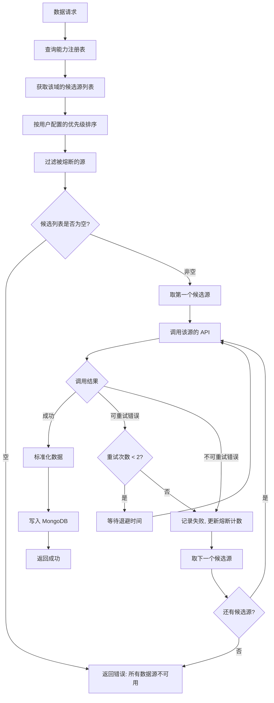
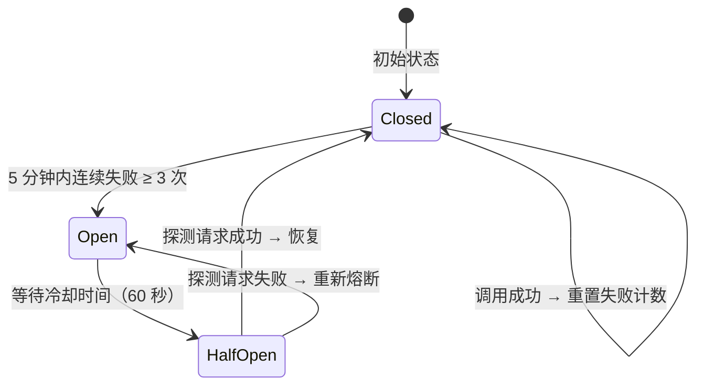
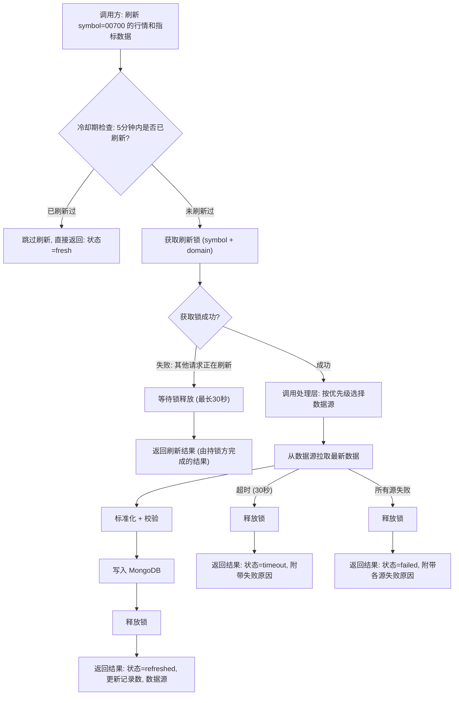
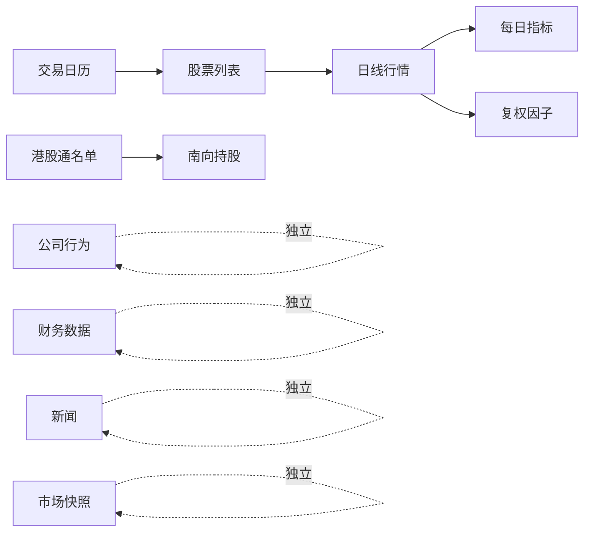

# 港股数据架构设计文档

> **版本**: v1.0
> **日期**: 2026-05-21
> **范围**: 仅限港股主板与创业板（GEM）股票，排除 ETF、REITs、债券、期权、牛熊证、窝轮
> **定位**: 面向实现的数据平台设计，与 A 股、美股共享统一架构

---

## 目录

1. [设计目标与原则](#1-设计目标与原则)
2. [数据源能力矩阵](#2-数据源能力矩阵)
3. [总体架构](#3-总体架构)
4. [数据域划分](#4-数据域划分)
5. [统一存储标准](#5-统一存储标准)
6. [多源选择与回退机制](#6-多源选择与回退机制)
7. [按需刷新机制](#7-按需刷新机制)
8. [自动更新调度](#8-自动更新调度)
9. [用户优先级配置](#9-用户优先级配置)
10. [数据质量保障](#10-数据质量保障)
11. [前端数据管理](#11-前端数据管理)
12. [实施路线图](#12-实施路线图)
13. [附录](#13-附录)

---

## 1. 设计目标与原则

### 1.1 核心目标

构建一套港股数据平台，实现以下能力：

1. 从多个外部数据源拉取港股数据，标准化处理后统一存入 MongoDB，供分析引擎和前端消费
2. 支持按需刷新指定股票的最新数据，满足分析引擎对数据时效性的要求
3. 支持全自动定时增量更新，无需人工干预
4. 多数据源之间具备完整的回退机制，保证数据可用性
5. 用户可在前端配置数据源优先级，系统实时生效
6. 与 A 股、美股共享同一套核心组件（处理层、调度层、存储层），仅在数据源与字段标准化层做市场特化

### 1.2 设计原则

1. **实用优先**: 不引入不需要的抽象层，不为"可能的未来需求"预留过度复杂的设计
2. **统一标准**: 无论数据来自哪个数据源，写入 MongoDB 的字段名称、类型、单位完全一致
3. **读写分离**: 消费方只从 MongoDB 读取标准数据，不直接调用外部数据源 API
4. **接口级回退**: 某个数据源的某个接口失败，只影响该接口的回退，不牵连该数据源的其他接口
5. **幂等写入**: 所有写入操作均为 upsert，同一数据重复写入不产生副作用
6. **增量为主**: 日常同步以增量方式进行，全量同步仅用于初始化和异常修复
7. **跨市场一致**: 与 A 股、美股遵守同一架构契约，仅在 `sources/hk/` 与 `schema/markets/hk.py` 内做市场化扩展

### 1.3 非目标

1. 分钟级实时行情、Level-2 报价、撮合明细
2. 期权、牛熊证、窝轮、衍生权证
3. ETF、REITs、债券、互惠基金
4. 经纪商交易、账户持仓、回测引擎
5. 港股通额度实时数据（仅记录通联标识，不跟踪南北水流向）
6. 原始数据存档（Raw 层）— 本项目不需要原始响应回放能力

### 1.4 与 A 股/美股的差异要点

| 维度 | A 股 | 美股 | 港股 |
|------|------|------|------|
| 时区 | CST（UTC+8） | ET（UTC-5/-4） | HKT（UTC+8，与北京时间相同） |
| 涨跌幅限制 | ±10%/20%/30% | 无限制 | 无限制（含市调机制 VCM/CAS） |
| 交易时段 | 09:30–11:30 / 13:00–15:00 | 09:30–16:00（含盘前盘后） | 09:30–12:00 / 13:00–16:00（含午休） |
| 代码格式 | 6 位数字 + 交易所后缀 | 字母 ticker | 5 位数字（含前导 0） + `.HK` |
| 主流货币 | CNY | USD | HKD（部分 USD/CNY/EUR/GBP 计价） |
| 财报频率 | 一/三/年 + 半年 | 季报为主（10-Q + 10-K） | 半年为主（中期 + 年报），少数季报 |
| 港股通 | – | – | 沪港通 / 深港通标识，重要业务字段 |
| 双重上市 | – | – | 同一公司可能在 NYSE/NASDAQ 同时上市（如 09988.HK ↔ BABA） |
| 同股不同权 | – | – | 双重股权结构（DR）股票，需特殊标识 |
| 复权处理 | 数据源直接提供 | 由 corporate_actions 推导 | 数据源直接提供为主，必要时本地推导 |

这些差异通过数据源适配器与 `schema/markets/hk.py` 内化，**对消费层完全透明**。

---

## 2. 数据源能力矩阵

### 2.1 数据源概览

| 维度 | Tushare HK | AKShare HK | yfinance HK | Tencent HK |
|------|------------|------------|-------------|------------|
| 性质 | 积分制 / 商业化 | 免费开源 | 免费开源（雅虎财经包装） | 公开行情接口（免费） |
| 注册 | 需要 Token；hk_basic / hk_tradecal 需 ≥ 2000 积分 | 无需注册 | 无需注册 | 无需注册 |
| 稳定性 | 高 | 中（聚合多个公开接口） | 中 | 高（实时行情） |
| 限流 | 200 次 / 分钟 | 无硬限制（建议 1s 间隔） | 无硬限制（建议 1s 间隔） | 较宽松（公共接口） |
| 覆盖深度 | 基础信息 + 行情 + 复权 + 财务三表 + 财务指标 + 沪深股通持股 | 行情 + 基础信息 + 部分财务 + 港股通名单 + 公司行为（含红股） + 披露易公告 | 行情 + 基础信息 + 财务 + 双重上市数据 + 公司行为 | 实时行情 + 基础信息 |
| 历史深度 | 数十年（hk_daily 可至 1990 年） | 数年 | 数十年 | 仅最新快照 |

### 2.2 各数据域支持情况

| 数据域 | Tushare HK | AKShare HK | yfinance HK | Tencent HK | 说明 |
|--------|------------|------------|-------------|------------|------|
| 股票列表 | ✅ hk_basic | ✅ stock_hk_spot_em | ⚠️ 需主动维护 | ⚠️ 仅热门股票 | Tushare、AKShare 全市场列表最完整 |
| 交易日历 | ✅ hk_tradecal | ⚠️ 通过历史日期反推 | ⚠️ 通过历史日期反推 | ❌ | **Tushare 是唯一直接提供日历的源** |
| 日线行情 | ✅ hk_daily | ✅ 全 | ✅ 全 | ❌ 仅快照 | 三源均可覆盖 |
| 复权行情 | ✅ hk_daily_adj | ⚠️ 部分 | ✅ 提供调整价 | ❌ | Tushare 提供专用复权接口 |
| 每日指标 | ⚠️ hk_daily_adj 内含市值/换手 | ✅ PE/PB/股息率 | ✅ PE/PB/MarketCap | ⚠️ 部分 | AKShare 与 yfinance 在 PE/PB/股息率上更完整 |
| 复权因子 | ✅ hk_adjfactor | ✅ 提供前/后复权 | ✅ 提供调整价 | ❌ | 三源均可提供 |
| 财务三表 | ✅ hk_income / hk_balancesheet / hk_cashflow | ✅ 半年/年报 | ✅ 半年/年报 | ❌ | 三源均覆盖港股财报披露节奏 |
| 财务指标 | ✅ hk_fina_indicator | ✅ 全 | ✅ 全 | ❌ | 三源均可覆盖 |
| 公司行为（红股 / 供股） | ❌ 不支持 | ✅ 含红股 / 供股 | ✅ dividends / splits（无红股） | ❌ | **AKShare 是唯一覆盖红股 / 供股的源** |
| 港股通名单 | ⚠️ 通过 hk_hold 间接判定 | ✅ 沪 / 深港通名单 | ❌ | ❌ | AKShare 维护更直接 |
| 沪深股通持股 | ✅ hk_hold（沪深股通持股明细） | ✅ 南向持股 | ❌ | ❌ | 双源互为主备 |
| 新闻公告 | ❌ 不支持港股新闻 | ✅ 港交所披露易 | ⚠️ 仅雅虎汇总 | ❌ | **AKShare 是核心源** |
| 市场快照 | ✅ rt_hk_k（实时日线） | ✅ stock_hk_spot_em | ✅ download | ✅ 实时报价 | 四源互补 |
| 实时 / 准实时报价 | ✅ rt_hk_k（实时日 K） | ⚠️ 延迟 15 分钟 | ⚠️ 延迟 15 分钟 | ✅ 准实时 | Tushare 与 Tencent 在实时层面占优 |
| 分钟行情 | ✅ hk_mins（1/5/15/30/60min） | ⚠️ 部分 | ⚠️ 部分 | ❌ | 仅作为可选增强域，不在核心范围 |

> ✅ = 完整支持 &nbsp; ⚠️ = 部分支持 &nbsp; ❌ = 不支持

### 2.3 关键结论

1. **Tushare HK 是默认主源**: 数据规范、稳定、覆盖深度大；在基础信息、行情、复权、财务三表、财务指标、沪深股通持股等核心数据域为首选源
2. **AKShare HK 是关键备源 + 公司行为 / 新闻唯一源**: 在公司行为（红股 / 供股）、港交所披露易公告等港股特色字段上**不可替代**；行情类数据可作为 Tushare 的备源
3. **yfinance HK 是国际化备源**: 在历史深度、双重上市股票数据、国际化字段上有优势，作为第三优先级备源
4. **Tencent HK 是实时快照专用源**: 仅在 `market_quotes` 域使用，弥补延迟数据的实时性需求
5. **公司行为（红股 / 供股 / 新闻）是 Tushare 的盲区**: 这三个数据域必须固定使用 AKShare HK 为主源，不能依赖 Tushare 回退
6. **Tushare 的积分门槛需关注**: 港股基础信息、交易日历需要 ≥ 2000 积分，未达门槛时自动降级到 AKShare HK
7. **数据源能力必须参数化**: 系统通过能力注册表判断可用性，不硬编码在业务逻辑中

---

## 3. 总体架构

### 3.1 架构总图

```text
┌─────────────────────────────────────────────────────────────────┐
│                        消费层 (Consumer)                         │
│    分析引擎    股票筛选    前端管理页面    数据导出 API            │
└───────────────────────────┬─────────────────────────────────────┘
                            │ 只读查询
                            ▼
┌─────────────────────────────────────────────────────────────────┐
│                      统一读取层 (Reader)                         │
│                                                                 │
│   ┌─────────────┐  ┌──────────────┐  ┌───────────────────┐     │
│   │ 标准数据读取  │  │  新鲜度判定   │  │  异步刷新通知      │     │
│   └──────┬──────┘  └──────┬───────┘  └────────┬──────────┘     │
│          │                │                    │                 │
└──────────┼────────────────┼────────────────────┼─────────────────┘
           │                │                    │
           ▼                │                    ▼
┌──────────────────┐        │         ┌──────────────────────────┐
│                  │        │         │     处理层 (Processor)    │
│     MongoDB      │◄───────┘─────────│                          │
│  （_hk 集合族）   │    写入标准数据    │  ┌──────────────────┐   │
│                  │                  │  │    回退路由器     │   │
│  ┌────────────┐  │                  │  │  FallbackRouter  │   │
│  │ 标准业务集合 │  │                  │  └────────┬─────────┘   │
│  ├────────────┤  │                  │           │             │
│  │ 同步元数据  │  │                  │  ┌────────┴─────────┐   │
│  └────────────┘  │                  │  │ 标准化  限流  熔断  │   │
│                  │                  │  │ 校验  去重  写入   │   │
└──────────────────┘                  │  └────────┬─────────┘   │
                                      └───────────┼─────────────┘
                                                  │
                              ┌───────────────┬───┴───────────┬───────────────┐
                              │               │               │               │
                              ▼               ▼               ▼               ▼
                        ┌────────────┐  ┌────────────┐  ┌────────────┐  ┌─────────────┐
                        │ Tushare HK │  │ AKShare HK │  │yfinance HK │  │ Tencent HK  │
                        │  Provider  │  │  Provider  │  │  Provider  │  │  Provider   │
                        └─────┬──────┘  └─────┬──────┘  └─────┬──────┘  └─────┬───────┘
                              │               │               │               │
                              ▼               ▼               ▼               ▼
                        ┌────────────┐  ┌────────────┐  ┌────────────┐  ┌─────────────┐
                        │  Tushare   │  │  AKShare   │  │   Yahoo    │  │   Tencent   │
                        │  Pro API   │  │ 公开接口   │  │  Finance   │  │  行情接口   │
                        └────────────┘  └────────────┘  └────────────┘  └─────────────┘
```

### 3.2 四层职责

| 层 | 职责 | 禁止行为 |
|----|------|---------|
| **消费层** | 消费标准化数据，生成分析报告、筛选结果、页面展示 | 禁止直接调用外部数据源 API |
| **读取层** | 从 MongoDB 读取标准数据；判定新鲜度；异步通知刷新服务 | 禁止同步调用外部数据源，禁止承担标准化或批量同步逻辑 |
| **处理层** | 数据源选择与回退；字段标准化与校验；限流与熔断；写入 MongoDB | 禁止承担业务分析逻辑 |
| **数据源层** | 封装第三方 API 调用，返回原始数据；管理认证与连接 | 禁止做字段映射或写数据库 |

### 3.3 三条数据流

系统存在三条核心数据流，与 A 股、美股完全一致：

**数据流 A — 定时同步（后台自动）**

```text
调度器定时触发（HKT 时区，与服务器 CST 一致） → 处理层按域编排 → 选择数据源 → 拉取 → 标准化 → 写入 MongoDB → 更新检查点
```

**数据流 B — 内部服务调用刷新（后端编排，核心场景）**

```text
后端服务需要最新数据（如分析前）
  → 调用 DataRefreshService.refresh(symbol, market="HK", domains)
  → 处理层: 选择数据源 → 拉取 → 标准化 → 写入 MongoDB
  → 返回刷新结果（成功/失败/部分成功）
  → 后端服务根据结果继续后续逻辑
```

**数据流 C — Reader 过期感知（读取时检测，异步通知）**

```text
消费方请求数据 → Reader 读 MongoDB → 判定新鲜度（按 HKT 时区与 HKEX 日历，含午休）
  ├── 新鲜 → 直接返回数据
  └── 过期 → 立即返回当前数据（附带 stale 标记）
           → 同时异步通知刷新服务进行后台更新（非阻塞）
```

**关键约束：**

- Reader 层的读取操作永远不阻塞在外部数据源调用上，调用方立即获得结果
- 过期数据仍然有价值，返回时通过新鲜度标记（fresh / stale）告知消费方数据状态
- 异步通知的刷新任务在独立线程中执行，与读取操作互不干扰
- 同一 symbol + domain 的异步刷新具备去重机制，不会重复触发

### 3.4 Redis 的角色与职责

Redis 作为内存级基础设施，与 MongoDB 形成互补，承担以下职责：

| 职责 | 说明 | 失效策略 |
|------|------|---------|
| **分布式锁** | 按需刷新的并发去重锁（symbol + domain 粒度） | Redis 不可用时降级为进程内存锁 |
| **限流计数器** | 各数据源的请求频率计数（滑动窗口） | Redis 不可用时降级为内存计数 |
| **熔断器状态** | 各数据源 + 数据域的熔断状态与冷却计时 | Redis 不可用时降级为内存状态 |
| **刷新冷却标记** | 记录 symbol + domain 的最近刷新时间，实现 5 分钟冷却期 | Redis 不可用时降级为内存标记 |
| **异步刷新队列** | Reader 层异步通知刷新服务时的消息传递 | Redis 不可用时降级为进程内队列 |
| **市场状态缓存** | HKEX 当前是否开市、是否在午休时段、是否假期 | Redis 不可用时直接查询 MongoDB 交易日历 |

---

## 4. 数据域划分

### 4.1 数据域与语义类型

根据数据的业务特征，将港股数据分为四种语义类型：

| 语义类型 | 数据域 | 存储主键 | 更新策略 | 说明 |
|---------|--------|---------|---------|------|
| **实体数据** | 股票基本信息 | symbol | Upsert 覆盖 | 缓慢变化，含港股通标识、双重上市标识 |
| **实体数据** | 交易日历 | exchange + date | Upsert 覆盖 | HKEX 日历，含半日交易日 |
| **时序数据** | 日线行情 | symbol + trade_date | Upsert 追加 | 每日产生新记录 |
| **时序数据** | 每日指标 | symbol + trade_date | Upsert 追加 | PE/PB/股息率/市值，每日产生 |
| **时序数据** | 复权因子 | symbol + trade_date | Upsert 追加 | 每日产生 |
| **时序数据** | 公司行为 | symbol + ex_date + action_type | Upsert 追加 | 分红、拆股、红股、供股事件 |
| **快照数据** | 财务数据 | symbol + report_period + statement_type | Upsert 覆盖 | 半年报 / 年报，可能被修订 |
| **快照数据** | 市场实时快照 | symbol | 全量覆盖 | 盘中/盘后快照，每 symbol 只保留最新 |
| **事件数据** | 新闻公告 | 去重键（标题+日期哈希） | 追加去重 | 港交所披露易公告，不可变事件 |

### 4.2 数据域全景

```text
港股数据域
│
├── 基础信息域
│   ├── 股票基本信息（代码、名称、行业、上市日期、板块、港股通标识、双重上市标识）
│   └── 交易日历（HKEX，含半日交易日与台风/暴雨停市）
│
├── 行情域
│   ├── 日线行情（OHLCV + 涨跌）
│   ├── 每日指标（PE、PB、股息率、市值）
│   ├── 复权因子
│   └── 市场实时快照（含准实时报价）
│
├── 财务域
│   ├── 利润表（半年报 + 年报为主）
│   ├── 资产负债表
│   ├── 现金流量表
│   └── 财务指标（ROE、ROA、EPS 等）
│
├── 公司行为域
│   ├── 现金分红（cash dividend，可能含特别股息）
│   ├── 股票拆分（stock split / consolidation）
│   ├── 红股（bonus issue，港股特色）
│   ├── 供股（rights issue，港股特色）
│   └── 并购/退市（merger / privatization，仅记录事件）
│
└── 新闻事件域
    ├── 股票新闻
    └── 港交所披露易公告
```

### 4.3 与 A 股/美股的数据域差异

| 数据域 | A 股 | 美股 | 港股 | 说明 |
|--------|------|------|------|------|
| 基本信息 | ✓ | ✓ | ✓ | 港股增加港股通标识、双重上市标识 |
| 交易日历 | ✓ | ✓ | ✓ | 港股增加台风/暴雨停市记录 |
| 日线行情 | ✓ | ✓ | ✓ | 字段表大体一致 |
| 每日指标 | ✓ | ✓ | ✓ | 港股 dividend_yield 比较关键 |
| 复权因子 | ✓ | ✓ | ✓ | 港股复权事件含红股、供股 |
| 财务三表 | ✓ | ✓ | ✓ | 港股以半年为主 |
| 财务指标 | ✓ | ✓ | ✓ | 字段表大体一致 |
| 市场快照 | ✓ | ✓ | ✓ | 港股可叠加 Tencent 准实时快照 |
| 新闻 | ✓ | ✓ | ✓ | 三市场通用 |
| 公司行为 | – | ✓ | ✓ | **港股新增红股、供股事件类型** |

---

## 5. 统一存储标准

### 5.1 集合规划

| 集合名称 | 数据域 | 语义类型 | 说明 |
|---------|--------|---------|------|
| `stock_basic_info_hk` | 股票基本信息 | 实体数据 | 港股全市场股票主档 |
| `trade_calendar_hk` | 交易日历 | 实体数据 | HKEX 交易日（含半日 / 临时停市） |
| `stock_daily_quotes_hk` | 日线行情 | 时序数据 | OHLCV + 涨跌幅 |
| `stock_daily_indicators_hk` | 每日指标 | 时序数据 | PE/PB/股息率/市值 |
| `stock_adj_factors_hk` | 复权因子 | 时序数据 | 前/后复权因子 |
| `stock_corporate_actions_hk` | 公司行为 | 时序数据 | 分红 / 拆股 / 红股 / 供股 |
| `stock_financial_data_hk` | 财务数据 | 快照数据 | 三表 + 财务指标，按半年 / 年报 |
| `market_quotes_hk` | 市场快照 | 快照数据 | 每股票最新行情快照（含准实时来源标记） |
| `stock_news_hk` | 新闻公告 | 事件数据 | 港交所披露易公告与股票相关新闻 |
| `sync_checkpoints` | 同步检查点 | 元数据 | 跨市场共用，文档内含 `market` 字段区分 |
| `sync_events` | 同步事件 | 元数据 | 跨市场共用 |
| `source_health` | 数据源健康 | 元数据 | 跨市场共用 |

> 业务集合采用 `_hk` 后缀；元数据集合（`sync_checkpoints` / `sync_events` / `source_health`）由三市场共用，通过 `market` 字段区分。

### 5.2 公共字段规范

每个业务集合的文档必须包含以下公共字段：

| 字段 | 类型 | 说明 | 是否必填 |
|------|------|------|---------|
| symbol | string | 5 位数字股票代码（含前导 0，如 `00700`） | 是 |
| market | string | 固定为 `HK` | 是 |
| data_source | string | 数据来源编码（`tushare_hk` / `akshare_hk` / `yfinance_hk` / `tencent_hk`） | 是 |
| updated_at | datetime | 最后更新时间（UTC） | 是 |

### 5.3 各集合主键与索引

| 集合 | 唯一键 | 说明 |
|------|--------|------|
| `stock_basic_info_hk` | symbol | 每只股票一条记录，data_source 字段标识当前数据来源 |
| `trade_calendar_hk` | exchange + cal_date | 交易所 + 日期（exchange 固定 `HKEX`） |
| `stock_daily_quotes_hk` | symbol + trade_date + period | 日 / 周 / 月线分别存储 |
| `stock_daily_indicators_hk` | symbol + trade_date | 每日一条 |
| `stock_adj_factors_hk` | symbol + trade_date | 每日一条 |
| `stock_corporate_actions_hk` | symbol + ex_date + action_type | 同一日可能多事件（分红 + 拆股 + 红股） |
| `stock_financial_data_hk` | symbol + report_period + statement_type + report_type | 报告期 + 报表类型 + 报告类型（中报 / 年报） |
| `market_quotes_hk` | symbol | 每只股票仅保留最新快照 |
| `stock_news_hk` | content_hash | 内容哈希去重 |
| `sync_checkpoints` | market + domain + source | 三市场共用元数据集合 |

**单源写入原则：**

业务集合的唯一键均不包含 `data_source` 字段。具体规则：

- 正常运行时，按优先级使用第一个可用数据源写入数据
- 发生回退时，备用源的数据通过 upsert 直接覆盖原记录
- 主源恢复后，下次同步会再次覆盖为主源数据
- 消费方无需关心数据来自哪个源

**例外 — `market_quotes_hk`：**

港股市场快照可同时由两类源更新——常规快照源（AKShare / yfinance，15 分钟延迟）与准实时源（Tencent）。为保证准实时数据不被延迟数据覆盖，`market_quotes_hk` 增加约束：

- 写入前比较新数据的 `last_updated` 与已有记录，仅当新数据更新时才覆盖
- `quote_source_type` 字段标记快照来源类型（`delayed` / `realtime`）
- 准实时源的写入间隔至少 30 秒，避免压力过大

### 5.4 字段标准化规则

无论数据来自哪个数据源，写入 MongoDB 前必须执行以下标准化：

| 规则 | 说明 |
|------|------|
| 股票代码统一为 5 位数字 | 数据源若返回 `700` / `0700` 一律补全为 `00700`；雅虎格式 `0700.HK`、Tushare 格式 `00700.HK` 去后缀后补全 |
| Tushare ts_code 处理 | Tushare 返回 `00700.HK` 格式，写入 `symbol` 字段时去掉 `.HK`，`full_symbol` 字段保留完整形式 |
| 日期统一为 `YYYY-MM-DD` | 不使用 `YYYYMMDD` 格式（Tushare 默认返回 `YYYYMMDD` 需要转换） |
| 时间戳存 UTC | 港股交易在 HKT（UTC+8），与服务器 CST 一致，但仍按 UTC 存储以保持跨市场统一 |
| 主货币统一为 HKD | 数据源若返回 USD 计价（部分双重上市股），原币种保留到 `quote_currency` 字段 |
| 金额单位统一为港币元 | 千元 × 1000，万元 × 10000，亿元 × 100000000 |
| 成交量单位统一为股 | 港股以股计量，不涉及"手"换算 |
| 百分比保留原值 | 如涨跌幅 `2.35` 表示 `2.35%`，不除以 100 |
| 浮点数精度 | 价格保留 3 位（兼容仙股），比率保留 4 位，金额保留 2 位 |
| 空值处理 | 数据源返回 NaN / None / 空字符串统一写为 `null` |
| 行业字段统一为恒生行业分类 | 数据源返回 GICS / 自定义分类时统一映射到恒生一级 / 二级行业 |

### 5.5 stock_basic_info_hk 字段

| 字段 | 类型 | 说明 |
|------|------|------|
| symbol | string | 5 位数字代码（含前导 0） |
| name_zh | string | 中文名称 |
| name_en | string | 英文名称 |
| full_symbol | string | 带后缀代码（如 `00700.HK`） |
| exchange | string | 固定 `HKEX` |
| board | string | 上市板块（`MAIN` 主板 / `GEM` 创业板） |
| industry_l1 | string | 恒生一级行业 |
| industry_l2 | string | 恒生二级行业 |
| sector | string | 板块（如金融、地产、科技） |
| currency | string | 主计价货币（`HKD` / `USD` / `CNY` / `EUR` / `GBP`） |
| list_status | string | 上市状态（`L` 上市 / `D` 退市 / `S` 暂停） |
| list_date | string | 上市日期 |
| delist_date | string | 退市日期（可为空） |
| connect_status | string | 港股通标识（`stock_connect_sh` 沪港通 / `stock_connect_sz` 深港通 / `stock_connect_both` 双通 / `none` 不通） |
| dual_listed | boolean | 是否双重上市 |
| dual_listed_us_symbol | string | 对应美股 ticker（如 `BABA`，仅 dual_listed=true 时有意义） |
| dual_listed_a_symbol | string | 对应 A 股 symbol（如 H+A 股） |
| weighted_voting_rights | boolean | 是否同股不同权（WVR / DR 股票） |
| chinese_company | boolean | 是否中资股（红筹 / H 股 / 中概股） |

### 5.6 stock_daily_quotes_hk 字段

| 字段 | 类型 | 说明 |
|------|------|------|
| symbol | string | 5 位数字代码 |
| trade_date | string | 交易日期（HKT 归属） |
| period | string | 周期（daily / weekly / monthly） |
| open | float | 开盘价 |
| high | float | 最高价 |
| low | float | 最低价 |
| close | float | 收盘价 |
| pre_close | float | 昨收价 |
| change | float | 涨跌额 |
| pct_chg | float | 涨跌幅（%，无限制） |
| volume | float | 成交量（股） |
| amount | float | 成交额（HKD） |
| turnover_rate | float | 换手率（%） |

**周线/月线数据的产生方式：**

| period 值 | 数据来源 | 说明 |
|-----------|---------|------|
| daily | 数据源直接提供 | 日线行情，每交易日同步 |
| weekly | 本地聚合 | 由处理层基于日线数据计算：周一开盘价、周内最高/最低价、周五收盘价、周内成交量/额求和 |
| monthly | 本地聚合 | 由处理层基于日线数据计算：月初开盘价、月内最高/最低价、月末收盘价、月内成交量/额求和 |

**港股特殊情况处理：**

- 半日交易日（如圣诞前夕、农历新年前夕）按当日实际开收盘价聚合
- 因台风 / 暴雨临时停市的当日不产生日线记录，周/月线聚合时跳过

### 5.7 stock_daily_indicators_hk 字段

| 字段 | 类型 | 说明 |
|------|------|------|
| symbol | string | 5 位数字代码 |
| trade_date | string | 交易日期 |
| pe_ttm | float | 市盈率（TTM） |
| pb | float | 市净率 |
| ps_ttm | float | 市销率（TTM） |
| dividend_yield | float | 股息率（%，港股核心指标） |
| dividend_yield_ttm | float | 滚动股息率（TTM） |
| total_mv | float | 总市值（HKD） |
| circ_mv | float | 流通市值（HKD） |
| shares_outstanding | float | 总股本（股） |
| float_shares | float | 流通股本（股） |
| southbound_holding | float | 港股通持股数（股，可为空） |
| southbound_holding_ratio | float | 港股通持股占比（%，可为空） |

> 港股通持股数据在 connect_status ≠ `none` 的股票上才有意义，其他股票字段值为 null。

### 5.8 stock_corporate_actions_hk 字段

| 字段 | 类型 | 说明 |
|------|------|------|
| symbol | string | 5 位数字代码 |
| ex_date | string | 除权除息日 |
| record_date | string | 登记日 |
| pay_date | string | 派发日（仅分红） |
| action_type | string | 事件类型（`cash_dividend` / `special_dividend` / `stock_split` / `consolidation` / `bonus_issue` / `rights_issue` / `merger` / `privatization`） |
| amount | float | 现金分红金额（每股，原币种） |
| currency | string | 分红原币种（`HKD` / `USD` / `CNY` / `GBP` 等） |
| amount_hkd | float | 折算为 HKD 后的每股金额 |
| ratio_from | float | 拆股 / 红股 / 供股前的基数 |
| ratio_to | float | 拆股 / 红股 / 供股后的对应数 |
| rights_price | float | 供股价（仅 rights_issue） |
| announce_date | string | 公告日期（披露易公告日） |

**说明：**

- `cash_dividend` 与 `special_dividend` 用于复权因子推导
- `stock_split` / `consolidation` / `bonus_issue` / `rights_issue` 均参与复权
- `merger` / `privatization` 仅作为事件记录，不参与复权
- 分红币种需双轨记录，便于统计原币现金流与本位币（HKD）等价金额

### 5.9 stock_financial_data_hk 字段

| 字段 | 类型 | 说明 |
|------|------|------|
| symbol | string | 5 位数字代码 |
| report_period | string | 报告期截止日（如 `2025-12-31`） |
| statement_type | string | 报表类型（`income` / `balance` / `cashflow` / `indicator`） |
| report_type | string | 报告类型（`H1` 中报 / `H2` 全年报 / 少数 `Q1` / `Q3`） |
| fiscal_year | int | 财年 |
| announce_date | string | 公告日期 |
| filing_url | string | 披露易报告链接（可为空） |
| currency | string | 报告币种（多数为 `HKD`，少数 `USD` / `CNY`） |
| revenue | float | 营业收入（原币） |
| revenue_hkd | float | 折算 HKD 后营业收入 |
| net_profit | float | 净利润（原币） |
| net_profit_hkd | float | 折算 HKD 后净利润 |
| total_assets | float | 总资产（原币） |
| total_equity | float | 净资产（原币） |
| roe | float | 净资产收益率（%） |
| roa | float | 总资产收益率（%） |
| gross_margin | float | 毛利率（%） |
| net_margin | float | 净利率（%） |
| debt_ratio | float | 资产负债率（%） |
| current_ratio | float | 流动比率 |
| eps | float | 每股收益（原币） |
| bps | float | 每股净资产（原币） |
| operating_cashflow | float | 经营活动现金流量净额（原币） |
| dividend_per_share | float | 每股股息（含中期 + 末期） |

> 注：`statement_type` 与 `report_type` 共同参与唯一键，区分中报与年报、季报与半年报。原币与折算 HKD 双轨记录，方便分析。

### 5.10 market_quotes_hk 字段（含准实时增强）

| 字段 | 类型 | 说明 |
|------|------|------|
| symbol | string | 5 位数字代码 |
| last_price | float | 最新价 |
| last_volume | float | 最新成交量 |
| last_updated | datetime | 最新更新时间（UTC） |
| quote_source_type | string | 快照来源类型（`delayed` 延迟 15 分钟 / `realtime` 准实时） |
| bid_price | float | 买一价（仅 realtime） |
| ask_price | float | 卖一价（仅 realtime） |
| bid_volume | float | 买一量（仅 realtime） |
| ask_volume | float | 卖一量（仅 realtime） |
| session | string | 当前会话（`morning` 早市 / `lunch_break` 午休 / `afternoon` 午市 / `closed` 闭市 / `pre_open` 早盘前 / `closing_auction` 收市竞价） |

### 5.11 sync_checkpoints 字段（含 market 字段）

| 字段 | 类型 | 说明 |
|------|------|------|
| market | string | 市场（固定 `HK`） |
| domain | string | 数据域（`daily_quotes` / `corporate_actions` / ...） |
| source | string | 数据源编码 |
| last_sync_date | string | 上次成功同步的数据截止日期 |
| last_sync_time | datetime | 上次成功同步的执行时间 |
| status | string | 状态（`success` / `failed` / `running`） |
| record_count | int | 上次同步的记录数 |

唯一键为 `market + domain + source`，三市场共用同一集合。

---

## 6. 多源选择与回退机制

这是本设计的核心章节。解决以下问题：

- 有多个数据源，如何选择？
- 某个接口失败时，如何回退？
- 是整个数据源降级还是单个接口降级？
- 如何防止对故障源的持续请求浪费时间？

### 6.1 能力注册表

系统维护一张能力注册表，记录每个数据源对每个数据域的支持情况。回退路由器的所有决策均基于此表：

| 数据域 | Tushare HK | AKShare HK | yfinance HK | Tencent HK | 默认优先级 |
|--------|------------|------------|-------------|------------|-----------|
| basic_info | ✅ 可用（需 2000 积分） | ✅ 可用 | ⚠️ 部分 | ❌ 不可用 | Tushare HK → AKShare HK → yfinance HK |
| trade_calendar | ✅ 可用（需 2000 积分） | ⚠️ 反推 | ⚠️ 反推 | ❌ 不可用 | Tushare HK → AKShare HK |
| daily_quotes | ✅ 可用 | ✅ 可用 | ✅ 可用 | ❌ 不可用 | Tushare HK → AKShare HK → yfinance HK |
| daily_indicators | ⚠️ 部分（含市值/换手） | ✅ 可用 | ✅ 可用 | ❌ 不可用 | AKShare HK → yfinance HK → Tushare HK |
| financial_data | ✅ 可用（含三表+指标） | ✅ 可用 | ✅ 可用 | ❌ 不可用 | Tushare HK → AKShare HK → yfinance HK |
| corporate_actions | ❌ 不支持 | ✅ 全（含红股供股） | ✅ 部分（无红股） | ❌ 不可用 | AKShare HK → yfinance HK |
| adj_factors | ✅ 可用 | ✅ 可用 | ✅ 可用 | ❌ 不可用 | Tushare HK → AKShare HK → yfinance HK |
| connect_status（港股通名单） | ⚠️ 间接（通过 hk_hold） | ✅ 沪 / 深港通名单 | ❌ 不支持 | ❌ 不支持 | AKShare HK → Tushare HK |
| southbound_holding（南向持股） | ✅ hk_hold | ✅ 可用 | ❌ 不支持 | ❌ 不支持 | Tushare HK → AKShare HK |
| market_quotes | ✅ rt_hk_k（实时日 K） | ✅ 延迟 | ✅ 延迟 | ✅ 准实时 | Tencent HK → Tushare HK → AKShare HK → yfinance HK |
| news | ❌ 不支持 | ✅ 披露易 | ⚠️ 仅雅虎汇总 | ❌ 不可用 | AKShare HK → yfinance HK |

此表有两个关键用途：

1. **过滤**: 某个域标记为 ❌ 的数据源，不会出现在该域的候选列表中
2. **排序**: 用户可修改每个域的优先级顺序（参见第 9 章）

**关键能力约束：**

| 数据域 | 约束类型 | 说明 |
|--------|---------|------|
| corporate_actions | 必须使用 AKShare HK | Tushare 不支持港股公司行为；yfinance 缺红股 / 供股事件 |
| news | 必须使用 AKShare HK | Tushare 不提供港股新闻；yfinance 仅有汇总 |
| connect_status | AKShare HK 主源 | Tushare 仅能从持股反推名单，准确性较弱 |
| basic_info / trade_calendar | Tushare 主源依赖积分 | 用户未达 2000 积分门槛时，自动降级至 AKShare HK 主源 |

**积分不足处理：**

当港股 Tushare Token 未配置或积分不足时，系统在初始化时自动从能力注册表中移除 Tushare HK 的对应数据域条目，使其不参与回退路由。Tushare HK 在该域的 `data_source` 标记为 `unavailable_no_credits`，记录到 source_health 集合。

### 6.1.1 默认优先级与双层模型

港股默认优先级遵循"零配置可用 + 配置后自动升级"原则：

**双层优先级模型：**

| 层级 | 内容 | 来源 |
|------|------|------|
| 1. 静态默认 | YAML 配置中的基线优先级（按数据质量排序） | `config/default_priorities.yaml` |
| 2. 动态可用性 | 启动时基于 Tushare Token / 积分检测后的实际可用源列表 | 内存（每 30 秒刷新） |
| 3. 用户覆盖 | 前端拖拽调整保存的优先级 | MongoDB `system_configs` |
| 4. 最终生效 | `用户覆盖 ∩ 实际可用` 按 `用户覆盖` 顺序排序 | 内存（每次请求时合成） |

**港股默认优先级矩阵：**

| 数据域 | 静态默认（按质量排序） | 配置 Tushare HK 后实际生效 | 零配置实际生效 |
|--------|----------------------|--------------------------|---------------|
| basic_info | Tushare HK → AKShare HK → yfinance HK | Tushare HK → AKShare HK → yfinance HK | AKShare HK → yfinance HK |
| trade_calendar | Tushare HK → AKShare HK | Tushare HK → AKShare HK | AKShare HK |
| daily_quotes | Tushare HK → AKShare HK → yfinance HK | Tushare HK → AKShare HK → yfinance HK | AKShare HK → yfinance HK |
| daily_indicators | AKShare HK → yfinance HK → Tushare HK | AKShare HK → yfinance HK → Tushare HK | AKShare HK → yfinance HK |
| financial_data | Tushare HK → AKShare HK → yfinance HK | Tushare HK → AKShare HK → yfinance HK | AKShare HK → yfinance HK |
| corporate_actions | AKShare HK → yfinance HK | AKShare HK → yfinance HK | AKShare HK → yfinance HK |
| adj_factors | Tushare HK → AKShare HK → yfinance HK | Tushare HK → AKShare HK → yfinance HK | AKShare HK → yfinance HK |
| connect_status | AKShare HK → Tushare HK | AKShare HK → Tushare HK | AKShare HK |
| southbound_holding | Tushare HK → AKShare HK | Tushare HK → AKShare HK | AKShare HK |
| market_quotes | Tencent HK → Tushare HK → AKShare HK → yfinance HK | Tencent HK → Tushare HK → AKShare HK → yfinance HK | Tencent HK → AKShare HK → yfinance HK |
| news | AKShare HK → yfinance HK | AKShare HK → yfinance HK | AKShare HK → yfinance HK |

**关键设计原则：**

1. **零配置可用**：未配置 Tushare HK Token 时，系统自动剔除 Tushare HK 条目，仅依赖免费源（AKShare HK / yfinance HK / Tencent HK）就能完整运行
2. **配置后自动升级**：配置 Tushare HK Token 且达到积分门槛后，系统自动将 Tushare HK 前置为主源（行情 / 基础信息 / 财务 / 复权 / 南向持股），无需用户手动调整
3. **域级差异化**：corporate_actions 和 news 始终以 AKShare HK 为主源（Tushare 不支持），不受 Token 配置影响
4. **市场快照专项**：Tencent HK 始终位于第一（准实时优于延迟）

### 6.2 回退粒度：接口级回退

**核心原则：回退是按数据域（接口）级别进行的，不是整个数据源级别的。**

```text
示例场景：
  AKShare HK 的 daily_quotes 接口因公开接口变更返回解析失败

  ✅ 正确行为：daily_quotes 回退到 yfinance HK，其他域继续使用 AKShare HK
  ❌ 错误行为：整个 AKShare HK 标记为不可用，所有域都切换到 yfinance HK
```

这意味着：

- 每个数据域独立维护自己的回退状态
- 熔断器的粒度是 **数据源 + 数据域** 的组合
- 例如 AKShare HK 的 `daily_quotes` 熔断了，不影响 AKShare HK 的 `connect_status`

### 6.3 数据源选择流程

每次数据请求都经过以下选择流程：



### 6.4 重试 vs 降级的判定

并非所有错误都需要切换数据源。系统将错误分为两类：

**可重试错误 — 在同一数据源上重试（最多 2 次，指数退避）**

| 错误类型 | 退避策略 | 说明 |
|---------|---------|------|
| HTTP 429 限流 | 第 1 次等 3 秒，第 2 次等 10 秒 | 数据源临时限流 |
| 网络超时 | 第 1 次等 5 秒，第 2 次等 15 秒 | 网络抖动 |
| 连接断开 | 第 1 次等 2 秒，第 2 次等 5 秒 | 短暂连接问题 |
| 反爬验证码 | 第 1 次等 30 秒 | AKShare 公开接口偶有反爬，等待后重试 |

**不可重试错误 — 立即切换到下一个数据源**

| 错误类型 | 处理 | 说明 |
|---------|------|------|
| HTTP 403 / 404 | 立即降级 | 接口下线或访问受限 |
| HTTP 500 服务器错误 | 立即降级 | 数据源内部故障 |
| 数据格式异常 | 立即降级 | 返回数据无法解析（公开接口可能突然变更） |
| 空结果（应有数据） | 立即降级 | 数据源数据缺失 |
| Symbol 不存在 | 不降级，直接返回错误 | 该 symbol 已退市或拼写错误 |
| Tushare 积分不足 | 立即降级，标记长冷却 | 报文中含 "积分不足" / "权限不足" 时由 Tushare Adapter 抛出 InsufficientCreditsError，路由器降级并将该源熔断 24 小时 |
| Tushare Token 失效 | 立即降级，禁用源 | 401 / Token 过期时，将 Tushare HK 全市场所有域标记为 `unavailable_token`，需用户更新 Token |

### 6.5 熔断器

防止系统对已故障的数据源持续发送请求。**熔断器作用于「数据源 + 数据域」的组合**。



**熔断参数：**

| 参数 | 值 | 说明 |
|------|-----|------|
| 失败阈值 | 3 次 | 在窗口期内连续失败 3 次触发熔断 |
| 窗口期 | 5 分钟 | 失败计数的滑动窗口 |
| 初始冷却时间 | 60 秒 | 第一次熔断后的等待时间 |
| 最大冷却时间 | 600 秒 | 冷却时间的上限 |
| 探测请求数 | 1 次 | 半开状态只允许 1 个请求通过 |

**阶梯式冷却策略：**

| 熔断次数 | 冷却时间 | 场景 |
|---------|---------|------|
| 第 1 次 | 60 秒 | 短暂故障，快速恢复 |
| 第 2 次 | 120 秒 | 故障持续，延长等待 |
| 第 3 次 | 300 秒 | 较严重故障 |
| 第 4 次及以上 | 600 秒 | 长时间故障，低频探测 |

冷却时间在以下情况重置为初始值：

- 探测请求成功（Half-Open → Closed）
- 熔断器连续处于 Closed 状态超过 30 分钟（说明已稳定恢复）

**按错误类型差异化冷却：**

| 错误类型 | 冷却倍数 | 理由 |
|---------|---------|------|
| 限流（429） | ×2 | 限流窗口通常较长 |
| 反爬验证码 | ×3 | AKShare 公开接口反爬可能持续较久 |
| 接口下线（404） | ×5 | 通常需要适配器更新，长时间无法恢复 |
| 网络/超时 | ×1 | 网络问题恢复较快 |
| 服务器错误（500） | ×1.5 | 服务端问题，适度延长 |

### 6.6 回退记录与通知

每次发生回退时，系统执行以下操作：

1. **写入 sync_events 集合**: 记录回退事件（市场、域、从哪个源降级到哪个源、原因、时间）
2. **日志记录**: 输出 WARNING 级别日志
3. **前端通知**: 通过 SSE 向前端推送降级通知（如果有活跃连接）
4. **健康统计更新**: 更新 `source_health` 集合中该源+域的失败计数和成功率

### 6.7 所有源都失败的兜底策略

当某个数据域的所有候选源都失败时：

| 场景 | 处理 |
|------|------|
| **定时同步中** | 记录同步失败事件，保留上次成功的数据不变，下次调度时重试 |
| **按需刷新中** | 返回 MongoDB 中已有的旧数据，附带新鲜度状态标记 `stale`，前端展示"数据可能过期"提示 |
| **首次获取（无旧数据）** | 返回明确的"数据不可用"错误，附带所有源的失败原因 |
| **唯一源域失败（如 connect_status）** | 直接返回 `no_available_source`，调用方按业务容忍度处理 |

---

## 7. 按需刷新机制

### 7.1 设计场景

按需刷新解决的核心问题：**后端服务在执行业务逻辑前，需要确保指定股票的数据是最新的。**

典型场景：

```text
用户点击"分析 00700"
  → 后端分析服务启动
  → 分析服务调用数据刷新服务: "确保 00700 的数据是最新的"
  → 数据刷新服务从数据源拉取最新数据 → 标准化 → 写入 MongoDB
  → 刷新完成，返回结果（成功/失败/部分成功）
  → 分析服务根据刷新结果继续执行分析逻辑
  → 分析服务从 MongoDB 读取最新数据进行分析
```

**关键特征：这是一个后端内部的同步调用，调用方等待刷新完成后再执行后续逻辑。与前端无关。**

### 7.2 三种调用方式

| 调用方式 | 调用者 | 行为 | 使用场景 |
|---------|--------|------|---------|
| **内部服务调用** | 分析引擎、筛选服务等后端模块 | 同步阻塞，调用方等待刷新完成后继续执行 | 分析前确保数据最新 |
| **Reader 异步通知** | Reader 读取层（内部） | 读取数据时发现过期，异步通知刷新服务后台执行，读取本身立即返回当前数据 | 后台静默更新，不阻塞读取 |
| **HTTP API** | 前端管理页面、运维脚本 | `POST /api/hk/data/refresh/{symbol}`，返回刷新结果 | 管理员手动刷新 |

**三种方式共享同一套底层刷新逻辑**（数据源选择、回退、限流、熔断），行为完全一致。

### 7.3 内部服务调用流程（核心）



**调用方拿到刷新结果后自行决定后续行为：**

| 刷新结果状态 | 含义 | 调用方典型处理 |
|------------|------|-------------|
| `fresh` | 数据已经是新鲜的，无需刷新 | 直接继续后续逻辑 |
| `refreshed` | 刷新成功，数据已更新 | 直接继续后续逻辑 |
| `partial` | 部分域刷新成功，部分失败 | 根据业务决定是否继续 |
| `timeout` | 刷新超时 | 可选择用旧数据继续，或放弃 |
| `failed` | 全部失败 | 可选择用旧数据继续，或返回错误 |

**关键原则：数据刷新服务只负责刷新数据并返回结果，不决定调用方的后续行为。**

### 7.4 调用编排示例

```text
分析服务收到请求: 分析股票 00700
│
├── 步骤 1: 调用 DataRefreshService.refresh("00700", market="HK",
│              domains=["daily_quotes", "daily_indicators",
│                      "financial_data", "corporate_actions"])
│   │
│   ├── 刷新服务内部: 并行刷新四个域
│   │   ├── daily_quotes: AKShare HK 拉取 → 标准化 → 写入 MongoDB ✅
│   │   ├── daily_indicators: AKShare HK 拉取 → 标准化 → 写入 MongoDB ✅
│   │   ├── financial_data: AKShare HK 拉取 → 标准化 → 写入 MongoDB ✅
│   │   └── corporate_actions: AKShare HK 拉取 → 标准化 → 写入 MongoDB ✅
│   │
│   └── 返回结果: { status: "refreshed", domains: { ... } }
│
├── 步骤 2: 分析服务检查刷新结果 → 全部成功
├── 步骤 3: 分析服务从 Reader 读取最新数据
└── 步骤 4: 执行分析逻辑，生成报告
```

**带回退的场景：**

```text
分析服务收到请求: 分析股票 00700
│
├── 步骤 1: 调用 DataRefreshService.refresh("00700", market="HK",
│              domains=["daily_quotes"])
│   │
│   ├── 刷新服务内部:
│   │   ├── AKShare HK 拉取 daily_quotes → 接口解析失败 ❌
│   │   ├── 重试 AKShare HK → 仍然失败 ❌
│   │   ├── 回退到 yfinance HK → 拉取成功 ✅
│   │   └── 标准化 → 写入 MongoDB
│   │
│   └── 返回结果: { status: "refreshed", source: "yfinance_hk", fallback_from: "akshare_hk" }
│
├── 步骤 2: 分析服务检查刷新结果 → 成功（虽然用了备源）
└── 步骤 3: 继续正常分析
```

### 7.5 刷新参数

| 参数 | 是否必填 | 说明 |
|------|---------|------|
| symbol | 是 | 5 位数字股票代码 |
| market | 否 | 默认按 symbol 自动判定，可显式指定 `HK` |
| domains | 否 | 要刷新的数据域列表，不指定则刷新所有域 |
| force | 否 | 是否强制刷新（忽略冷却期），默认否 |
| timeout | 否 | 超时时间（秒），默认 30 秒 |

### 7.6 新鲜度判定

Reader 异步通知模式下，需要判定数据是否过期来决定是否通知刷新服务。每个数据域有不同的新鲜度要求（**所有时间均按 HKT 判定**）：

| 数据域 | 新鲜度标准 | 说明 |
|--------|-----------|------|
| daily_quotes | 交易日 16:30 HKT 后，必须有当日数据 | 收盘后 30 分钟内应可用 |
| daily_indicators | 交易日 17:00 HKT 后，必须有当日数据 | 通常比行情晚一点 |
| basic_info | 最近 24 小时内有更新 | 变化不频繁 |
| financial_data | 最近 7 天内有更新 | 中报 / 年报披露期可缩短至 1 天 |
| corporate_actions | 最近 24 小时内有更新 | 关键域 |
| connect_status | 最近 7 天内有更新 | 港股通名单变更频率低 |
| southbound_holding | 最近 24 小时内有更新 | 每日收盘后港交所披露 |
| news | 最近 1 小时内有更新 | 新闻时效性要求中等 |
| market_quotes | 最近 30 分钟内有更新（延迟源） / 5 分钟内（准实时源） | 取决于 quote_source_type |

**非交易日处理**: 周末和 HKEX 假期不需要新的行情数据，新鲜度判定自动跳过。Reader 通过查询 `trade_calendar_hk` 判定。

**午休时段处理**: 12:00–13:00 HKT 为午休时段，期间不进行行情同步，新鲜度判定跳过此时段的"最近 N 分钟"要求。

**台风 / 暴雨停市处理**: 当日临时停市的情况通过交易日历的特殊标记记录，新鲜度判定自动跳过当日。

### 7.7 防并发重复刷新

如果多个请求同时需要刷新同一只股票的同一个数据域，系统只执行一次刷新：

- 使用内存锁（单进程）或 Redis 锁（多进程），锁的粒度为 **market + symbol + domain**
- 第一个请求获取锁并执行刷新
- 后续请求等待锁释放后，直接获取第一个请求的刷新结果
- 锁的最大等待时间为 30 秒，超时后返回超时状态

### 7.8 限流保护

防止大量按需刷新请求冲击数据源：

| 保护策略 | 规则 |
|---------|------|
| 同股票冷却 | 同一 symbol + domain 的刷新请求，5 分钟内最多执行 1 次（force=true 可绕过） |
| 全局并发上限 | 同时进行的按需刷新不超过 10 个 |
| 单源频率上限 | AKShare HK / yfinance HK：批次间隔 1 秒；Tencent HK：每股票最快每 30 秒一次 |
| Tencent 准实时专用 | 仅在 market_quotes 域使用，且仅在交易时段触发 |

---

## 8. 自动更新调度

### 8.1 时区处理

港股以 HKT（UTC+8）开市与收市，与服务器 CST（北京时间，UTC+8）相同，**无需时区换算**。所有调度配置直接使用本地时间。

### 8.2 调度频率

| 数据域 | 调度时间（HKT） | 调度方式 | 主源 | 说明 |
|--------|----------------|---------|------|------|
| trade_calendar | 每日 00:00 | 全量 | Tushare HK | 先于其他所有同步；Tushare 未配置时降级 AKShare HK |
| basic_info | 每日 08:00 | 全量 | Tushare HK | 捕获新股 IPO、退市、更名 |
| connect_status | 每周一 09:00 | 全量 | AKShare HK | 港股通名单变更频率低 |
| daily_quotes | 每交易日 18:30 | 增量 | Tushare HK | Tushare 港股日线 18:00 左右更新当日数据 |
| daily_indicators | 每交易日 19:00 | 增量 | AKShare HK | PE/PB/股息率以 AKShare 为主 |
| southbound_holding | 每交易日 19:30 | 增量 | Tushare HK | hk_hold 在港交所披露后约 1 小时更新 |
| corporate_actions | 每日 20:00 | 增量 | AKShare HK | **Tushare 不支持，必须用 AKShare** |
| adj_factors | 每交易日 19:30 | 增量 | Tushare HK | hk_adjfactor 接口直接提供 |
| financial_data | 每日 21:00 | 增量 | Tushare HK | 中报 / 年报披露期密集 |
| market_quotes | 每交易日 16:01 | 全量 | Tushare HK（rt_hk_k） | 收盘快照 |
| market_quotes（准实时） | 交易时段每 30 秒 | 增量 | Tencent HK | 仅活跃股票（如恒指成分股） |
| news | 每 1 小时 | 增量 | AKShare HK | **Tushare 不支持，必须用 AKShare** |

### 8.3 调度依赖链

部分数据域之间存在依赖关系，必须按顺序执行：



**说明：**

- 交易日历必须先完成，后续域才能知道今天是否交易日
- 股票列表必须先完成，后续域才能知道要同步哪些股票
- 日线行情完成后才同步每日指标和复权因子
- 港股通名单确定后才能同步南向持股数据
- 财务数据、公司行为、新闻、市场快照与上述链路无依赖，可并行

### 8.4 增量同步机制

增量同步通过检查点（sync_checkpoints）实现：

```text
增量同步流程：
  1. 读取该域的检查点（market=HK + domain + source），获取上次同步截止日期
  2. 计算本次需要同步的日期范围
  3. 从数据源拉取该范围的数据
  4. 标准化并 upsert 到 MongoDB
  5. 更新检查点为本次同步截止日期
```

**检查点推进规则**：只有在本次同步成功完成后才推进检查点。

**分批同步与检查点一致性保护：**

| 策略 | 说明 |
|------|------|
| 按日期分批 | 多日增量数据时，逐日拉取并写入，每日完成后推进检查点到该日 |
| 按股票分批 | 港股全市场约 2500–3000 只股票，按批次（每 200 只）写入 |
| 原子性保证 | 单批次内的 upsert 作为一个逻辑单元 |
| 港股通名单变化处理 | basic_info 同步时检测 connect_status 变化，记录到 sync_events |

**异常恢复机制：**

| 异常场景 | 恢复策略 |
|---------|---------|
| 进程异常退出 | 下次启动时从检查点恢复，重复拉取可能已写入的数据（upsert 幂等） |
| 部分批次成功、部分失败 | 检查点停留在最后一个完整成功日期 |
| 检查点与实际数据不一致 | 每日完整性检查发现缺口后，回退检查点到缺口起始日期 |
| 临时停市当日 | 跳过该日同步，检查点直接推进到下一交易日 |

### 8.5 全量同步

全量同步用于以下场景：

| 场景 | 触发方式 |
|------|---------|
| 系统初始化 | 管理员手动触发 |
| 数据异常修复 | 管理员手动触发 |
| 新增数据源 | 管理员手动触发 |
| 股票列表和交易日历 | 定时调度（这两个域每次都是全量） |
| 港股通名单 | 每周一全量 |

全量同步会拉取完整历史数据。对于行情数据，按时间窗口分批拉取，每批之间遵守限流规则。

### 8.6 限流策略

| 数据源 | 限流规则 | 调度器行为 |
|--------|---------|-----------|
| Tushare HK | 200 次/分钟（账户级，与 A 股共享配额） | 批次间隔 0.3 秒，大批量时自动降速 |
| AKShare HK | 无硬限制（建议间隔） | 批次间隔 1 秒（礼貌间隔） |
| yfinance HK | 无硬限制（建议间隔） | 批次间隔 1 秒（礼貌间隔） |
| Tencent HK | 较宽松（公共接口） | 单股票最快每 30 秒一次 |

### 8.7 非交易日处理

- 行情类数据（daily_quotes、daily_indicators、market_quotes、adj_factors、southbound_holding）在非交易日**跳过同步**
- 基础信息、财务数据、新闻、公司行为在非交易日**正常同步**
- 半日交易日（如圣诞前夕、农历新年前夕、12:00 HKT 收盘）的同步时间整体前移 4 小时
- 临时停市（台风 8 号或以上、黑色暴雨）当日不进行行情同步，由人工或自动检测后写入交易日历的特殊标记
- 交易日判断通过查询 `trade_calendar_hk` 集合实现

### 8.8 同步任务监控

每个同步任务执行时，向 `sync_events` 集合写入事件记录：

| 事件类型 | 时机 | 记录内容 |
|---------|------|---------|
| SYNC_START | 任务开始 | 市场、域、源、时间范围、任务 ID |
| SYNC_SUCCESS | 任务成功 | 市场、域、源、记录数、耗时 |
| SYNC_FAILED | 任务失败 | 市场、域、源、错误原因、重试次数 |
| SOURCE_FALLBACK | 发生回退 | 从哪个源降级到哪个源、原因 |
| CIRCUIT_OPEN | 熔断器打开 | 源、域、触发原因 |
| CIRCUIT_CLOSE | 熔断器恢复 | 源、域 |
| CONNECT_STATUS_CHANGE | 港股通名单变化 | 新增 / 移除的股票列表 |
| MARKET_HALT | 临时停市 | 原因（台风 / 暴雨）、停市时间、恢复时间 |
| TUSHARE_CREDITS_LOW | Tushare 积分预警 | 当前积分、所需积分、影响域 |
| TUSHARE_TOKEN_INVALID | Tushare Token 失效 | 失效时间、影响域列表 |

---

## 9. 用户优先级配置

### 9.1 可配置项

| 配置项 | 粒度 | 默认值 | 说明 |
|--------|------|--------|------|
| 数据源启用/禁用 | 按市场 × 数据源 | 全部启用（已配置凭据的） | 用户可彻底禁用某个数据源 |
| 数据域优先级 | 按市场 × 数据域 × 数据源 | 见 6.1.1 节 | 用户可拖拽调整每个域内各源的顺序 |
| 数据域级源屏蔽 | 按市场 × 数据域 × 数据源 | 全部启用 | 用户可在某个域上**单独禁用**某个源（不影响该源在其他域的使用） |
| Tushare HK Token | **港股专属** | 空 | **与 A 股 / 美股 Token 完全独立**；未配置则自动禁用 Tushare HK，所有依赖 Tushare 的域降级到 AKShare HK |
| Tushare HK 积分门槛 | 全局 | 自动检测 | 启动时调用 hk_basic 试探，未达 2000 积分时自动从能力注册表移除 Tushare HK 在 basic_info / trade_calendar 上的条目 |
| 自动同步开关 | 按数据域 | 全部开启 | 用户可关闭某个域的自动同步 |
| 同步时间 | 按数据域 | 见调度频率表（HKT） | 高级用户可调整同步时间 |
| 准实时跟踪 | 全局 | 关闭 | 默认关闭以减少接口压力，开启后仅跟踪用户关注列表 |
| 准实时关注列表 | 全局 | 空 | 启用准实时跟踪时指定的股票列表（如恒指成分股） |
| Universe 范围 | 全局 | 全市场 | 港股股票数量适中，默认全市场 |

### 9.1.1 Tushare Token 按市场独立

**核心约定**：Tushare 在三市场（A 股 / 港股 / 美股）的 Token **完全独立配置**，互不影响：

| 市场 | Token 配置项 | 环境变量 | 说明 |
|------|-------------|---------|------|
| A 股 | `tushare_cn_token` | `TUSHARE_CN_TOKEN` | A 股 Tushare 数据访问 Token |
| **港股** | **`tushare_hk_token`** | **`TUSHARE_HK_TOKEN`** | **港股 Tushare 数据访问 Token** |
| 美股 | `tushare_us_token` | `TUSHARE_US_TOKEN` | 美股 Tushare 数据访问 Token |

**典型用户场景：**

| 场景 | A 股 Token | 港股 Token | 美股 Token | 实际效果 |
|------|-----------|-----------|-----------|---------|
| 完全免费用户 | 空 | 空 | 空 | 三市场均使用免费源（AKShare / yfinance / 等） |
| 仅 A 股付费 | 已配置 | 空 | 空 | A 股用 Tushare 主，港股 / 美股用免费源 |
| A 股 + 港股付费 | 已配置 | 已配置 | 空 | A 股 / 港股用 Tushare 主，美股用免费源 |
| 三市场各自付费 | Token A | Token B | Token C | 三市场独立 Token，配额独立 |
| 三市场共用同一 Token | 同一 Token | 同一 Token | 同一 Token | 配额共享（在 `RateLimiter` 中按 Token 哈希聚合） |

**积分检测：**

- 系统启动时**分别**调用 `hk_basic` 试探港股 Tushare 的积分情况
- 港股积分检测失败 / Token 失效**不会**影响 A 股 / 美股 Tushare 的可用性
- 港股积分情况显示在前端的"港股 Tushare 配置"区块

**限流配额隔离：**

- 默认情况下：每个市场的 Tushare 配额**独立计算**（即使是同一个 Token）
- 检测到三市场使用同一 Token 时：`RateLimiter` 自动按 Token 哈希聚合配额（200 次 / 分钟为账户级共享上限），避免超限
- 检测方式：启动时对比三市场的 Token 字符串

### 9.1.2 用户自定义优先级（详细行为）

**用户可执行的自定义操作：**

| 操作 | 粒度 | 行为 |
|------|------|------|
| 整体禁用源 | 按市场 × 源 | 该源在所有域都不参与回退路由 |
| 单域禁用源 | 按市场 × 域 × 源 | 该源仅在指定域不参与回退路由，其他域仍可用 |
| 调整顺序 | 按市场 × 域 | 拖拽改变各源在该域的优先级 |
| 强制单源 | 按市场 × 域 | 仅保留 1 个源，禁用回退（高级用法，慎用） |

**实时生效机制：**

```text
用户在前端调整优先级 → 立即写入 system_configs（保存按钮）
  → 处理层每 30 秒刷新内存缓存
  → 下次请求即按新配置选源
  → 不需要重启服务、不影响正在执行的同步任务
```

**用户配置与能力注册表的合成规则：**

```text
最终优先级 = 静态默认 → 应用动态可用性过滤（凭据 / 积分 / 熔断）→ 应用用户覆盖

例：用户配置 daily_quotes = [yfinance HK, AKShare HK]（移除了 Tushare HK 与 Tencent HK）
    动态可用性 = {Tushare HK: 可用, AKShare HK: 可用, yfinance HK: 可用}
    Tencent HK 不在能力矩阵的 daily_quotes 域中（不支持）

最终生效顺序：[yfinance HK, AKShare HK]
（用户主动移除了 Tushare HK，即使可用也不会使用）
```

**安全约束（防误配置）：**

| 约束 | 说明 |
|------|------|
| 至少保留 1 个源 | 用户禁用所有源时，前端拒绝保存并提示 |
| 唯一源域不可禁用主源 | corporate_actions 的 AKShare HK 不可被禁用（前端置灰） |
| 不可启用未支持的源 | 能力矩阵 ❌ 的源不会出现在用户可选列表中 |
| 配置错误回滚 | 保存后首次请求失败 ≥ 3 次时自动回滚到上一版配置 |

### 9.2 配置存储

用户配置存储在 MongoDB 的 `system_configs` 集合中，格式与 A 股、美股共用：

| 字段 | 说明 |
|------|------|
| config_type | 配置类型（`data_source_priority`） |
| market | 市场（固定 `HK`） |
| domain | 数据域 |
| sources | 按优先级排序的数据源列表 |
| updated_by | 更新人 |
| updated_at | 更新时间 |

### 9.3 配置生效机制

```text
用户在前端修改优先级
  → 写入 system_configs 集合
  → 处理层在每次请求时读取最新配置（带内存缓存，TTL 30 秒）
  → 下一次数据请求即按新优先级执行
  → 不需要重启服务
```

### 9.4 前端配置界面

```text
┌─────────────────────────────────────────┐
│  港股数据源优先级配置                      │
│                                         │
│  ┌─ 日线行情 ───────────────────────┐    │
│  │  1. ☰ Tushare HK   [已启用]      │    │
│  │  2. ☰ AKShare HK   [已启用]      │    │
│  │  3. ☰ yfinance HK  [已启用]      │    │
│  │     Tencent HK     [不支持]      │    │
│  └───────────────────────────────┘      │
│                                         │
│  ┌─ 财务数据 ───────────────────────┐    │
│  │  1. ☰ Tushare HK   [已启用]      │    │
│  │  2. ☰ AKShare HK   [已启用]      │    │
│  │  3. ☰ yfinance HK  [已启用]      │    │
│  └───────────────────────────────┘      │
│                                         │
│  ┌─ 公司行为（红股 / 供股）────────  │    │
│  │  1. ☰ AKShare HK   [已启用]      │    │
│  │  2. ☰ yfinance HK  [部分]        │    │
│  │     Tushare HK     [不支持]      │    │
│  └───────────────────────────────┘      │
│                                         │
│  ┌─ 市场快照（含准实时）─────────  │    │
│  │  1. ☰ Tencent HK   [准实时]     │    │
│  │  2. ☰ Tushare HK   [实时日 K]   │    │
│  │  3. ☰ AKShare HK   [延迟 15min] │    │
│  │  4. ☰ yfinance HK  [延迟 15min] │    │
│  └───────────────────────────────┘      │
│                                         │
│  ┌─ Tushare HK 配置（独立 Token）─┐     │
│  │  Token: ●●●●●●●●●● (已配置)      │    │
│  │  此 Token 仅用于港股，与 A 股 /    │    │
│  │  美股 Token 完全独立              │    │
│  │  当前积分: 5000 / 最低门槛: 2000  │    │
│  │  状态: ✓ 全部域可用               │    │
│  │  [测试连接]  [清除 Token]         │    │
│  └───────────────────────────────┘      │
│                                         │
│  ┌─ 准实时跟踪 ──────────────────┐      │
│  │  ○ 关闭                          │    │
│  │  ● 仅恒指成分股（推荐）           │    │
│  │  ○ 自定义关注列表（最多 50）      │    │
│  └───────────────────────────────┘      │
│                                         │
│  [保存配置]                              │
└─────────────────────────────────────────┘
```

---

## 10. 数据质量保障

### 10.1 写入前校验

| 校验项 | 规则 | 处理 |
|--------|------|------|
| 必填字段 | symbol、trade_date（行情）等必须非空 | 拒绝写入，记录错误 |
| 数据类型 | 价格必须为正数，成交量必须 ≥ 0 | 拒绝该条记录 |
| 日期合法性 | trade_date 必须在合理范围内 | 拒绝该条记录 |
| 大幅波动 | 单日涨跌幅 > 50% 标记可疑（合理但需告警） | 标记为可疑，仍写入但记录告警 |
| 仙股价格异常 | 价格 < HK$0.01 标记可疑 | 标记为可疑（港股仙股较多，仍写入） |
| 红股 / 供股一致性 | 当日有 bonus_issue / rights_issue 时，前后股价比例应匹配 | 不匹配时记录告警，不阻止写入 |
| 重复检测 | 同一自然键的数据不重复写入 | 通过 upsert 机制自动处理 |
| 代码格式 | 必须为 5 位数字（含前导 0） | 写入前自动补全 |
| 港股通标识合法性 | connect_status 必须为预定义值 | 非法值写入前标准化为 `none` |

### 10.2 完整性检查

| 检查项 | 频率 | 说明 |
|--------|------|------|
| 行情日期连续性 | 每日 | 检查是否有交易日缺少行情数据，跳过台风 / 暴雨临停日 |
| 股票覆盖率 | 每日 | 检查当日行情覆盖了多少比例的活跃股票 |
| 港股通持股完整性 | 每日 | 检查 connect_status ≠ none 的股票是否都有南向持股记录 |
| 公司行为对账 | 每周 | 在 AKShare HK 与 yfinance HK 中比较 dividends / splits 的差异 |
| 财报字段完整性 | 半年 | 中报 / 年报披露后检查关键字段 |
| 双重上市数据一致性 | 每周 | 检查 dual_listed_us_symbol 的对应美股是否存在 |
| 检查点一致性 | 每日 | 检查点日期与实际数据是否一致 |

### 10.3 新鲜度监控

在 `source_health` 集合中维护每个数据源 + 数据域 + 市场的健康统计：

| 指标 | 说明 |
|------|------|
| 最近 1 小时成功率 | 最近 1 小时内调用成功的比例 |
| 最近 1 小时平均延迟 | AKShare HK 延迟通常在 200–800ms，yfinance HK 延迟通常 500–1500ms |
| 熔断器当前状态 | Closed / Open / HalfOpen |
| 最后成功时间 | 最近一次成功调用的时间 |
| 连续失败次数 | 当前连续失败的次数 |
| 准实时源刷新频率 | Tencent HK 在交易时段的实际调用频率 |

---

## 11. 前端数据管理

### 11.1 页面结构

```text
港股数据管理
│
├── 总览看板
│   ├── 各数据域最新同步时间与状态
│   ├── 各数据源健康状态（成功率、延迟、熔断状态）
│   ├── 数据覆盖率统计（含港股通名单覆盖）
│   ├── 失败任务告警
│   └── 临时停市信息（台风 / 暴雨）
│
├── 同步管理
│   ├── 当前运行中的同步任务
│   ├── 历史同步记录（可筛选域、源、状态）
│   ├── 手动触发全量/增量同步
│   └── 回退事件时间线
│
├── 数据源配置
│   ├── 数据源启用/禁用
│   ├── 各域优先级排序（拖拽）
│   ├── 同步时间调整（HKT）
│   ├── 准实时跟踪配置（关注列表）
│   └── Universe 范围设置
│
├── 股票数据查看
│   ├── 按 symbol 查看各域数据
│   ├── 数据来源标识（含 quote_source_type）
│   ├── 新鲜度状态
│   ├── 港股通标识与南向持股趋势
│   ├── 公司行为时间线（dividend / split / bonus / rights）
│   ├── 双重上市联动视图（如 09988.HK ↔ BABA）
│   └── 手动刷新按钮
│
└── 数据质量
    ├── 缺失数据统计
    ├── 异常数据告警
    └── 完整性检查报告
```

### 11.2 关键交互

| 操作 | 行为 |
|------|------|
| 点击"刷新"某只股票 | 触发按需刷新 API，实时显示进度 |
| 拖拽调整数据源优先级 | 保存到数据库，30 秒内生效 |
| 手动触发增量同步 | 提交后台任务，通过 SSE 实时推送进度 |
| 手动触发全量同步 | 需二次确认，提交后台任务 |
| 查看公司行为时间线 | 展示 dividend / split / bonus / rights 列表 |
| 切换原币 / HKD 视图 | 财务字段在原币与折算 HKD 间切换 |
| 双重上市跳转 | 从 09988.HK 一键跳转到对应美股 BABA 数据视图 |

---

## 12. 实施路线图

### Phase 1: 基础骨架

目标：搭建四层架构、Provider/Adapter 模式、统一 Schema

1. 实现四个 Provider（Tushare HK / AKShare HK / yfinance HK / Tencent HK）的基类和具体实现
2. 实现四个 Adapter，完成字段标准化映射（含代码补零、HKD 折算、行业映射、Tushare ts_code 处理）
3. 创建全部 9 个 MongoDB 业务集合及索引（元数据集合共用）
4. 实现 Reader 统一读取层
5. 基础能力注册表（含 Tushare 积分检测与公司行为 / 新闻必须使用 AKShare 的约束）

### Phase 2: 回退、按需刷新与公司行为

目标：完整的回退路由器、熔断器、按需刷新能力，公司行为域完成

1. 实现 FallbackRouter（选择流程 + 重试逻辑 + 降级逻辑 + 唯一源处理）
2. 实现 CircuitBreaker（三态状态机）
3. 实现按需刷新（新鲜度判定 + 并发锁 + 超时兜底，含午休时段处理）
4. 实现 corporate_actions 域（含红股 / 供股事件）
5. 同步事件记录、source_health 健康统计

### Phase 3: 自动调度

目标：全自动增量同步、检查点管理

1. 基于 APScheduler 实现各域定时同步（HKT 时区）
2. 实现增量同步与检查点推进
3. 调度依赖链管理
4. 限流控制
5. 半日交易日与假期跳过逻辑
6. 临时停市检测与人工标注通道
7. 港股通名单维护任务
8. 准实时快照专用通道（仅关注列表）

### Phase 4: 用户配置与前端

目标：前端配置界面、数据管理页面

1. 用户优先级配置 API 与存储
2. 前端数据源配置页面（拖拽排序）
3. 总览看板（含临时停市告警）
4. 同步管理页面
5. 股票数据查看与手动刷新
6. 公司行为时间线视图
7. 双重上市联动视图
8. 港股通持股趋势图

### Phase 5: 质量闭环

目标：数据质量自动检查与告警

1. 写入前校验规则（含港股通标识合法性、红股 / 供股一致性）
2. 完整性定期检查
3. 异常数据检测与告警
4. 多源公司行为对账
5. 双重上市数据一致性核对
6. 数据质量看板

---

## 13. 附录

### A. 港股代码规范

| 板块 | 代码格式 | 示例 |
|------|---------|------|
| 主板（蓝筹股） | 5 位数字（含前导 0） | `00001`（长江和记）、`00700`（腾讯）、`00005`（汇丰） |
| 主板（一般） | 5 位数字 | `00939`（建行）、`02318`（平安） |
| 创业板（GEM） | 5 位数字（80000 起） | `08083` 等 |
| 红筹 / H 股 | 5 位数字 | `00941`（中国移动）、`03988`（中国银行） |
| 双重上市 | 5 位数字 | `09988`（阿里巴巴 ↔ BABA）、`09618`（京东 ↔ JD） |

**代码规范化规则：**

| 输入形式 | 标准化结果 |
|---------|-----------|
| `700` | `00700` |
| `0700` | `00700` |
| `00700` | `00700` |
| `0700.HK` | `00700`（symbol 字段），`00700.HK`（full_symbol 字段） |
| `HK.00700`（部分 API） | `00700` |

### B. 单位与货币规范

| 维度 | 标准 |
|------|------|
| 主货币 | HKD（港币元） |
| 原币种保留 | 双重上市 USD / 中资 CNY 股票，原币种保留至 `currency` / `quote_currency` 字段 |
| 金额单位 | 港币元（数据源返回千港元 / 万港元 / 亿港元一律换算到港币元） |
| 成交量 | 股 |
| 时间戳 | UTC 存储；HKT 与 CST 同步，前端按用户偏好显示 |
| 日期归属 | 按 HKT 当日归属 |

### C. HKEX 假期与半日交易日

HKEX 标准假期（通过交易日历同步获取）：

| 假期 | 通常日期 | 说明 |
|------|---------|------|
| New Year's Day | 1月1日 | 全休 |
| 农历新年（CNY） | 春节前两天 + 初一至初三 | 通常停市 3–4 天 |
| 清明节（Ching Ming） | 4月初 | 全休 |
| Good Friday + Easter Monday | 复活节假期 | 全休 |
| 劳动节 | 5月1日 | 全休 |
| 佛诞 | 农历四月初八 | 全休 |
| 端午节（Tuen Ng） | 农历五月初五 | 全休 |
| 香港特别行政区成立纪念日 | 7月1日 | 全休 |
| 中秋节翌日 | 农历八月十六 | 全休 |
| 国庆节 | 10月1日 | 全休 |
| 重阳节（Chung Yeung） | 农历九月初九 | 全休 |
| 圣诞前夕 | 12月24日 | 半日（12:00 HKT 收市） |
| 圣诞节 | 12月25日 | 全休 |
| 节礼日 | 12月26日 | 全休 |
| 农历新年前夕 | 春节前一天 | 半日 |

半日交易日的调度时间整体前移 4 小时。

**临时停市规则：**

| 触发条件 | 影响 |
|---------|------|
| 台风 8 号 / 9 号 / 10 号信号 | 9:00 前发出则全日停市；交易中发出则停市 2 小时后取消当日剩余交易 |
| 黑色暴雨警告 | 9:00 前发出则停市；交易中发出维持原交易 |
| 极端情况 | 港交所公告，写入交易日历的 `special_status` 字段 |

### D. 关键设计决策摘要

| 决策 | 选择 | 理由 |
|------|------|------|
| 架构层数 | 4 层 | 与 A 股、美股一致 |
| 回退粒度 | 接口级 | 避免一个接口故障拖累整个数据源 |
| 按需刷新模式 | 同步阻塞（30 秒超时） | 与 A 股、美股一致 |
| 主源选择 | 配置 Tushare HK 后 Tushare 主，否则 AKShare HK 主 | 双层优先级模型，零配置可用 + 配置后自动升级 |
| 数据源数量 | 4 个 | Tushare HK（高质量）+ AKShare HK（公司行为 / 新闻）+ yfinance HK（国际化备源）+ Tencent HK（实时快照） |
| 优先级模型 | 静态默认 → 动态可用性 → 用户覆盖 → 最终生效 | 兼顾开箱即用、配置升级、用户自定义三种诉求 |
| Tushare Token | **按市场独立**（`TUSHARE_HK_TOKEN`） | 港股 Token 与 A 股 / 美股 Token 完全独立，互不影响 |
| 限流配额 | 每市场独立，相同 Token 时自动聚合 | 在 `RateLimiter` 中按 Token 哈希识别共享场景 |
| 公司行为 | 独立成域，含红股 / 供股 | 港股核心特征；Tushare 不支持，固定 AKShare 主源 |
| 新闻 | 强制使用 AKShare HK | Tushare 不支持港股新闻；披露易公告无替代 |
| 港股通名单 | AKShare HK 主 + Tushare 备 | AKShare 直接维护名单更准确；Tushare 通过持股反推 |
| 双重上市 | 字段联动而非业务联动 | basic_info 维护对应美股 ticker，分析层自行联动 |
| 准实时快照 | Tencent + Tushare rt_hk_k + 关注列表 | 弥补 15 分钟延迟，又不冲击全市场 |
| 复权因子 | 数据源直接提供为主，本地推导校验 | 港股复权事件复杂（红股 / 供股），自算风险高 |
| Tushare 积分 | 启动时分别检测，自动从能力表移除不可用域 | 用户未达 2000 积分时自动降级到 AKShare HK |
| 用户自定义 | 整体禁用 / 单域禁用 / 调整顺序 / 强制单源 | 实时生效，30 秒内 |
| 集合数量 | 9 个业务集合 + 3 元数据集合（共用） | 含 corporate_actions 的额外集合 |

### E. 与 A 股、美股的统一性

本设计与 A 股、美股共享：

- 完全相同的四层架构、三条数据流、Redis 角色分工
- 完全相同的处理层（FallbackRouter、CircuitBreaker、RateLimiter）
- 完全相同的 Reader 抽象与按需刷新服务接口
- 完全相同的元数据集合（`sync_checkpoints` / `sync_events` / `source_health`）
- 完全相同的字段标准化原则（仅具体规则按市场差异化）

差异仅集中在：

- `sources/hk/` — 数据源实现（4 个：tushare_hk / akshare_hk / yfinance_hk / tencent_hk）
- `schema/markets/hk.py` — 市场特化字段（港股通标识、双重上市、行业映射）
- 集合后缀 `_hk`
- 调度配置文件按 HKT 时区（与 CST 一致）
- 新增公司行为事件类型：`bonus_issue`、`rights_issue`、`consolidation`、`privatization`
- 准实时快照通道（Tencent HK + Tushare rt_hk_k + 关注列表）
- 临时停市处理（台风 / 暴雨）
- Tushare 积分检测与自动降级机制


