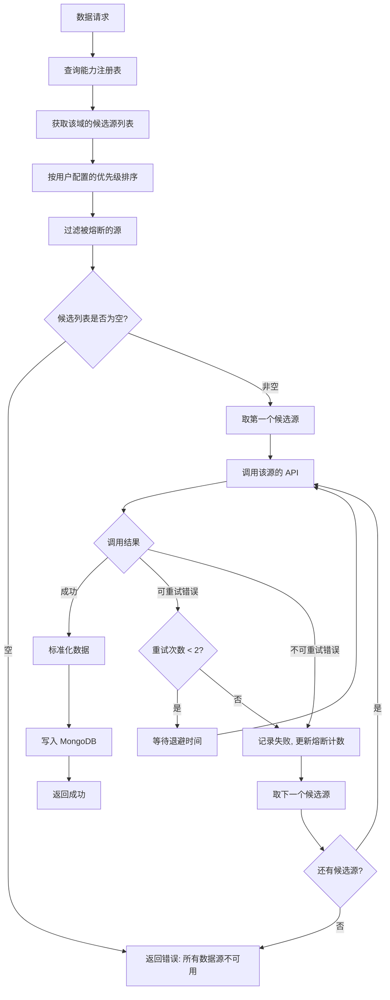
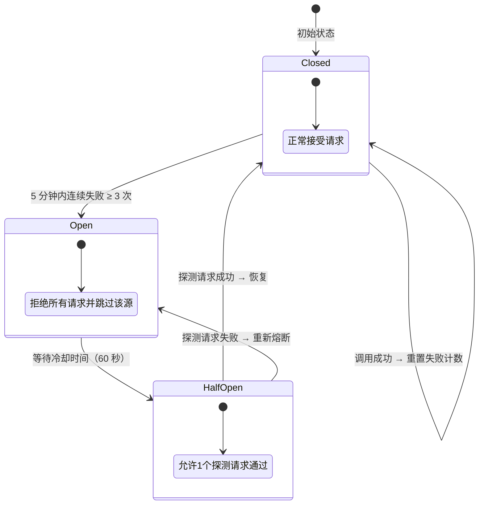
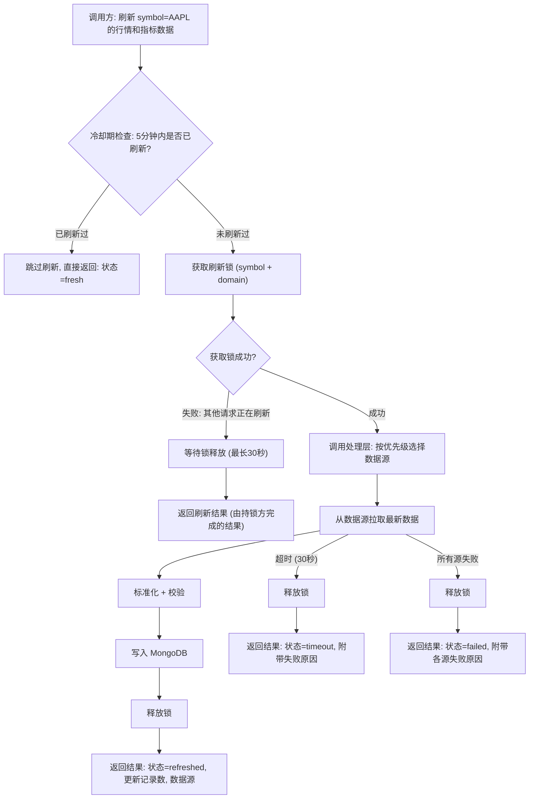
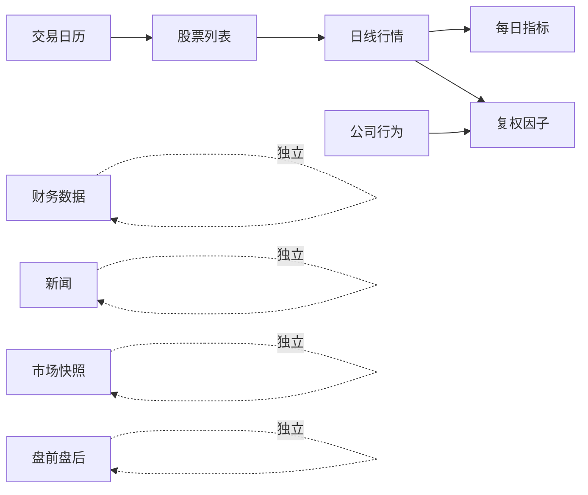

# 美股数据架构设计文档

> **版本**: v1.0
> **日期**: 2026-05-21
> **范围**: 仅限美股普通股（含 ADR），排除 ETF、共同基金、债券、期权、期货、加密货币
> **定位**: 面向实现的数据平台设计，与 A 股、港股共享统一架构

---

## 目录

1. [设计目标与原则](#1-设计目标与原则)
2. [数据源能力矩阵](#2-数据源能力矩阵)
3. [总体架构](#3-总体架构)
4. [数据域划分](#4-数据域划分)
5. [统一存储标准](#5-统一存储标准)
6. [多源选择与回退机制](#6-多源选择与回退机制)
7. [按需刷新机制](#7-按需刷新机制)
8. [自动更新调度](#8-自动更新调度)
9. [用户优先级配置](#9-用户优先级配置)
10. [数据质量保障](#10-数据质量保障)
11. [前端数据管理](#11-前端数据管理)
12. [实施路线图](#12-实施路线图)
13. [附录](#13-附录)

---

## 1. 设计目标与原则

### 1.1 核心目标

构建一套美股数据平台，实现以下能力：

1. 从多个外部数据源拉取美股数据，标准化处理后统一存入 MongoDB，供分析引擎和前端消费
2. 支持按需刷新指定股票的最新数据，满足分析引擎对数据时效性的要求
3. 支持全自动定时增量更新，无需人工干预
4. 多数据源之间具备完整的回退机制，保证数据可用性
5. 用户可在前端配置数据源优先级，系统实时生效
6. 与 A 股、港股共享同一套核心组件（处理层、调度层、存储层），仅在数据源与字段标准化层做市场特化

### 1.2 设计原则

1. **实用优先**: 不引入不需要的抽象层，不为"可能的未来需求"预留过度复杂的设计
2. **统一标准**: 无论数据来自哪个数据源，写入 MongoDB 的字段名称、类型、单位完全一致
3. **读写分离**: 消费方只从 MongoDB 读取标准数据，不直接调用外部数据源 API
4. **接口级回退**: 某个数据源的某个接口失败，只影响该接口的回退,不牵连该数据源的其他接口
5. **幂等写入**: 所有写入操作均为 upsert，同一数据重复写入不产生副作用
6. **增量为主**: 日常同步以增量方式进行，全量同步仅用于初始化和异常修复
7. **跨市场一致**: 与 A 股、港股遵守同一架构契约，仅在 `sources/us/` 与 `schema/markets/us.py` 内做市场化扩展

### 1.3 非目标

1. 分钟级实时行情、Level-2 报价、撮合明细
2. 期权链、期货合约、加密货币、外汇
3. 基本面之外的另类数据（卫星、刷卡、舆情情绪指数等）
4. 经纪商交易、账户持仓、回测引擎
5. ETF、共同基金、SPAC（仅在出现拆并购变更后被动捕获，不主动跟踪）
6. 原始数据存档（Raw 层）— 本项目不需要原始响应回放能力

### 1.4 与 A 股/港股的差异要点

| 维度 | A 股 | 美股 |
|------|------|------|
| 时区 | CST（UTC+8） | ET（UTC-5/-4，含夏令时） |
| 涨跌幅限制 | ±10%/20%/30% | 无限制（仅熔断机制） |
| 交易时段 | 09:30–11:30 / 13:00–15:00 | 09:30–16:00（盘前/盘后另算） |
| 代码格式 | 纯数字 + 交易所后缀 | 字母 ticker + 交易所标识 |
| 公司行为 | 拆股较少、分红常见 | 拆股、并股、特殊分红常见 |
| 财报披露 | 一/三/年 + 半年 | 季报（10-Q）+ 年报（10-K） |
| 复权处理 | 数据源直接提供 | 需基于 dividends + splits 自算或采用数据源调整价 |
| 主流货币 | CNY | USD |

这些差异通过数据源适配器与 `schema/markets/us.py` 内化，**对消费层完全透明**。

---

## 2. 数据源能力矩阵

### 2.1 数据源概览

| 维度 | Tushare US | yfinance | Finnhub | Alpha Vantage |
|------|------------|----------|---------|---------------|
| 性质 | 积分制 / 商业化 | 免费开源（雅虎财经包装） | Freemium（免费层 60 次/分钟） | Freemium（免费 25 次/天） |
| 注册 | 需要 Token；us_basic 需 120 试用 / 5000 正式 | 无需注册 | 需要 API Key | 需要 API Key |
| 稳定性 | 高 | 中（雅虎接口偶有变更） | 高 | 中 |
| 限流 | 200 次 / 分钟 | 无硬限制（建议 1s 间隔） | 60 次/分钟（免费层） | 25 次/天 / 5 次/分钟 |
| 覆盖深度 | 基础信息 + 行情 + 复权 + 财务三表 + 财务指标（**仅覆盖主要美股和中概股**） | 行情 + 基础财务 + 公司行为 | 行情 + 基础信息 + 新闻 + 部分财务 | 财务 + 经济指标深度 |
| 历史深度 | 数十年 | 数十年（视品种而定） | 1 年（免费层） | 20 年 |
| 全市场覆盖 | ❌ 仅主要美股 + 中概股（约 1000–2000 只） | ✅ 全市场 8000+ | ✅ 全市场 | ⚠️ 主要市场 |

### 2.2 各数据域支持情况

| 数据域 | Tushare US | yfinance | Finnhub | Alpha Vantage | 说明 |
|--------|------------|----------|---------|---------------|------|
| 股票列表 | ⚠️ us_basic（仅主要美股 + 中概股） | ⚠️ 需主动维护 universe | ✅ symbol/lookup | ⚠️ LISTING_STATUS | Finnhub 全市场覆盖最优 |
| 交易日历 | ✅ us_tradecal | ⚠️ 通过历史日期反推 | ✅ stock/market-status | ❌ 不支持 | Tushare、Finnhub 直接提供 |
| 日线行情 | ✅ us_daily（全美股） | ✅ 全 | ✅ 全（免费 1 年） | ✅ 全（含调整） | 四源均可覆盖 |
| 复权行情 | ✅ us_daily_adj | ✅ adj_close | ⚠️ 部分 | ✅ TIME_SERIES_DAILY_ADJUSTED | Tushare 提供专用复权接口 |
| 每日指标 | ⚠️ us_daily 含 PE/PB/市值 | ✅ PE/PB/MarketCap 等 | ✅ basic-financials | ⚠️ 部分字段 | 四源互补 |
| 复权因子 | ✅ us_adjfactor | ⚠️ 由 corporate_actions 推导 | ❌ 不支持 | ❌ 不支持 | Tushare 唯一直供 |
| 财务三表 | ✅ 仅主要美股 + 中概股 | ✅ 全市场 income/balance/cashflow | ✅ financials-reported | ✅ INCOME/BALANCE/CASHFLOW | **Tushare 仅覆盖部分股票，全市场仍需 yfinance** |
| 财务指标 | ✅ us_fina_indicator（仅主要美股 + 中概股） | ✅ 全 | ✅ basic-financials/metric | ✅ 全 | 同上覆盖限制 |
| 公司行为 | ❌ 不支持 | ✅ dividends/splits | ⚠️ 仅最新 | ✅ 历史完整 | **Tushare 不支持美股公司行为** |
| 新闻公告 | ❌ 不支持美股新闻 | ⚠️ 仅近期 | ✅ company-news | ⚠️ NEWS_SENTIMENT | **Finnhub 最全** |
| 市场快照 | ⚠️ 部分（需 us_daily 拼接） | ✅ download 批量 | ✅ quote 批量 | ❌ 速率不允许 | yfinance / Finnhub 主用 |
| 盘前盘后行情 | ❌ 不支持 | ⚠️ 部分 | ✅ pre-market/after-hours | ❌ | 仅作为可选增强域 |

> ✅ = 完整支持 &nbsp; ⚠️ = 部分支持 &nbsp; ❌ = 不支持

### 2.3 关键结论

1. **Tushare US 是中概股 / 主要美股的高质量主源**: 数据规范、稳定，对中概股（BABA / JD / PDD 等）和大型美股（FAANG、SP500 主要股票）有完整覆盖；对长尾小盘股、ADR、SPAC 则覆盖不足
2. **yfinance 是默认全市场主源**: 免费、覆盖全市场 8000+ 股票、无需 API Key，是覆盖广度的保底选择
3. **Finnhub 是新闻与盘前盘后主源**: 在新闻、盘前盘后行情、公司基础信息上不可替代
4. **Alpha Vantage 是财务深度备源**: 历史财务数据深度好，但限流严苛，作为兜底使用
5. **公司行为与新闻是 Tushare 的盲区**: 这两个数据域必须固定使用 yfinance / Finnhub
6. **覆盖范围分层策略**: 主要美股 + 中概股优先用 Tushare（数据质量高），其他股票降级到 yfinance / Finnhub
7. **Universe 维护是美股特殊问题**: 通过 Finnhub symbol/lookup + Tushare us_basic + yfinance 三源合并维护
8. **公司行为是美股核心域**: dividends 与 splits 直接影响行情复权，必须独立成域并保持高质量
9. **Tushare 的积分门槛需关注**: 美股基础信息需要 120 积分试用 / 5000 正式权限；未达门槛时降级到其他源
10. **数据源能力必须参数化**: 系统通过能力注册表判断可用性，不硬编码在业务逻辑中

---

## 3. 总体架构

### 3.1 架构总图

```text
┌─────────────────────────────────────────────────────────────────┐
│                        消费层 (Consumer)                         │
│    分析引擎    股票筛选    前端管理页面    数据导出 API            │
└───────────────────────────┬─────────────────────────────────────┘
                            │ 只读查询
                            ▼
┌─────────────────────────────────────────────────────────────────┐
│                      统一读取层 (Reader)                         │
│                                                                 │
│   ┌─────────────┐  ┌──────────────┐  ┌───────────────────┐     │
│   │ 标准数据读取  │  │  新鲜度判定   │  │  异步刷新通知      │     │
│   └──────┬──────┘  └──────┬───────┘  └────────┬──────────┘     │
│          │                │                    │                 │
└──────────┼────────────────┼────────────────────┼─────────────────┘
           │                │                    │
           ▼                │                    ▼
┌──────────────────┐        │         ┌──────────────────────────┐
│                  │        │         │     处理层 (Processor)    │
│     MongoDB      │◄───────┘─────────│                          │
│  （_us 集合族）   │    写入标准数据    │  ┌──────────────────┐   │
│                  │                  │  │    回退路由器     │   │
│  ┌────────────┐  │                  │  │  FallbackRouter  │   │
│  │ 标准业务集合 │  │                  │  └────────┬─────────┘   │
│  ├────────────┤  │                  │           │             │
│  │ 同步元数据  │  │                  │  ┌────────┴─────────┐   │
│  └────────────┘  │                  │  │ 标准化  限流  熔断  │   │
│                  │                  │  │ 校验  去重  写入   │   │
└──────────────────┘                  │  └────────┬─────────┘   │
                                      └───────────┼─────────────┘
                                                  │
                              ┌───────────────┬───┴───────────┬───────────────┐
                              │               │               │               │
                              ▼               ▼               ▼               ▼
                        ┌────────────┐  ┌───────────┐  ┌───────────┐  ┌────────────────┐
                        │ Tushare US │  │ yfinance  │  │  Finnhub  │  │ Alpha Vantage  │
                        │  Provider  │  │  Provider │  │  Provider │  │   Provider     │
                        └─────┬──────┘  └─────┬─────┘  └─────┬─────┘  └────────┬───────┘
                              │               │              │                 │
                              ▼               ▼              ▼                 ▼
                        ┌────────────┐  ┌───────────┐  ┌───────────┐  ┌────────────────┐
                        │  Tushare   │  │   Yahoo   │  │  Finnhub  │  │  AlphaVantage  │
                        │  Pro API   │  │  Finance  │  │   API     │  │      API       │
                        └────────────┘  └───────────┘  └───────────┘  └────────────────┘
```

### 3.2 四层职责

| 层 | 职责 | 禁止行为 |
|----|------|---------|
| **消费层** | 消费标准化数据，生成分析报告、筛选结果、页面展示 | 禁止直接调用外部数据源 API |
| **读取层** | 从 MongoDB 读取标准数据；判定新鲜度；异步通知刷新服务 | 禁止同步调用外部数据源，禁止承担标准化或批量同步逻辑 |
| **处理层** | 数据源选择与回退；字段标准化与校验；限流与熔断；写入 MongoDB | 禁止承担业务分析逻辑 |
| **数据源层** | 封装第三方 API 调用，返回原始数据；管理认证与连接 | 禁止做字段映射或写数据库 |

### 3.3 三条数据流

系统存在三条核心数据流，与 A 股、港股完全一致：

**数据流 A — 定时同步（后台自动）**

```text
调度器定时触发（按 ET 时区换算 → CST/UTC） → 处理层按域编排 → 选择数据源 → 拉取 → 标准化 → 写入 MongoDB → 更新检查点
```

**数据流 B — 内部服务调用刷新（后端编排，核心场景）**

```text
后端服务需要最新数据（如分析前）
  → 调用 DataRefreshService.refresh(symbol, market="US", domains)
  → 处理层: 选择数据源 → 拉取 → 标准化 → 写入 MongoDB
  → 返回刷新结果（成功/失败/部分成功）
  → 后端服务根据结果继续后续逻辑
```

**数据流 C — Reader 过期感知（读取时检测，异步通知）**

```text
消费方请求数据 → Reader 读 MongoDB → 判定新鲜度（按美东时区与 NYSE 日历）
  ├── 新鲜 → 直接返回数据
  └── 过期 → 立即返回当前数据（附带 stale 标记）
           → 同时异步通知刷新服务进行后台更新（非阻塞）
```

**关键约束：**

- Reader 层的读取操作永远不阻塞在外部数据源调用上，调用方立即获得结果
- 过期数据仍然有价值，返回时通过新鲜度标记（fresh / stale）告知消费方数据状态
- 异步通知的刷新任务在独立线程中执行，与读取操作互不干扰
- 同一 symbol + domain 的异步刷新具备去重机制，不会重复触发

### 3.4 Redis 的角色与职责

Redis 作为内存级基础设施，与 MongoDB 形成互补，承担以下职责：

| 职责 | 说明 | 失效策略 |
|------|------|---------|
| **分布式锁** | 按需刷新的并发去重锁（symbol + domain 粒度） | Redis 不可用时降级为进程内存锁（单进程部署）|
| **限流计数器** | 各数据源的请求频率计数（滑动窗口） | Redis 不可用时降级为内存计数（重启后重置） |
| **熔断器状态** | 各数据源 + 数据域的熔断状态与冷却计时 | Redis 不可用时降级为内存状态（多实例无法共享） |
| **刷新冷却标记** | 记录 symbol + domain 的最近刷新时间，实现 5 分钟冷却期 | Redis 不可用时降级为内存标记 |
| **异步刷新队列** | Reader 层异步通知刷新服务时的消息传递 | Redis 不可用时降级为进程内队列 |
| **市场状态缓存** | NYSE 当前是否开市、是否半日、是否假期 | Redis 不可用时直接查询 MongoDB 交易日历 |

---

## 4. 数据域划分

### 4.1 数据域与语义类型

根据数据的业务特征，将美股数据分为四种语义类型，每种类型决定了不同的存储主键、更新策略和新鲜度标准：

| 语义类型 | 数据域 | 存储主键 | 更新策略 | 说明 |
|---------|--------|---------|---------|------|
| **实体数据** | 股票基本信息 | symbol | Upsert 覆盖 | 缓慢变化，如股票名称、行业（GICS）、上市日期 |
| **实体数据** | 交易日历 | exchange + date | Upsert 覆盖 | 每年更新一次，含半日交易日标记 |
| **时序数据** | 日线行情 | symbol + trade_date | Upsert 追加 | 每日产生新记录 |
| **时序数据** | 每日指标 | symbol + trade_date | Upsert 追加 | PE/PB/MarketCap 等，每日产生 |
| **时序数据** | 复权因子 | symbol + trade_date | Upsert 追加 | 由 dividends + splits 推导，每日产生 |
| **时序数据** | 公司行为 | symbol + ex_date + action_type | Upsert 追加 | 分红、拆股事件，按除权日索引 |
| **快照数据** | 财务数据 | symbol + report_period + statement_type | Upsert 覆盖 | 季报/年报，可能被修订 |
| **快照数据** | 市场实时快照 | symbol | 全量覆盖 | 盘中/盘后快照，每 symbol 只保留最新 |
| **事件数据** | 新闻公告 | 去重键（标题+日期哈希） | 追加去重 | 不可变事件，只增不改 |

### 4.2 数据域全景

```text
美股数据域
│
├── 基础信息域
│   ├── 股票基本信息（ticker、name、行业 GICS、市值分级、上市日期、状态）
│   └── 交易日历（NYSE / NASDAQ 共用，含半日交易日）
│
├── 行情域
│   ├── 日线行情（OHLCV + 调整后收盘价）
│   ├── 每日指标（PE、PB、Market Cap、换手率等）
│   ├── 复权因子（基于 corporate_actions 推导）
│   └── 市场实时快照
│
├── 财务域
│   ├── 利润表（income statement）
│   ├── 资产负债表（balance sheet）
│   ├── 现金流量表（cash flow statement）
│   └── 财务指标（ROE、ROA、EPS、Free Cash Flow 等）
│
├── 公司行为域（美股特有，独立成域）
│   ├── 现金分红（cash dividend）
│   ├── 股票拆分（stock split / reverse split）
│   ├── 特殊分红（special dividend）
│   └── 并购/拆分（merger / spinoff，仅记录事件，不参与复权）
│
└── 新闻事件域
    ├── 股票新闻
    └── 公司公告（SEC 8-K 等关键披露）
```

### 4.3 与 A 股/港股的数据域差异

| 数据域 | A 股 | 港股 | 美股 | 说明 |
|--------|------|------|------|------|
| 基本信息 | ✓ | ✓ | ✓ | 三市场通用，字段集略有差异 |
| 交易日历 | ✓ | ✓ | ✓ | 三市场各自维护 |
| 日线行情 | ✓ | ✓ | ✓ | 美股增加 `adj_close` 字段 |
| 每日指标 | ✓ | ✓ | ✓ | 字段表大体一致 |
| 复权因子 | ✓ | ✓ | ✓ | 美股可基于 corporate_actions 推导 |
| 财务三表 | ✓ | ✓ | ✓ | 美股以季报为主 |
| 财务指标 | ✓ | ✓ | ✓ | 字段表大体一致 |
| 市场快照 | ✓ | ✓ | ✓ | 美股增加 `pre_market_*` / `post_market_*` 字段 |
| 新闻 | ✓ | ✓ | ✓ | 三市场通用 |
| 公司行为 | – | – | ✓ | **美股专有的独立域** |

---

## 5. 统一存储标准

### 5.1 集合规划

| 集合名称 | 数据域 | 语义类型 | 说明 |
|---------|--------|---------|------|
| `stock_basic_info_us` | 股票基本信息 | 实体数据 | 美股全市场股票主档 |
| `trade_calendar_us` | 交易日历 | 实体数据 | NYSE/NASDAQ 交易日 |
| `stock_daily_quotes_us` | 日线行情 | 时序数据 | OHLCV + adj_close |
| `stock_daily_indicators_us` | 每日指标 | 时序数据 | PE/PB/MarketCap 等 |
| `stock_adj_factors_us` | 复权因子 | 时序数据 | 前/后复权因子（由公司行为推导） |
| `stock_corporate_actions_us` | 公司行为 | 时序数据 | 分红、拆股事件（**美股新增**） |
| `stock_financial_data_us` | 财务数据 | 快照数据 | 三表 + 财务指标，按季报 / 年报 |
| `market_quotes_us` | 市场快照 | 快照数据 | 每股票最新行情快照（含盘前盘后字段） |
| `stock_news_us` | 新闻公告 | 事件数据 | 股票相关新闻、SEC 公告 |
| `sync_checkpoints` | 同步检查点 | 元数据 | 跨市场共用，文档内含 `market` 字段区分 |
| `sync_events` | 同步事件 | 元数据 | 跨市场共用 |
| `source_health` | 数据源健康 | 元数据 | 跨市场共用 |

> 业务集合采用 `_us` 后缀；元数据集合（`sync_checkpoints` / `sync_events` / `source_health`）由三市场共用，通过 `market` 字段区分。

### 5.2 公共字段规范

每个业务集合的文档必须包含以下公共字段：

| 字段 | 类型 | 说明 | 是否必填 |
|------|------|------|---------|
| symbol | string | 股票 ticker（大写，如 `AAPL`） | 是 |
| market | string | 固定为 `US` | 是 |
| data_source | string | 数据来源编码（`tushare_us` / `yfinance` / `finnhub` / `alpha_vantage`） | 是 |
| updated_at | datetime | 最后更新时间（UTC） | 是 |

### 5.3 各集合主键与索引

| 集合 | 唯一键 | 说明 |
|------|--------|------|
| `stock_basic_info_us` | symbol | 每只股票一条记录，data_source 字段标识当前数据来源 |
| `trade_calendar_us` | exchange + cal_date | 交易所 + 日期 |
| `stock_daily_quotes_us` | symbol + trade_date + period | 日 / 周 / 月线分别存储 |
| `stock_daily_indicators_us` | symbol + trade_date | 每日一条 |
| `stock_adj_factors_us` | symbol + trade_date | 每日一条 |
| `stock_corporate_actions_us` | symbol + ex_date + action_type | 同一日可能多事件（如同时拆股与分红） |
| `stock_financial_data_us` | symbol + report_period + statement_type + report_type | 报告期 + 报表类型 + 报告类型 |
| `market_quotes_us` | symbol | 每只股票仅保留最新快照 |
| `stock_news_us` | content_hash | 内容哈希去重 |
| `sync_checkpoints` | market + domain + source | 三市场共用元数据集合，按市场+域+源建索引 |

**单源写入原则：**

业务集合的唯一键均不包含 `data_source` 字段。系统在任一时刻只有一个活跃数据源在工作，其他数据源仅在回退时才会被使用。具体规则：

- 正常运行时，按优先级使用第一个可用数据源写入数据，`data_source` 字段记录实际来源
- 发生回退时，备用源的数据通过 upsert 直接覆盖原记录，`data_source` 字段更新为新的来源
- 主源恢复后，下次同步会再次覆盖为主源数据
- 消费方无需关心数据来自哪个源，`data_source` 仅用于运维排查和健康监控

**例外 — `sync_checkpoints`：**

检查点表的唯一键包含 source，因为每个数据源的同步进度独立维护。

### 5.4 字段标准化规则

无论数据来自哪个数据源，写入 MongoDB 前必须执行以下标准化：

| 规则 | 说明 |
|------|------|
| 股票代码统一为大写字母 | 去掉前后空格，统一大写，如 `aapl` → `AAPL` |
| Tushare ts_code 处理 | Tushare 美股 ts_code 形式（如 `AAPL.O` 表示 NASDAQ）写入 `symbol` 时去掉交易所后缀，`full_symbol` 字段保留交易所限定形式 |
| 复合 ticker 处理 | `BRK.B` / `BRK-B` 统一为 `BRK.B`（句点形式），`full_symbol` 字段同时维护 `BRK-B` 别名 |
| 日期统一为 `YYYY-MM-DD` | UTC 日期；交易日按 ET 时区归属判定后再转换 |
| 时间戳统一为 UTC | 数据源若返回 ET 时间，转换为 UTC 后存储；前端展示时再换算 |
| 金额单位统一为美元（USD） | 数据源若返回千美元、百万美元，写入前换算到美元 |
| 成交量单位统一为股 | yfinance / Finnhub 通常已是股，直接写入 |
| 百分比保留原值 | 如涨跌幅 `2.35` 表示 `2.35%`，不除以 100 |
| 浮点数精度 | 价格保留 4 位（兼容 micro-cap 低价股），比率保留 4 位，金额保留 2 位 |
| 空值处理 | 数据源返回 NaN / None / 空字符串统一写为 `null` |
| 行业字段统一为 GICS | 数据源返回 SIC / NAICS / Industry Group 时统一映射到 GICS 一级行业 |

### 5.5 stock_basic_info_us 字段

| 字段 | 类型 | 说明 |
|------|------|------|
| symbol | string | 股票 ticker（大写） |
| name | string | 公司全称 |
| full_symbol | string | 带交易所标识（如 `AAPL.NASDAQ`） |
| exchange | string | 主交易所（`NYSE` / `NASDAQ` / `AMEX`） |
| sector | string | GICS 一级行业 |
| industry | string | GICS 二级行业 |
| country | string | 注册地国家 |
| currency | string | 计价货币（通常 `USD`） |
| market_cap_tier | string | 市值分级（`mega` / `large` / `mid` / `small` / `micro` / `nano`） |
| list_status | string | 上市状态（`L` 上市 / `D` 退市 / `S` 暂停） |
| list_date | string | 上市日期 |
| delist_date | string | 退市日期（可为空） |
| isin | string | 国际证券识别码（可为空） |
| cik | string | SEC CIK 编号（可为空） |
| is_adr | boolean | 是否为 ADR |
| home_country | string | ADR 对应的母国家代码（仅 is_adr=true 时有意义） |

### 5.6 stock_daily_quotes_us 字段

| 字段 | 类型 | 说明 |
|------|------|------|
| symbol | string | 股票 ticker |
| trade_date | string | 交易日期（按 ET 归属） |
| period | string | 周期（daily / weekly / monthly） |
| open | float | 开盘价（原始） |
| high | float | 最高价（原始） |
| low | float | 最低价（原始） |
| close | float | 收盘价（原始，未复权） |
| adj_close | float | 调整后收盘价（前复权，含分红与拆股调整） |
| pre_close | float | 昨收价 |
| change | float | 涨跌额（基于 close） |
| pct_chg | float | 涨跌幅（%，基于 close） |
| volume | float | 成交量（股） |
| amount | float | 成交额（USD，可由 close × volume 估算） |

**周线/月线数据的产生方式：**

| period 值 | 数据来源 | 说明 |
|-----------|---------|------|
| daily | 数据源直接提供 | 日线行情，每交易日同步 |
| weekly | 本地聚合 | 由处理层基于日线数据计算：周一开盘价、周内最高/最低价、周五收盘价、周内成交量/额求和 |
| monthly | 本地聚合 | 由处理层基于日线数据计算：月初开盘价、月内最高/最低价、月末收盘价、月内成交量/额求和 |

聚合规则与 A 股一致；对 `adj_close` 字段，周/月线取最后一个交易日的 `adj_close`。

### 5.7 stock_daily_indicators_us 字段

| 字段 | 类型 | 说明 |
|------|------|------|
| symbol | string | 股票 ticker |
| trade_date | string | 交易日期 |
| pe_ttm | float | 市盈率（TTM） |
| pe_forward | float | 前瞻市盈率 |
| pb | float | 市净率 |
| ps_ttm | float | 市销率（TTM） |
| pcf_ttm | float | 市现率（TTM） |
| ev_ebitda | float | EV/EBITDA |
| dividend_yield | float | 股息率（%） |
| beta | float | 相对市场 Beta |
| market_cap | float | 总市值（USD） |
| float_market_cap | float | 流通市值（USD） |
| shares_outstanding | float | 总股本（股） |
| float_shares | float | 流通股本（股） |

### 5.8 stock_corporate_actions_us 字段（美股新增）

| 字段 | 类型 | 说明 |
|------|------|------|
| symbol | string | 股票 ticker |
| ex_date | string | 除权除息日（ET 归属） |
| record_date | string | 登记日（可为空） |
| pay_date | string | 派发日（可为空） |
| action_type | string | 事件类型（`cash_dividend` / `special_dividend` / `stock_split` / `reverse_split` / `merger` / `spinoff`） |
| amount | float | 现金分红金额（USD/股，仅 dividend 类） |
| ratio_from | float | 拆股前股数（仅 split 类） |
| ratio_to | float | 拆股后股数（仅 split 类） |
| currency | string | 分红货币（默认 `USD`） |
| announce_date | string | 公告日期（可为空） |

**说明：**

- 复权因子由处理层基于本表的 `cash_dividend` + `stock_split` 事件推导，写入 `stock_adj_factors_us`
- `merger` / `spinoff` 仅作为事件记录存入，不参与复权计算（用于业务展示与回测对齐）
- `special_dividend` 通常不参与常规复权，但需显式记录供策略使用

### 5.9 stock_financial_data_us 字段

| 字段 | 类型 | 说明 |
|------|------|------|
| symbol | string | 股票 ticker |
| report_period | string | 报告期截止日（如 `2026-03-31`） |
| statement_type | string | 报表类型（`income` / `balance` / `cashflow` / `indicator`） |
| report_type | string | 报告类型（`Q1` / `Q2` / `Q3` / `Q4` / `FY`） |
| fiscal_year | int | 财年（注意美股财年可能跨自然年） |
| fiscal_period | string | 财年内期次（与 report_type 配合） |
| announce_date | string | 公告日期（10-Q / 10-K 提交日期） |
| filing_url | string | SEC EDGAR 链接（可为空） |
| revenue | float | 营业收入（USD） |
| net_income | float | 净利润（USD） |
| total_assets | float | 总资产（USD） |
| total_equity | float | 净资产（USD） |
| roe | float | 净资产收益率（%） |
| roa | float | 总资产收益率（%） |
| gross_margin | float | 毛利率（%） |
| net_margin | float | 净利率（%） |
| debt_to_equity | float | 资产负债率衍生（%） |
| current_ratio | float | 流动比率 |
| eps_basic | float | 基本每股收益（USD） |
| eps_diluted | float | 稀释每股收益（USD） |
| bps | float | 每股净资产（USD） |
| operating_cashflow | float | 经营活动现金流量净额（USD） |
| free_cashflow | float | 自由现金流（USD） |

> 注：`statement_type` 参与唯一键，`report_type` 参与唯一键以区分季报与年报。GAAP / Non-GAAP 字段差异通过适配器映射统一到 GAAP 口径，Non-GAAP 不进入主表（如需可扩展为独立子集合）。

### 5.10 market_quotes_us 字段（含盘前盘后增强）

| 字段 | 类型 | 说明 |
|------|------|------|
| symbol | string | 股票 ticker |
| last_price | float | 最新价（盘中） |
| last_volume | float | 最新成交量 |
| last_updated | datetime | 最新更新时间（UTC） |
| pre_market_price | float | 盘前最新价（可为空） |
| pre_market_change | float | 盘前涨跌额（相对昨收） |
| pre_market_volume | float | 盘前成交量 |
| post_market_price | float | 盘后最新价（可为空） |
| post_market_change | float | 盘后涨跌额（相对收盘） |
| post_market_volume | float | 盘后成交量 |
| session | string | 当前会话（`pre` / `regular` / `post` / `closed`） |

### 5.11 sync_checkpoints 字段（含 market 字段）

| 字段 | 类型 | 说明 |
|------|------|------|
| market | string | 市场（`CN` / `HK` / `US`） |
| domain | string | 数据域（`daily_quotes` / `corporate_actions` / ...） |
| source | string | 数据源编码 |
| last_sync_date | string | 上次成功同步的数据截止日期 |
| last_sync_time | datetime | 上次成功同步的执行时间 |
| status | string | 状态（`success` / `failed` / `running`） |
| record_count | int | 上次同步的记录数 |

唯一键为 `market + domain + source`，三市场共用同一集合。

---

## 6. 多源选择与回退机制

这是本设计的核心章节。解决以下问题：

- 有多个数据源，如何选择？
- 某个接口失败时，如何回退？
- 是整个数据源降级还是单个接口降级？
- 如何防止对故障源的持续请求浪费时间？

### 6.1 能力注册表

系统维护一张能力注册表，记录每个数据源对每个数据域的支持情况。回退路由器的所有决策均基于此表：

| 数据域 | Tushare US | yfinance | Finnhub | Alpha Vantage | 默认优先级（静态基线） |
|--------|------------|----------|---------|---------------|---------------------|
| basic_info | ⚠️ 仅主要美股 + 中概股 | ⚠️ 部分 | ✅ 可用 | ⚠️ 部分 | Finnhub → yfinance → Tushare US → Alpha Vantage |
| trade_calendar | ✅ us_tradecal | ⚠️ 反推 | ✅ 可用 | ❌ 不可用 | Finnhub → Tushare US → yfinance |
| daily_quotes | ✅ 全美股（仅白名单内） | ✅ 全市场 | ✅ 可用（免费 1 年） | ✅ 可用 | yfinance → Tushare US（白名单内） → Finnhub → Alpha Vantage |
| daily_indicators | ⚠️ 部分（含市值/PE/PB） | ✅ 可用 | ✅ 可用 | ⚠️ 部分 | yfinance → Finnhub → Tushare US → Alpha Vantage |
| financial_data | ✅ 仅主要美股 + 中概股 | ✅ 全市场 | ✅ 全市场 | ✅ 全市场 | Tushare US（白名单内）→ yfinance → Finnhub → Alpha Vantage |
| corporate_actions | ❌ 不支持 | ✅ 可用 | ⚠️ 部分 | ✅ 可用 | yfinance → Alpha Vantage → Finnhub |
| adj_factors | ✅ us_adjfactor 直供 | ✅ 推导 | ✅ 推导 | ✅ 推导 | Tushare US（白名单内）→ 本地推导兜底 |
| market_quotes | ⚠️ us_daily 拼接 | ✅ 可用 | ✅ 可用 | ❌ 限流过严 | yfinance → Finnhub |
| news | ❌ 不支持 | ⚠️ 部分 | ✅ 可用 | ⚠️ 部分 | Finnhub → yfinance → Alpha Vantage |
| pre_post_market | ❌ 不支持 | ❌ 不支持 | ✅ 可用 | ❌ 不支持 | Finnhub（唯一源） |

> **设计变更说明**：与 A 股 / 港股不同，美股将 yfinance 作为全市场默认主源，Tushare US 仅在白名单内股票上前置。这是因为 Tushare US 仅覆盖主要美股 + 中概股，全市场覆盖度受限。

此表有两个关键用途：

1. **过滤**: 某个域标记为 ❌ 的数据源，不会出现在该域的候选列表中
2. **排序**: 用户可修改每个域的优先级顺序（参见第 9 章）

**关键能力约束：**

| 数据域 | 约束类型 | 说明 |
|--------|---------|------|
| corporate_actions | 必须使用 yfinance / Alpha Vantage | Tushare 不支持美股公司行为 |
| news | 必须使用 Finnhub | Tushare 不提供美股新闻；yfinance 仅近期 |
| pre_post_market | 必须使用 Finnhub | 唯一可用源 |
| financial_data | 按股票分层选源 | Tushare 优先，但仅主要美股 + 中概股；其他股票自动降级到 yfinance |

**按股票分层的选源策略：**

由于 Tushare US 仅覆盖主要美股 + 中概股（约 1000–2000 只），系统在能力注册表上额外维护一份"Tushare US 覆盖白名单"：

- 启动时通过 us_basic 接口拉取并缓存 Tushare US 支持的 ticker 列表
- 路由器在选源前检查目标 symbol 是否在白名单中
- **在白名单内**: 按上表默认优先级使用 Tushare US 主源
- **不在白名单**: 直接跳过 Tushare US，使用 yfinance / Finnhub
- 白名单每周更新一次（basic_info 同步任务的副产物）

**积分不足处理：**

当美股 Tushare Token 未配置或积分不足（< 120）时，系统在初始化时自动从能力注册表中移除 Tushare US 的所有条目，不参与回退路由。

### 6.1.1 默认优先级与双层模型

美股默认优先级遵循"零配置可用 + 配置后白名单内自动升级"原则：

**双层优先级模型：**

| 层级 | 内容 | 来源 |
|------|------|------|
| 1. 静态默认 | YAML 配置中的基线优先级（按数据质量排序） | `config/default_priorities.yaml` |
| 2. 动态可用性 | 启动时基于 Tushare US Token / 积分 / API Key 检测后的实际可用源列表 | 内存（每 30 秒刷新） |
| 3. Tushare 白名单 | 按 symbol 判断是否在 Tushare US 覆盖范围内 | 内存（每周刷新） |
| 4. 用户覆盖 | 前端拖拽调整保存的优先级 | MongoDB `system_configs` |
| 5. 最终生效 | `用户覆盖 ∩ 实际可用 ∩ 白名单约束` 按 `用户覆盖` 顺序排序 | 内存（每次请求时合成） |

**美股默认优先级矩阵：**

| 数据域 | 静态默认（按质量排序） | 配置 Tushare US 后实际生效（白名单内 / 外） | 零配置实际生效 |
|--------|----------------------|--------------------------------------|---------------|
| basic_info | Finnhub → yfinance → Tushare US → Alpha Vantage | 白名单内: 同左; 白名单外: Finnhub → yfinance → Alpha Vantage | Finnhub → yfinance → Alpha Vantage |
| trade_calendar | Finnhub → Tushare US → yfinance | Finnhub → Tushare US → yfinance | Finnhub → yfinance |
| daily_quotes | yfinance → Tushare US → Finnhub → Alpha Vantage | 白名单内: yfinance → Tushare US → Finnhub → Alpha Vantage; 白名单外: yfinance → Finnhub → Alpha Vantage | yfinance → Finnhub → Alpha Vantage |
| daily_indicators | yfinance → Finnhub → Tushare US → Alpha Vantage | 白名单内: 同左; 白名单外: yfinance → Finnhub → Alpha Vantage | yfinance → Finnhub → Alpha Vantage |
| financial_data | Tushare US → yfinance → Finnhub → Alpha Vantage | 白名单内: Tushare US → yfinance → Finnhub → Alpha Vantage; 白名单外: yfinance → Finnhub → Alpha Vantage | yfinance → Finnhub → Alpha Vantage |
| corporate_actions | yfinance → Alpha Vantage → Finnhub | yfinance → Alpha Vantage → Finnhub | yfinance → Alpha Vantage → Finnhub |
| adj_factors | Tushare US → 本地推导 | 白名单内: Tushare US → 本地推导; 白名单外: 本地推导 | 本地推导（基于 corporate_actions） |
| market_quotes | yfinance → Finnhub | yfinance → Finnhub | yfinance → Finnhub |
| news | Finnhub → yfinance → Alpha Vantage | Finnhub → yfinance → Alpha Vantage | Finnhub → yfinance → Alpha Vantage |
| pre_post_market | Finnhub | Finnhub | Finnhub |

**关键设计原则：**

1. **零配置可用**：未配置任何 Token / API Key 时，系统自动剔除 Tushare US / Finnhub / Alpha Vantage 中无凭据的源，仅依赖 yfinance 即可完整运行（除 news / pre_post_market 等少数域）
2. **yfinance 默认主源**：与 A 股 / 港股不同，美股 yfinance 是全市场默认主源，因为 Tushare US 仅覆盖白名单内股票
3. **白名单分层**：Tushare US 仅在白名单内股票上前置为主源，白名单外自动跳过（见 6.1 节"按股票分层选源策略"）
4. **域级差异化**：corporate_actions / news / pre_post_market 不依赖 Tushare US（不支持），无论是否配置 Token 都不变
5. **Finnhub 为新闻 / 实时 / 基础信息核心**：Finnhub 在 basic_info / news / pre_post_market 上是唯一或主要可用源，建议用户优先配置其 API Key

### 6.2 回退粒度：接口级回退

**核心原则：回退是按数据域（接口）级别进行的，不是整个数据源级别的。**

```text
示例场景：
  yfinance 的 daily_quotes 接口返回 429（雅虎反爬）

  ✅ 正确行为：daily_quotes 回退到 Finnhub，其他域继续使用 yfinance
  ❌ 错误行为：整个 yfinance 标记为不可用，所有域都切换到 Finnhub
```

这意味着：

- 每个数据域独立维护自己的回退状态
- 熔断器的粒度是 **数据源 + 数据域** 的组合，而不是整个数据源
- 例如 yfinance 的 `daily_quotes` 熔断了，不影响 yfinance 的 `corporate_actions`

### 6.3 数据源选择流程

每次数据请求（无论定时同步还是按需刷新）都经过以下选择流程：



### 6.4 重试 vs 降级的判定

并非所有错误都需要切换数据源。系统将错误分为两类：

**可重试错误 — 在同一数据源上重试（最多 2 次，指数退避）**

| 错误类型 | 退避策略 | 说明 |
|---------|---------|------|
| HTTP 429 限流 | 第 1 次等 5 秒，第 2 次等 30 秒 | 美股数据源限流窗口通常较长 |
| 网络超时 | 第 1 次等 5 秒，第 2 次等 15 秒 | 跨境网络抖动，需要更长等待 |
| 连接断开 | 第 1 次等 2 秒，第 2 次等 5 秒 | 短暂连接问题 |

**不可重试错误 — 立即切换到下一个数据源**

| 错误类型 | 处理 | 说明 |
|---------|------|------|
| HTTP 401/403 权限不足 | 立即降级 | API Key 失效或额度耗尽 |
| HTTP 500 服务器错误 | 立即降级 | 数据源内部故障 |
| 数据格式异常 | 立即降级 | 返回数据无法解析（如 yfinance 返回空 DataFrame） |
| 空结果（应有数据） | 立即降级 | 数据源数据缺失 |
| Symbol 不存在 | 不降级，直接返回错误 | 该 ticker 已退市或拼写错误，无需尝试其他源 |
| Tushare Symbol 不在白名单 | 不报错，直接跳过该源 | 长尾股票 / 小盘股不在 Tushare 覆盖范围内属正常情况 |
| Tushare 积分不足 | 立即降级，标记长冷却 | 报文中含 "积分不足" / "权限不足" 时由 Tushare Adapter 抛 InsufficientCreditsError，路由器降级并将该源熔断 24 小时 |
| Tushare Token 失效 | 立即降级，禁用源 | 401 / Token 过期时，将 Tushare US 全市场所有域标记为 `unavailable_token`，需用户更新 Token |

### 6.5 熔断器

防止系统对已故障的数据源持续发送请求，浪费时间和配额。

**熔断器作用于「数据源 + 数据域」的组合**，例如 `yfinance + daily_quotes` 是一个独立的熔断器实例。



**熔断参数：**

| 参数 | 值 | 说明 |
|------|-----|------|
| 失败阈值 | 3 次 | 在窗口期内连续失败 3 次触发熔断 |
| 窗口期 | 5 分钟 | 失败计数的滑动窗口 |
| 初始冷却时间 | 60 秒 | 第一次熔断后的等待时间 |
| 最大冷却时间 | 1800 秒 | 美股数据源恢复较慢，上限设大些 |
| 探测请求数 | 1 次 | 半开状态只允许 1 个请求通过 |

**阶梯式冷却策略：**

| 熔断次数 | 冷却时间 | 场景 |
|---------|---------|------|
| 第 1 次 | 60 秒 | 短暂故障，快速恢复 |
| 第 2 次 | 180 秒 | 故障持续，延长等待 |
| 第 3 次 | 600 秒 | 较严重故障 |
| 第 4 次及以上 | 1800 秒 | 长时间故障，低频探测（如 API Key 配额耗尽） |

冷却时间在以下情况重置为初始值：

- 探测请求成功（Half-Open → Closed）
- 熔断器连续处于 Closed 状态超过 30 分钟（说明已稳定恢复）

**按错误类型差异化冷却：**

| 错误类型 | 冷却倍数 | 理由 |
|---------|---------|------|
| 限流（429） | ×2 | 限流窗口通常较长 |
| 权限错误（401/403） | ×10 | 通常意味着 API Key / 额度问题，需人工介入 |
| 网络/超时 | ×1 | 网络问题恢复较快 |
| 服务器错误（500） | ×1.5 | 服务端问题，适度延长 |

### 6.6 回退记录与通知

每次发生回退时，系统执行以下操作：

1. **写入 sync_events 集合**: 记录回退事件（市场、域、从哪个源降级到哪个源、原因、时间）
2. **日志记录**: 输出 WARNING 级别日志
3. **前端通知**: 通过 SSE 向前端推送降级通知（如果有活跃连接）
4. **健康统计更新**: 更新 `source_health` 集合中该源+域的失败计数和成功率

### 6.7 所有源都失败的兜底策略

当某个数据域的所有候选源都失败时：

| 场景 | 处理 |
|------|------|
| **定时同步中** | 记录同步失败事件，保留上次成功的数据不变，下次调度时重试 |
| **按需刷新中** | 返回 MongoDB 中已有的旧数据，附带新鲜度状态标记 `stale`，前端展示"数据可能过期"提示 |
| **首次获取（无旧数据）** | 返回明确的"数据不可用"错误，附带所有源的失败原因 |

---

## 7. 按需刷新机制

### 7.1 设计场景

按需刷新解决的核心问题：**后端服务在执行业务逻辑前，需要确保指定股票的数据是最新的。**

典型场景：

```text
用户点击"分析 AAPL"
  → 后端分析服务启动
  → 分析服务调用数据刷新服务: "确保 AAPL 的数据是最新的"
  → 数据刷新服务从数据源拉取最新数据 → 标准化 → 写入 MongoDB
  → 刷新完成，返回结果（成功/失败/部分成功）
  → 分析服务根据刷新结果继续执行分析逻辑
  → 分析服务从 MongoDB 读取最新数据进行分析
```

**关键特征：这是一个后端内部的同步调用，调用方等待刷新完成后再执行后续逻辑。与前端无关。**

### 7.2 三种调用方式

| 调用方式 | 调用者 | 行为 | 使用场景 |
|---------|--------|------|---------|
| **内部服务调用** | 分析引擎、筛选服务等后端模块 | 同步阻塞，调用方等待刷新完成后继续执行 | 分析前确保数据最新 |
| **Reader 异步通知** | Reader 读取层（内部） | 读取数据时发现过期，异步通知刷新服务后台执行，读取本身立即返回当前数据 | 后台静默更新，不阻塞读取 |
| **HTTP API** | 前端管理页面、运维脚本 | `POST /api/us/data/refresh/{symbol}`，返回刷新结果 | 管理员手动刷新 |

**三种方式共享同一套底层刷新逻辑**（数据源选择、回退、限流、熔断），行为完全一致。

### 7.3 内部服务调用流程（核心）



**调用方拿到刷新结果后自行决定后续行为：**

| 刷新结果状态 | 含义 | 调用方典型处理 |
|------------|------|-------------|
| `fresh` | 数据已经是新鲜的，无需刷新 | 直接继续后续逻辑 |
| `refreshed` | 刷新成功，数据已更新 | 直接继续后续逻辑 |
| `partial` | 部分域刷新成功，部分失败 | 根据业务决定是否继续 |
| `timeout` | 刷新超时 | 可选择用旧数据继续，或放弃 |
| `failed` | 全部失败 | 可选择用旧数据继续，或返回错误 |

**关键原则：数据刷新服务只负责刷新数据并返回结果，不决定调用方的后续行为。**

### 7.4 调用编排示例

```text
分析服务收到请求: 分析股票 AAPL
│
├── 步骤 1: 调用 DataRefreshService.refresh("AAPL", market="US",
│              domains=["daily_quotes", "daily_indicators",
│                      "financial_data", "corporate_actions"])
│   │
│   ├── 刷新服务内部: 并行刷新四个域
│   │   ├── daily_quotes: yfinance 拉取 → 标准化 → 写入 MongoDB ✅
│   │   ├── daily_indicators: yfinance 拉取 → 标准化 → 写入 MongoDB ✅
│   │   ├── financial_data: yfinance 拉取 → 标准化 → 写入 MongoDB ✅
│   │   └── corporate_actions: yfinance 拉取 → 标准化 → 写入 MongoDB ✅
│   │
│   ├── 后处理: 基于 corporate_actions 重新计算 stock_adj_factors_us 与 daily_quotes.adj_close
│   │
│   └── 返回结果: { status: "refreshed", domains: { ... } }
│
├── 步骤 2: 分析服务检查刷新结果 → 全部成功
├── 步骤 3: 分析服务从 Reader 读取最新数据
└── 步骤 4: 执行分析逻辑，生成报告
```

### 7.5 刷新参数

| 参数 | 是否必填 | 说明 |
|------|---------|------|
| symbol | 是 | 股票 ticker |
| market | 否 | 默认按 ticker 自动判定，可显式指定 `US` |
| domains | 否 | 要刷新的数据域列表，不指定则刷新所有域 |
| force | 否 | 是否强制刷新（忽略冷却期），默认否 |
| timeout | 否 | 超时时间（秒），默认 30 秒 |

### 7.6 新鲜度判定

Reader 异步通知模式下，需要判定数据是否过期来决定是否通知刷新服务。每个数据域有不同的新鲜度要求（**所有时间均按美东时间 ET 判定，由 Reader 内部转换**）：

| 数据域 | 新鲜度标准 | 说明 |
|--------|-----------|------|
| daily_quotes | 交易日 16:30 ET 后，必须有当日数据 | 收盘后 30 分钟内应可用 |
| daily_indicators | 交易日 17:30 ET 后，必须有当日数据 | 通常比行情晚一点 |
| basic_info | 最近 24 小时内有更新 | 变化不频繁 |
| financial_data | 最近 7 天内有更新 | 财报季可缩短至 1 天 |
| corporate_actions | 最近 24 小时内有更新 | 关键域，要求高 |
| news | 最近 30 分钟内有更新 | 美股新闻时效性高 |
| market_quotes | 最近 5 分钟内有更新 | 盘中快照 |
| pre_post_market | 盘前/盘后窗口内 5 分钟内有更新 | 仅在对应时段判定 |

**非交易日处理**: 周末和 NYSE 假期不需要新的行情数据，新鲜度判定自动跳过。Reader 通过查询 `trade_calendar_us` 判定。

**半日交易日处理**: 提前收市日（如感恩节次日，13:00 ET 收盘）的新鲜度标准前移 3 小时。

### 7.7 防并发重复刷新

如果多个请求同时需要刷新同一只股票的同一个数据域，系统只执行一次刷新：

- 使用内存锁（单进程）或 Redis 锁（多进程），锁的粒度为 **market + symbol + domain**
- 第一个请求获取锁并执行刷新
- 后续请求等待锁释放后，直接获取第一个请求的刷新结果
- 锁的最大等待时间为 30 秒，超时后返回超时状态

### 7.8 限流保护

防止大量按需刷新请求冲击数据源：

| 保护策略 | 规则 |
|---------|------|
| 同股票冷却 | 同一 symbol + domain 的刷新请求，5 分钟内最多执行 1 次（force=true 可绕过） |
| 全局并发上限 | 同时进行的按需刷新不超过 10 个 |
| 单源频率上限 | 遵守各数据源的限流规则（Finnhub 60/分钟、Alpha Vantage 5/分钟 25/天） |
| Alpha Vantage 兜底 | Alpha Vantage 的免费额度极小，仅在前两源全失败时使用，并记录调用配额计数 |

---

## 8. 自动更新调度

### 8.1 时区处理

美股以美东时间（ET）开市与收市，但服务器统一以 UTC / CST 调度，所以所有调度配置内部记录 ET 时间，调度引擎在运行时换算到当地时区：

| ET 时间 | UTC（夏令时） | UTC（冬令时） | CST（北京时间） |
|---------|--------------|--------------|----------------|
| 09:30（开盘） | 13:30 | 14:30 | 21:30 / 22:30 |
| 16:00（收盘） | 20:00 | 21:00 | 04:00 / 05:00 次日 |
| 17:00（财务披露窗口） | 21:00 | 22:00 | 05:00 / 06:00 次日 |

调度配置只声明 ET 时间，调度引擎自动按当年 DST 规则换算。

### 8.2 调度频率

| 数据域 | 调度时间（ET） | 调度方式 | 主源 | 说明 |
|--------|---------------|---------|------|------|
| trade_calendar | 每日 00:00 | 全量 | Tushare US | 先于其他所有同步；Tushare 不可用时降级 Finnhub |
| basic_info | 每日 06:00 | 全量 | Finnhub | 全市场覆盖优先；Tushare US 用于补全中概股字段 |
| tushare_universe | 每周一 06:30 | 全量 | Tushare US | 维护"Tushare 覆盖白名单"，供路由器使用 |
| corporate_actions | 每日 18:00 | 增量 | yfinance | **Tushare 不支持**，必须用 yfinance / Alpha Vantage |
| daily_quotes | 每交易日 16:30 | 增量 | Tushare US（白名单内）/ yfinance（其他） | 收盘后 30 分钟内 |
| daily_indicators | 每交易日 17:30 | 增量 | yfinance | 依赖行情数据就绪 |
| adj_factors | 每交易日 18:30 | 增量 / 后处理 | Tushare US（白名单内）/ 本地推导（其他） | Tushare 直接提供，其他股票从 corporate_actions 推导 |
| financial_data | 每日 21:00 | 增量 | Tushare US（白名单内）/ yfinance（其他） | 财报季（1/4/7/10 月）密集披露 |
| market_quotes | 每交易日 16:01 | 全量 | yfinance | 收盘快照 |
| pre_post_market | 盘前 04:00–09:30 / 盘后 16:00–20:00 | 5 分钟一次 | Finnhub | 仅在对应时段触发 |
| news | 每 1 小时 | 增量 | Finnhub | **Tushare 不支持** |

### 8.3 调度依赖链

部分数据域之间存在依赖关系，必须按顺序执行：



**说明：**

- 交易日历必须先完成，后续域才能知道今天是否交易日
- 股票列表必须先完成，后续域才能知道要同步哪些股票
- 日线行情完成后才同步每日指标
- 复权因子需要日线行情 + 公司行为同时就绪后才计算
- 财务数据、新闻、市场快照、盘前盘后与上述链路无依赖，可并行

### 8.4 增量同步机制

增量同步通过检查点（sync_checkpoints）实现：

```text
增量同步流程：
  1. 读取该域的检查点（market=US + domain + source），获取上次同步截止日期
  2. 计算本次需要同步的日期范围（含夏令时换算）
  3. 从数据源拉取该范围的数据
  4. 标准化并 upsert 到 MongoDB
  5. 更新检查点为本次同步截止日期
```

**检查点推进规则**：只有在本次同步成功完成后才推进检查点。

**分批同步与检查点一致性保护：**

| 策略 | 说明 |
|------|------|
| 按日期分批 | 多日增量数据时，逐日拉取并写入，每日完成后推进检查点到该日 |
| 按股票分批 | 全市场约 6000-8000 只股票，按批次（每 200 只）写入 |
| 原子性保证 | 单批次内的 upsert 作为一个逻辑单元，全部成功后才记录该批次完成 |
| Universe 维护 | basic_info 同步时主动维护股票宇宙列表，新增股票纳入后续行情同步 |

**异常恢复机制：**

| 异常场景 | 恢复策略 |
|---------|---------|
| 进程异常退出 | 下次启动时从检查点恢复，重复拉取可能已写入的数据（upsert 幂等） |
| 部分批次成功、部分失败 | 检查点停留在最后一个完整成功日期，下次同步从该日期后重新开始 |
| 检查点与实际数据不一致 | 每日完整性检查发现缺口后，回退检查点到缺口起始日期 |
| API Key 配额耗尽 | 当日剩余调用切换到其他源；下日自动恢复主源 |

### 8.5 全量同步

全量同步用于以下场景：

| 场景 | 触发方式 |
|------|---------|
| 系统初始化 | 管理员手动触发 |
| 数据异常修复 | 管理员手动触发 |
| 新增数据源 | 管理员手动触发 |
| 股票列表和交易日历 | 定时调度（这两个域每次都是全量） |

全量同步会拉取完整历史数据。对于美股，受 Finnhub 免费层 1 年历史限制，全量同步主要使用 yfinance 与 Alpha Vantage。

### 8.6 限流策略

| 数据源 | 限流规则 | 调度器行为 |
|--------|---------|-----------|
| Tushare US | 200 次 / 分钟（账户级；按 Token 哈希聚合配额，独立 Token 时三市场互不影响） | 批次间隔 0.3 秒，大批量时自动降速 |
| yfinance | 无硬限制（建议 1 秒间隔） | 批次间隔 1 秒（礼貌间隔） |
| Finnhub（免费） | 60 次/分钟 | 批次间隔 1.1 秒 |
| Alpha Vantage（免费） | 5 次/分钟 + 25 次/天 | 批次间隔 12 秒，并维护当日调用计数 |

调度器在每次发起请求前检查限流计数器，达到上限自动等待或切换源。

### 8.7 非交易日处理

- 行情类数据（daily_quotes、daily_indicators、market_quotes、adj_factors）在非交易日**跳过同步**
- 基础信息、财务数据、新闻、公司行为在非交易日**正常同步**（公司行为可能在周末公告）
- 半日交易日（如感恩节次日）的同步时间按提前收市自动调整
- 交易日判断通过查询 `trade_calendar_us` 集合实现

### 8.8 同步任务监控

每个同步任务执行时，向 `sync_events` 集合写入事件记录：

| 事件类型 | 时机 | 记录内容 |
|---------|------|---------|
| SYNC_START | 任务开始 | 市场、域、源、时间范围、任务 ID |
| SYNC_SUCCESS | 任务成功 | 市场、域、源、记录数、耗时 |
| SYNC_FAILED | 任务失败 | 市场、域、源、错误原因、重试次数 |
| SOURCE_FALLBACK | 发生回退 | 从哪个源降级到哪个源、原因 |
| CIRCUIT_OPEN | 熔断器打开 | 源、域、触发原因 |
| CIRCUIT_CLOSE | 熔断器恢复 | 源、域 |
| QUOTA_EXHAUSTED | API Key 配额耗尽 | 源、当日已用次数、剩余次数 |
| TUSHARE_CREDITS_LOW | Tushare 积分预警 | 当前积分、所需积分、影响域 |
| TUSHARE_TOKEN_INVALID | Tushare Token 失效 | 失效时间、影响域列表 |
| TUSHARE_UNIVERSE_REFRESHED | Tushare 覆盖白名单刷新 | 新增 / 移除的 ticker 列表、当前白名单大小 |

---

## 9. 用户优先级配置

### 9.1 可配置项

| 配置项 | 粒度 | 默认值 | 说明 |
|--------|------|--------|------|
| 数据源启用/禁用 | 按市场 × 数据源 | 全部启用（已配置凭据的） | 用户可彻底禁用某个数据源 |
| 数据域优先级 | 按市场 × 数据域 × 数据源 | 见 6.1.1 节 | 用户可拖拽调整每个域内各源的顺序 |
| 数据域级源屏蔽 | 按市场 × 数据域 × 数据源 | 全部启用 | 用户可在某个域上**单独禁用**某个源（不影响该源在其他域的使用） |
| Tushare US Token | **美股专属** | 空 | **与 A 股 / 港股 Token 完全独立**；未配置则自动禁用 Tushare US |
| Tushare US 积分门槛 | 全局 | 自动检测 | 启动时调用 us_basic 试探，未达 120 积分时自动从能力注册表移除 Tushare US 条目 |
| Tushare 覆盖白名单 | 全局 | 自动维护 | 每周一 06:30 ET 由调度器自动从 us_basic 拉取并缓存 |
| Finnhub API Key | 全局 | 空 | 未配置则自动禁用 Finnhub |
| Alpha Vantage API Key | 全局 | 空 | 未配置则自动禁用 Alpha Vantage |
| 自动同步开关 | 按数据域 | 全部开启 | 用户可关闭某个域的自动同步 |
| 同步时间 | 按数据域 | 见调度频率表（ET） | 高级用户可调整同步时间（仍以 ET 为基准） |
| 盘前盘后跟踪 | 全局 | 关闭 | 默认关闭以节省调用次数 |
| Universe 范围 | 全局 | S&P 500 + Nasdaq 100 | 高级用户可扩展到全市场 |

### 9.1.1 Tushare Token 按市场独立

**核心约定**：Tushare 在三市场（A 股 / 港股 / 美股）的 Token **完全独立配置**，互不影响：

| 市场 | Token 配置项 | 环境变量 | 说明 |
|------|-------------|---------|------|
| A 股 | `tushare_cn_token` | `TUSHARE_CN_TOKEN` | A 股 Tushare 数据访问 Token |
| 港股 | `tushare_hk_token` | `TUSHARE_HK_TOKEN` | 港股 Tushare 数据访问 Token |
| **美股** | **`tushare_us_token`** | **`TUSHARE_US_TOKEN`** | **美股 Tushare 数据访问 Token** |

**典型用户场景：**

| 场景 | A 股 Token | 港股 Token | 美股 Token | 实际效果 |
|------|-----------|-----------|-----------|---------|
| 完全免费用户 | 空 | 空 | 空 | 三市场均使用免费源（AKShare / yfinance / 等） |
| 仅 A 股付费 | 已配置 | 空 | 空 | A 股用 Tushare 主，港股 / 美股用免费源 |
| A 股 + 美股付费 | 已配置 | 空 | 已配置 | A 股 / 美股（白名单内）用 Tushare 主，港股用免费源 |
| 三市场各自付费 | Token A | Token B | Token C | 三市场独立 Token，配额独立 |
| 三市场共用同一 Token | 同一 Token | 同一 Token | 同一 Token | 配额共享（在 `RateLimiter` 中按 Token 哈希聚合） |

**积分检测：**

- 系统启动时**分别**调用 `us_basic` 试探美股 Tushare 的积分情况
- 美股积分检测失败 / Token 失效**不会**影响 A 股 / 港股 Tushare 的可用性
- 美股积分情况显示在前端的"美股 Tushare 配置"区块

**限流配额隔离：**

- 默认情况下：每个市场的 Tushare 配额**独立计算**（即使是同一个 Token，也各自维护计数器）
- 检测到三市场使用同一 Token 时：`RateLimiter` 自动按 Token 哈希聚合配额（200 次 / 分钟为账户级共享上限），避免超限
- 检测方式：启动时对比三市场的 Token 字符串

### 9.1.2 用户自定义优先级（详细行为）

**用户可执行的自定义操作：**

| 操作 | 粒度 | 行为 |
|------|------|------|
| 整体禁用源 | 按市场 × 源 | 该源在所有域都不参与回退路由 |
| 单域禁用源 | 按市场 × 域 × 源 | 该源仅在指定域不参与回退路由，其他域仍可用 |
| 调整顺序 | 按市场 × 域 | 拖拽改变各源在该域的优先级 |
| 强制单源 | 按市场 × 域 | 仅保留 1 个源，禁用回退（高级用法，慎用） |

**实时生效机制：**

```text
用户在前端调整优先级 → 立即写入 system_configs（保存按钮）
  → 处理层每 30 秒刷新内存缓存
  → 下次请求即按新配置选源
  → 不需要重启服务、不影响正在执行的同步任务
```

**用户配置与能力注册表的合成规则：**

```text
最终优先级 = 静态默认 → 应用动态可用性过滤（凭据 / 积分 / 熔断 / Tushare 白名单）→ 应用用户覆盖

例：用户配置 daily_quotes = [yfinance, Tushare US]（移除了 Finnhub 与 Alpha Vantage）
    动态可用性 = {Tushare US: 可用, yfinance: 可用, Finnhub: 可用, Alpha Vantage: 可用}
    Symbol = AAPL（在 Tushare US 白名单内）

最终生效顺序：[yfinance, Tushare US]
（用户主动移除了 Finnhub 与 Alpha Vantage，即使可用也不会使用）

例 2：同上配置，但 symbol = LCID（不在 Tushare US 白名单内）
最终生效顺序：[yfinance]（Tushare US 因白名单被自动跳过）
```

**安全约束（防误配置）：**

| 约束 | 说明 |
|------|------|
| 至少保留 1 个源 | 用户禁用所有源时，前端拒绝保存并提示 |
| 唯一源域不可禁用主源 | pre_post_market 的 Finnhub 不可被禁用（前端置灰） |
| 不可启用未支持的源 | 能力矩阵 ❌ 的源不会出现在用户可选列表中 |
| 配置错误回滚 | 保存后首次请求失败 ≥ 3 次时自动回滚到上一版配置 |

### 9.2 配置存储

用户配置存储在 MongoDB 的 `system_configs` 集合中，格式与 A 股、港股共用：

| 字段 | 说明 |
|------|------|
| config_type | 配置类型（`data_source_priority`） |
| market | 市场（固定 `US`） |
| domain | 数据域 |
| sources | 按优先级排序的数据源列表 |
| updated_by | 更新人 |
| updated_at | 更新时间 |

### 9.3 配置生效机制

```text
用户在前端修改优先级
  → 写入 system_configs 集合
  → 处理层在每次请求时读取最新配置（带内存缓存，TTL 30 秒）
  → 下一次数据请求即按新优先级执行
  → 不需要重启服务
```

### 9.4 前端配置界面

```text
┌─────────────────────────────────────────┐
│  美股数据源优先级配置                      │
│                                         │
│  ┌─ 日线行情 ───────────────────────┐    │
│  │  1. ☰ Tushare US（仅白名单内） [已启用] │
│  │  2. ☰ yfinance              [已启用] │
│  │  3. ☰ Finnhub               [已启用] │
│  │  4. ☰ Alpha Vantage         [已启用] │
│  └───────────────────────────────┘      │
│                                         │
│  ┌─ 财务数据 ───────────────────────┐    │
│  │  1. ☰ Tushare US（仅白名单内） [已启用] │
│  │  2. ☰ yfinance              [已启用] │
│  │  3. ☰ Finnhub               [已启用] │
│  │  4. ☰ Alpha Vantage         [已启用] │
│  └───────────────────────────────┘      │
│                                         │
│  ┌─ 公司行为 ───────────────────────┐    │
│  │  1. ☰ yfinance              [已启用] │
│  │  2. ☰ Alpha Vantage         [已启用] │
│  │  3. ☰ Finnhub               [部分支持] │
│  │     Tushare US              [不支持] │
│  └───────────────────────────────┘      │
│                                         │
│  ┌─ Tushare US 配置（独立 Token）─┐     │
│  │  Token: ●●●●●●●●●● (已配置)      │    │
│  │  此 Token 仅用于美股，与 A 股 /    │    │
│  │  港股 Token 完全独立              │    │
│  │  当前积分: 5000 / 最低门槛: 120   │    │
│  │  覆盖白名单: 1683 只（更新于 2 天前）│
│  │  状态: ✓ Tushare US 在白名单内启用 │    │
│  │  [测试连接]  [刷新白名单]          │    │
│  │  [清除 Token]                    │    │
│  └───────────────────────────────┘      │
│                                         │
│  ┌─ Universe 设置 ──────────────────┐   │
│  │  ○ S&P 500 + Nasdaq 100          │    │
│  │  ● 罗素 3000                     │    │
│  │  ○ 全市场（约 8000 只）            │   │
│  └───────────────────────────────┘      │
│                                         │
│  [保存配置]                              │
└─────────────────────────────────────────┘
```

---

## 10. 数据质量保障

### 10.1 写入前校验

| 校验项 | 规则 | 处理 |
|--------|------|------|
| 必填字段 | symbol、trade_date（行情）等必须非空 | 拒绝写入，记录错误 |
| 数据类型 | 价格必须为正数，成交量必须 ≥ 0 | 拒绝该条记录 |
| 日期合法性 | trade_date 必须在合理范围内（1970 至今） | 拒绝该条记录 |
| 大幅波动 | 单日涨跌幅 > 50% 标记可疑（合理但需告警） | 标记为可疑，仍写入但记录告警 |
| 价格异常 | 价格 < $0.01 或 > $1,000,000 标记可疑 | 标记为可疑，仍写入但记录告警 |
| 拆股一致性 | 当日有 split 事件时，前后价格比例应匹配 | 不匹配时记录告警，不阻止写入 |
| 重复检测 | 同一自然键的数据不重复写入 | 通过 upsert 机制自动处理 |
| Ticker 大小写 | 一律强制大写 | 写入前自动转换 |

### 10.2 完整性检查

| 检查项 | 频率 | 说明 |
|--------|------|------|
| 行情日期连续性 | 每日 | 检查是否有交易日缺少行情数据 |
| Universe 覆盖率 | 每日 | 检查当日行情覆盖了 universe 的多少比例 |
| 公司行为对账 | 每周 | 在多源中比较 dividends / splits 的差异 |
| 财报字段完整性 | 季度 | 财报季后检查关键字段是否齐全 |
| 复权因子单调性 | 每日 | 复权因子序列应单调（拆股事件后阶跃下降） |
| 检查点一致性 | 每日 | 检查点日期与实际数据是否一致 |

### 10.3 新鲜度监控

在 `source_health` 集合中维护每个数据源 + 数据域 + 市场的健康统计：

| 指标 | 说明 |
|------|------|
| 最近 1 小时成功率 | 最近 1 小时内调用成功的比例 |
| 最近 1 小时平均延迟 | 美股跨境调用延迟通常在 500–2000ms |
| 熔断器当前状态 | Closed / Open / HalfOpen |
| 最后成功时间 | 最近一次成功调用的时间 |
| 连续失败次数 | 当前连续失败的次数 |
| 当日 API 配额使用率 | 仅适用于 Finnhub、Alpha Vantage |

---

## 11. 前端数据管理

### 11.1 页面结构

```text
美股数据管理
│
├── 总览看板
│   ├── 各数据域最新同步时间与状态（含 ET / 本地双时区显示）
│   ├── 各数据源健康状态（成功率、延迟、熔断状态、配额使用率）
│   ├── Universe 覆盖率统计
│   └── 失败任务告警
│
├── 同步管理
│   ├── 当前运行中的同步任务
│   ├── 历史同步记录（可筛选域、源、状态）
│   ├── 手动触发全量/增量同步
│   └── 回退事件时间线
│
├── 数据源配置
│   ├── 数据源启用/禁用
│   ├── 各域优先级排序（拖拽）
│   ├── Finnhub / Alpha Vantage API Key 配置
│   ├── 同步时间调整（以 ET 为基准）
│   └── Universe 范围设置
│
├── 股票数据查看
│   ├── 按 ticker 查看各域数据
│   ├── 数据来源标识
│   ├── 新鲜度状态
│   ├── 公司行为时间线（dividend / split 历史）
│   └── 手动刷新按钮
│
└── 数据质量
    ├── 缺失数据统计
    ├── 异常数据告警
    └── 完整性检查报告
```

### 11.2 关键交互

| 操作 | 行为 |
|------|------|
| 点击"刷新"某只股票 | 触发按需刷新 API，实时显示进度 |
| 拖拽调整数据源优先级 | 保存到数据库，30 秒内生效 |
| 手动触发增量同步 | 提交后台任务，通过 SSE 实时推送进度 |
| 手动触发全量同步 | 需二次确认，提交后台任务 |
| 查看公司行为时间线 | 展示 dividend / split 列表，支持按日期筛选 |
| 切换时区显示 | 在 ET / CST / UTC 三种时区间切换 |

---

## 12. 实施路线图

### Phase 1: 基础骨架

目标：搭建四层架构、Provider/Adapter 模式、统一 Schema

1. 实现四个 Provider（Tushare US / yfinance / Finnhub / Alpha Vantage）的基类和具体实现
2. 实现四个 Adapter，完成字段标准化映射（含 ticker 大小写、ET 时区转换、Tushare ts_code 处理）
3. 创建全部 12 个 MongoDB 集合及索引
4. 实现 Reader 统一读取层
5. 基础能力注册表（含 Tushare 积分检测与覆盖白名单约束）

### Phase 2: 回退、按需刷新与公司行为

目标：完整的回退路由器、熔断器、按需刷新能力，公司行为域独立完成

1. 实现 FallbackRouter（选择流程 + 重试逻辑 + 降级逻辑）
2. 实现 CircuitBreaker（三态状态机）
3. 实现按需刷新（新鲜度判定 + 并发锁 + 超时兜底）
4. 实现 corporate_actions 域 + 复权因子推导器
5. 同步事件记录、source_health 健康统计

### Phase 3: 自动调度

目标：全自动增量同步、检查点管理、ET 时区调度

1. 基于 APScheduler 实现各域定时同步（含 DST 切换）
2. 实现增量同步与检查点推进
3. 调度依赖链管理（行情 + 公司行为 → 复权因子）
4. 限流控制 + 配额管理
5. 半日交易日与假期跳过逻辑
6. Universe 维护任务

### Phase 4: 用户配置与前端

目标：前端配置界面、数据管理页面

1. 用户优先级配置 API 与存储
2. 前端数据源配置页面（拖拽排序 + API Key 安全存储）
3. 总览看板（多时区显示）
4. 同步管理页面
5. 股票数据查看与手动刷新
6. 公司行为时间线视图

### Phase 5: 质量闭环

目标：数据质量自动检查与告警

1. 写入前校验规则
2. 完整性定期检查（含拆股一致性、复权因子单调性）
3. 异常数据检测与告警
4. 多源公司行为对账
5. 数据质量看板

---

## 13. 附录

### A. 美股代码规范

| 交易所 | 代码格式 | 示例 |
|--------|---------|------|
| NYSE | 1–4 字母 | `IBM`, `BABA`, `BAC` |
| NASDAQ | 1–5 字母 | `AAPL`, `MSFT`, `GOOGL` |
| AMEX | 1–5 字母 | `SPY`（ETF，不在范围内） |

**特殊代码：**

| 类型 | 表示形式 | 示例 |
|------|---------|------|
| 同股不同权 | 句点或连字符 | `BRK.B` / `BRK-B` → 标准化为 `BRK.B` |
| 优先股 | `-P` 后缀（部分源） | `BAC-PB` → 标准化为 `BAC.PB` |
| 单位 / 权证 | `.U` / `.WS` | `XYZ.U`、`XYZ.WS` |
| ADR | 普通字母 + is_adr 标记 | `BABA`（is_adr=true，home_country=CN） |

> 数据库中 `symbol` 字段统一存大写句点形式，`full_symbol` 字段存交易所限定形式（如 `AAPL.NASDAQ`）。

### B. 单位与货币规范

| 维度 | 标准 |
|------|------|
| 货币 | USD（数据源若返回其他币种，按 ADR / 双重上市规则记录原币种到补充字段） |
| 金额单位 | 美元（数据源返回千美元/百万美元一律换算） |
| 成交量 | 股 |
| 时间戳 | UTC 存储；展示按用户偏好（ET / CST / UTC） |
| 日期归属 | 按 ET 当日归属（如 ET 23:30 的盘后交易仍归属当日） |

### C. NYSE 假期与半日交易日

NYSE 标准假期（通过交易日历同步获取）：

| 假期 | 通常日期 | 说明 |
|------|---------|------|
| New Year's Day | 1月1日 | 全休 |
| MLK Day | 1月第三个周一 | 全休 |
| Presidents' Day | 2月第三个周一 | 全休 |
| Good Friday | 复活节前周五 | 全休 |
| Memorial Day | 5月最后一个周一 | 全休 |
| Juneteenth | 6月19日 | 全休 |
| Independence Day | 7月4日 | 全休 |
| Labor Day | 9月第一个周一 | 全休 |
| Thanksgiving | 11月第四个周四 | 全休 |
| Day after Thanksgiving | 11月第四个周五 | 半日（13:00 ET 收盘） |
| Christmas Eve | 12月24日（部分年份） | 半日 |
| Christmas Day | 12月25日 | 全休 |

半日交易日的调度时间整体前移 3 小时。

### D. 关键设计决策摘要

| 决策 | 选择 | 理由 |
|------|------|------|
| 架构层数 | 4 层 | 与 A 股、港股一致 |
| 回退粒度 | 接口级 | 避免一个接口故障拖累整个数据源 |
| 按需刷新模式 | 同步阻塞（30 秒超时） | 与 A 股、港股一致 |
| 主源选择 | yfinance 全市场主源 + Tushare US 白名单内前置 | Tushare US 覆盖度受限，yfinance 是默认主源；与 A 股 / 港股的"配置 Tushare 即主源"模式不同 |
| 数据源数量 | 4 个 | yfinance（全市场主源）+ Tushare US（中概股 + 主要美股）+ Finnhub（新闻 + 盘前盘后）+ Alpha Vantage（财务深度兜底） |
| 优先级模型 | 静态默认 → 动态可用性 → 白名单约束 → 用户覆盖 → 最终生效 | 美股相比 A 股 / 港股多一层"白名单约束"步骤 |
| Tushare Token | **按市场独立**（`TUSHARE_US_TOKEN`） | 美股 Token 与 A 股 / 港股 Token 完全独立，互不影响 |
| 限流配额 | 每市场独立，相同 Token 时自动聚合 | 在 `RateLimiter` 中按 Token 哈希识别共享场景 |
| 按股票分层选源 | 维护 Tushare 覆盖白名单 | Tushare US 仅覆盖主要美股 + 中概股，长尾股票必须降级到 yfinance |
| 公司行为 | 独立成域 | 美股核心特征，影响复权与策略；Tushare 不支持，固定 yfinance / Alpha Vantage |
| 新闻 | 强制使用 Finnhub | Tushare 不支持美股新闻；yfinance 仅近期 |
| 复权因子 | 优先 Tushare 直供，其他股票本地推导 | 在白名单内用 Tushare us_adjfactor，其他用 corporate_actions 推导 |
| 盘前盘后 | 可选增强域，Finnhub 唯一源 | 默认关闭以节省 API 调用 |
| Universe 维护 | Finnhub + Tushare us_basic + yfinance 三源合并 | 美股无统一全市场免费接口 |
| 时区策略 | ET 配置 + UTC 存储 + 用户偏好显示 | 兼顾内部一致性与用户体验 |
| Tushare 积分 | 启动时分别检测，自动从能力表移除不可用域 | 用户未达 120 积分时自动降级到其他源 |
| 用户自定义 | 整体禁用 / 单域禁用 / 调整顺序 / 强制单源 | 实时生效，30 秒内 |
| 集合数量 | 12 个业务集合 + 3 元数据集合（共用） | 含 corporate_actions 的额外集合 |

### E. 与 A 股、港股的统一性

本设计与 A 股、港股共享：

- 完全相同的四层架构、三条数据流、Redis 角色分工
- 完全相同的处理层（FallbackRouter、CircuitBreaker、RateLimiter）
- 完全相同的 Reader 抽象与按需刷新服务接口
- 完全相同的元数据集合（`sync_checkpoints` / `sync_events` / `source_health`）
- 完全相同的字段标准化原则（仅具体规则按市场差异化）

差异仅集中在：

- `sources/us/` — 数据源实现（4 个：tushare_us / yfinance / finnhub / alpha_vantage）
- `schema/markets/us.py` — 市场特化字段（盘前盘后、ADR、公司行为字段）
- 集合后缀 `_us`
- 调度配置文件按 ET 时区（含 DST 切换）
- corporate_actions 独立数据域
- Tushare 覆盖白名单与按股票分层选源策略
- Tushare 积分检测与自动降级机制


