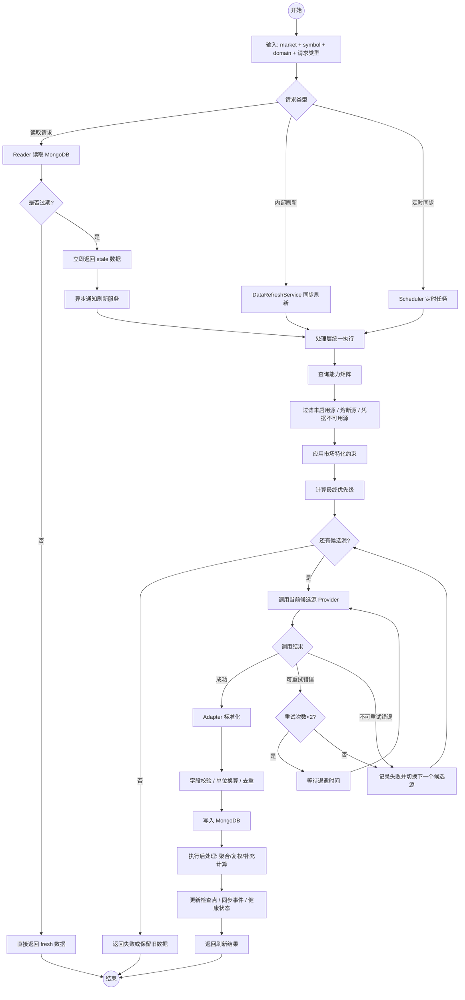

# 全市场股票数据架构设计文档

> **版本**: v2.1  
> **日期**: 2026-06-20  
> **范围**: A 股 / 港股 / 美股统一数据平台  
> **目标**: 用 1 份文档完整承载三市场的数据架构设计，既保留统一架构，也保留每个市场、每类数据源、每条关键规则的细节

---

## 整体架构

整个数据平台是一套 **三市场统一架构、按市场特化实现** 的数据系统。它的核心目标不是让业务层直接访问第三方数据源，而是将多源数据统一标准化、统一写入 MongoDB，再由分析引擎、筛选服务、前端页面和数据导出接口稳定消费。

三市场共享以下统一约束：

1. **4 层架构统一**：消费层、读取层、处理层、数据源层  
2. **3 条核心数据流统一**：定时同步、内部同步刷新、读取时过期感知  
3. **回退模型统一**：接口级回退，不做整源粗暴切换  
4. **写入模型统一**：标准化后 upsert，保证幂等  
5. **元数据模型统一**：`sync_checkpoints`、`sync_events`、`source_health` 统一管理  
6. **配置模型统一**：默认优先级 + 动态可用性 + 市场约束 + 用户覆盖  
7. **业务集合公共字段统一**：`symbol`、`market`、`data_source`、`updated_at`

三市场仅在以下位置保留差异：

- 数据源能力差异  
- 市场特化字段差异  
- 时区与调度时间差异  
- 个别专属数据域差异  
- 市场专属业务规则差异

### 四层职责

| 层级 | 角色 | 统一职责 | 严格禁止 |
|------|------|---------|---------|
| 消费层 | 分析引擎、筛选、前端、导出 API | 只读标准数据，消费统一 schema | 直接调用第三方数据源 API |
| 读取层 | Reader + 新鲜度判定 + 异步通知 | 从 MongoDB 读取数据，判断 `fresh/stale`，异步通知刷新服务 | 在读取路径里同步拉取外部数据 |
| 处理层 | DataRefreshService / FallbackRouter / CircuitBreaker / RateLimiter / Validator | 选源、重试、回退、标准化、校验、写库、更新元数据 | 混入业务分析逻辑 |
| 数据源层 | Provider + Adapter | 调用第三方 API，返回原始数据并完成字段映射 | 直接写 MongoDB |

---

## 完整流程图



---

## 核心数据流

### 数据流 A：定时同步

```text
Scheduler -> 处理层 -> 选择数据源 -> 拉取 -> 标准化 -> 写入 MongoDB -> 推进检查点
```

适用场景：

- 交易日历全量同步  
- 股票列表全量维护  
- 每交易日收盘后行情、指标、复权、财务、快照更新  
- 新闻与公司行为滚动更新

### 数据流 B：内部同步刷新

```text
业务服务 -> DataRefreshService.refresh() -> 处理层 -> 写库 -> 返回刷新结果
```

适用场景：

- 分析前确保目标股票数据最新  
- 筛选任务运行前主动补数  
- 手动触发单股票刷新

### 数据流 C：读取时过期感知

```text
消费方请求 -> Reader 读 MongoDB -> 判定新鲜度
    -> fresh: 直接返回
    -> stale: 立即返回当前数据，同时异步通知刷新服务
```

关键约束：

- 读取操作不能被外部 API 阻塞  
- stale 数据仍然有业务价值，必须可返回  
- 是否继续使用 stale 数据，由调用方和业务层决定

---

## 三市场统一对比

### 基础差异总表

| 维度 | A 股 | 港股 | 美股 |
|------|------|------|------|
| 市场编码 | `CN` | `HK` | `US` |
| 业务集合后缀 | 无后缀 | `_hk` | `_us` |
| 主货币 | CNY | HKD | USD |
| 时区 | CST(UTC+8) | HKT(UTC+8) | ET(UTC-5/-4，含 DST) |
| 代码格式 | 6 位数字 | 5 位数字 | 大写 ticker |
| 财报节奏 | 一季/半年/三季/年报 | 中报/年报为主，少量季报 | 季报/年报 |
| 主要专属域 | 无 | 港股通、南向持股、红股/供股 | 公司行为、盘前盘后 |
| 主要时段特性 | 午休 + 涨跌幅限制 | 午休 + 半日市 + 台风/暴雨停市 | 盘前盘后 + 半日市 + DST |

### 数据源组合总表

| 市场 | 主源组合 | 核心策略 |
|------|---------|---------|
| A 股 | Tushare / AKShare / BaoStock | Tushare 为高质量主源，AKShare 为主要备源，BaoStock 为基础兜底 |
| 港股 | Tushare HK / AKShare HK / yfinance HK / Tencent HK | Tushare HK 主基础数据，AKShare HK 主公司行为与新闻，Tencent HK 主准实时快照 |
| 美股 | Tushare US / yfinance / Finnhub / Alpha Vantage | yfinance 为全市场默认主源，Tushare US 仅在白名单内前置，Finnhub 主新闻与盘前盘后 |

---

## Tushare 三市场统一口径

Tushare 在平台中以三个独立数据源条目存在：

- `tushare`（A 股）  
- `tushare_hk`（港股）  
- `tushare_us`（美股）

它们遵循以下统一规则：

| 维度 | 统一规则 |
|------|---------|
| Provider / Adapter | 三套实现完全独立 |
| Token 配置 | 三套独立环境变量：`TUSHARE_CN_TOKEN` / `TUSHARE_HK_TOKEN` / `TUSHARE_US_TOKEN` |
| Token 回退 | 任一市场专属 Token 未配置时，自动回退到旧的 `TUSHARE_TOKEN`（保持向后兼容，允许单账号用户平滑迁移） |
| 可用性检测 | 启动时按市场分别检测凭据与积分 |
| 失败隔离 | 一个市场的 Token 失效或积分不足不影响其他市场 |
| 配额处理 | 默认独立维护；若用户在多个市场填写相同 Token，`RateLimiter` 按 Token 哈希聚合配额 |

这意味着：

1. 三市场 Tushare 不是一份共享配置  
2. 三市场可以分别付费、分别停用、分别失效  
3. 相同 Token 只会在限流层聚合，不会在架构层强行共享
4. 推荐做法：分别为每个市场申请独立 Token 并填入对应环境变量；仅当账号资源紧张时，可统一填写到 `TUSHARE_TOKEN`，此时三市场共享该 Token 与积分池

---

## 统一存储标准

### 业务集合命名

| 数据域 | A 股 | 港股 | 美股 |
|--------|------|------|------|
| 股票基本信息 | `stock_basic_info` | `stock_basic_info_hk` | `stock_basic_info_us` |
| 交易日历 | `trade_calendar` | `trade_calendar_hk` | `trade_calendar_us` |
| 日线行情 | `stock_daily_quotes` | `stock_daily_quotes_hk` | `stock_daily_quotes_us` |
| 每日指标 | `stock_daily_indicators` | `stock_daily_indicators_hk` | `stock_daily_indicators_us` |
| 复权因子 | `stock_adj_factors` | `stock_adj_factors_hk` | `stock_adj_factors_us` |
| 公司行为 | - | `stock_corporate_actions_hk` | `stock_corporate_actions_us` |
| 财务数据 | `stock_financial_data` | `stock_financial_data_hk` | `stock_financial_data_us` |
| 市场快照 | `market_quotes` | `market_quotes_hk` | `market_quotes_us` |
| 新闻公告 | `stock_news` | `stock_news_hk` | `stock_news_us` |

### 元数据集合

| 集合 | 说明 | 唯一键 |
|------|------|-------|
| `sync_checkpoints` | 记录同步进度 | `market + domain + source` |
| `sync_events` | 记录同步、回退、熔断、告警事件 | `_id` |
| `source_health` | 记录源健康状态 | `market + source + domain` |
| `system_configs` | 记录用户覆盖配置 | `config_type + market + domain + config_key` |

### 统一公共字段

所有业务集合统一保留以下公共字段：

| 字段 | 类型 | 说明 |
|------|------|------|
| `symbol` | string | 标准证券代码 |
| `market` | string | `CN` / `HK` / `US` |
| `data_source` | string | 实际写入来源 |
| `updated_at` | datetime | 最后更新时间（UTC） |

### 统一写入原则

1. 业务集合统一采用 upsert  
2. `data_source` 不进入业务主表唯一键，因为主业务表只保留当前生效版本  
3. 如需做多源对账、问题回溯或质量抽样，应将事件摘要、质量样本和切源记录写入 `sync_events` 或专门的质量结果集合，而不是在业务主表并存多份同自然键记录  
4. 发生回退时，备用源覆盖同一自然键记录，`data_source` 同步更新  
5. 元数据集合单独按 `market + domain + source` 维护，不与业务集合混用

---

## 统一回退、重试与熔断机制

### 接口级回退

系统的回退粒度必须是 **数据源 + 数据域**。

正确示例：

```text
yfinance 的 daily_quotes 失败 -> 仅切换 daily_quotes 域到 Finnhub
```

错误示例：

```text
yfinance 的 daily_quotes 失败 -> 整个 yfinance 在所有域全部停用
```

### 错误分类

| 错误类型 | 处理策略 |
|---------|---------|
| 429 / 网络超时 / 连接中断 | 同一数据源重试，最多 2 次 |
| 401/403 / 500 / 数据格式异常 / 应有数据为空 | 立即切换下一候选源 |
| 凭据失效 / Token 失效 / 积分不足 | 将对应市场该源标记为不可用，并写事件 |
| 市场约束不满足 | 直接跳过该源，不计入失败 |

### 熔断参数

冷却阶梯按数据源独立配置，存储在 `app/data/config/source_limits.yaml` 的 `circuit_initial_cooldown` 与 `circuit_max_cooldown` 字段，由 `CircuitBreaker` 在启动时加载。

| 参数 | 默认值 | 说明 |
|------|-------|------|
| 失败阈值 | 5 分钟内连续失败 3 次 | 全局统一 |
| 初始冷却 | 60 秒 | 未配置的源使用此值 |
| 阶梯档位 | `[initial, initial*2, max]` 三档 | 随跳闸次数递增，最终稳定在 max |
| 半开探测 | 1 次（超时 60 秒视为卡死） | 允许新探测通过 |
| 最大冷却（全局上限） | 3600 秒 | 任何源都不能突破此上限 |

各数据源的最大冷却（来自 `source_limits.yaml`）：

| 数据源 | 初始冷却 | 最大冷却 | 典型用途 |
|--------|---------|---------|---------|
| `tushare` / `tushare_hk` | 60s | 600s | 积分制限流，退避后恢复快 |
| `tushare_us` | 60s | 600s | 同上 |
| `akshare` / `akshare_hk` | 60s | 600s | 爬虫类，退避后可恢复 |
| `baostock` | 60s | 600s | 同上 |
| `yfinance` / `yfinance_hk` | 60s | 1800s | 非官方接口，需更长退避 |
| `finnhub` | 60s | 1800s | 配额制，需要更长退避 |
| `alpha_vantage` | 60s | 1800s | 严格配额（25/天），需要长退避 |
| `tencent_hk` | 30s | 300s | 准实时快照，快速恢复 |

错误类型冷却倍率叠加（最终值 = `base × multiplier`，封顶该源最大冷却或全局 3600s 上限）：

| 错误类型 | 倍率 |
|---------|------|
| `RATE_LIMITED` | ×2 |
| `TOKEN_INVALID` / `AUTH_FAILED` / `INSUFFICIENT_CREDITS` | ×5 |
| `SERVICE_UNAVAILABLE` / `SERVER_ERROR` | ×1.5 |
| `NETWORK_TIMEOUT` / `CONNECTION_ERROR` / `DATA_INVALID` | ×1 |

### 回退记录

每次发生回退时必须同步完成：

1. 写入 `sync_events` 事件  
2. 更新 `source_health` 统计  
3. 输出日志  
4. 若前端在线，则推送 SSE 通知

---

## 统一配置模型

最终优先级由以下四层共同决定：

```text
静态默认优先级
  ∩ 动态可用性（凭据 / 积分 / API Key / 熔断状态）
  ∩ 市场特化约束（如美股 Tushare 白名单）
  ∩ 用户覆盖
= 最终生效优先级
```

### 用户可配置内容

| 配置项 | 粒度 | 说明 |
|--------|------|------|
| 数据源启用/禁用 | 市场 × 数据源 | 整体关闭某个源 |
| 数据域优先级 | 市场 × 数据域 × 数据源 | 支持拖拽排序 |
| 数据域级屏蔽 | 市场 × 数据域 × 数据源 | 单域禁用某个源 |
| 自动同步开关 | 市场 × 数据域 | 控制调度是否启用 |
| 同步时间 | 市场 × 数据域 | 高级用户可调整 |
| 凭据配置 | 市场级 | `TUSHARE_CN_TOKEN` / `TUSHARE_HK_TOKEN` / `TUSHARE_US_TOKEN`（均可回退到 `TUSHARE_TOKEN`）、`FINNHUB_API_KEY`、`ALPHA_VANTAGE_API_KEY` |

补充约束：

- `system_configs.config_key` 需要能区分 `source`、`priority`、`schedule`、`switch` 等配置项，否则无法准确承载“市场 × 数据域 × 数据源”粒度的覆盖配置  
- 用户覆盖只改变候选源顺序和开关，不允许突破能力矩阵和市场专属约束

### 安全约束

1. 用户不能把某个域的所有候选源全部禁掉  
2. 唯一源域不能关闭其唯一可用主源  
3. 用户配置生效后若连续失败，可自动回滚到上一版配置

---

## A股详细设计

### 市场定位

A 股部分覆盖普通股票，排除基金、债券、指数、期货、期权、ETF。A 股是整个数据平台中数据域最完整、结构最规整的市场，也是最适合作为统一架构模板的实现对象。

### A 股数据源能力矩阵

| 数据域 | Tushare | AKShare | BaoStock | 结论 |
|--------|---------|---------|----------|------|
| 股票列表 | ✅ | ✅ | ✅ | 三源互备 |
| 交易日历 | ✅ | ✅ | ✅ | 三源互备 |
| 日线行情 | ✅ | ✅ | ✅ | 三源互备 |
| 每日指标 | ✅ 完整 | ⚠️ 部分 | ❌ | Tushare 主 |
| 财务三表 | ✅ 完整 | ⚠️ 基础 | ⚠️ 基础 | Tushare 主 |
| 财务指标 | ✅ | ❌ | ❌ | 仅 Tushare |
| 新闻公告 | ✅ | ⚠️ 部分 | ❌ | Tushare 最全 |
| 股东治理 | ✅ | ❌ | ❌ | 仅 Tushare |
| 资金流向 | ✅ | ⚠️ 部分 | ❌ | Tushare 主 |
| 复权因子 | ✅ | ✅ | ✅ | 三源互备 |
| 市场快照 | ✅ | ✅ | ❌ | Tushare / AKShare |

### A 股默认优先级

| 数据域 | 默认优先级 |
|--------|-----------|
| `basic_info` | Tushare -> AKShare -> BaoStock |
| `trade_calendar` | Tushare -> AKShare -> BaoStock |
| `daily_quotes` | Tushare -> AKShare -> BaoStock |
| `daily_indicators` | Tushare -> AKShare |
| `financial_data` | Tushare -> AKShare |
| `adj_factors` | Tushare -> AKShare -> BaoStock |
| `market_quotes` | Tushare -> AKShare |
| `news` | Tushare -> AKShare |

### A 股数据域

```text
A 股数据域
├── 基础信息域: 股票基本信息、交易日历
├── 行情域: 日线行情、每日指标、复权因子、市场快照
├── 财务域: 利润表、资产负债表、现金流量表、财务指标
└── 新闻事件域: 股票新闻、公司公告
```

### A 股业务集合

| 集合 | 说明 |
|------|------|
| `stock_basic_info` | 股票主档 |
| `trade_calendar` | 交易日历 |
| `stock_daily_quotes` | OHLCV + 涨跌幅 |
| `stock_daily_indicators` | PE/PB/换手率/市值等 |
| `stock_adj_factors` | 复权因子 |
| `stock_financial_data` | 财务三表 + 指标 |
| `market_quotes` | 市场快照 |
| `stock_news` | 新闻公告 |

### A 股关键字段标准

| 规则 | 说明 |
|------|------|
| `symbol` | 统一存纯数字，如 `000001` |
| `market` | 固定 `CN` |
| 金额 | 统一换算为元 |
| 成交量 | 统一换算为股 |
| 日期 | 统一为 `YYYY-MM-DD` |
| 百分比 | 保留原值，不除以 100 |

### A 股调度频率

| 数据域 | 调度时间 | 说明 |
|--------|---------|------|
| `trade_calendar` | 每日 00:00 | 全量 |
| `basic_info` | 每日 09:00 | 全量 |
| `daily_quotes` | 每交易日 16:15 | 收盘后同步 |
| `daily_indicators` | 每交易日 16:45 | 依赖行情 |
| `adj_factors` | 每交易日 17:00 | 除权除息后更新 |
| `financial_data` | 每日 20:00 | 财报季加密 |
| `market_quotes` | 每交易日 15:05 | 收盘快照 |
| `news` | 每 2 小时 | 滚动更新 |

### A 股新鲜度标准

| 数据域 | 标准 |
|--------|------|
| `daily_quotes` | 交易日 16:30 后必须有当日数据 |
| `daily_indicators` | 交易日 17:00 后必须有当日数据 |
| `basic_info` | 24 小时内更新 |
| `financial_data` | 7 天内更新 |
| `news` | 2 小时内更新 |
| `market_quotes` | 30 分钟内更新 |

### A 股质量检查

| 检查项 | 频率 |
|--------|------|
| 行情日期连续性 | 每日 |
| 股票覆盖率 | 每日 |
| 检查点一致性 | 每日 |
| 数据源健康统计 | 持续更新 |

### A 股关键设计结论

1. Tushare 是 A 股主源  
2. AKShare 是主要备源  
3. BaoStock 是基础兜底源  
4. A 股不需要独立公司行为域  
5. A 股业务集合统一保留 `market="CN"`

---

## 港股详细设计

### 市场定位

港股部分覆盖主板与创业板股票，排除 ETF、REITs、债券、期权、牛熊证、窝轮。港股与 A 股最大的差异在于：公司行为更复杂、港股通与南向持股需要单独建模、半日市与临时停市对调度影响显著。

### 港股数据源能力矩阵

| 数据域 | Tushare HK | AKShare HK | yfinance HK | Tencent HK | 结论 |
|--------|------------|------------|-------------|------------|------|
| 股票列表 | ✅ | ✅ | ⚠️ | ⚠️ | Tushare / AKShare 主 |
| 交易日历 | ✅ | ⚠️ 反推 | ⚠️ 反推 | ❌ | Tushare 唯一直供 |
| 日线行情 | ✅ | ✅ | ✅ | ❌ | 三源互备 |
| 每日指标 | ⚠️ 部分 | ✅ | ✅ | ❌ | AKShare / yfinance 主 |
| 复权因子 | ✅ | ✅ | ✅ | ❌ | 三源互备 |
| 财务数据 | ✅ | ✅ | ✅ | ❌ | Tushare 主 |
| 公司行为 | ❌ | ✅ 完整 | ✅ 部分 | ❌ | AKShare HK 主 |
| 港股通名单 | ⚠️ 间接 | ✅ | ❌ | ❌ | AKShare HK 主 |
| 南向持股 | ✅ | ✅ | ❌ | ❌ | Tushare / AKShare |
| 新闻公告 | ❌ | ✅ | ⚠️ 部分 | ❌ | AKShare HK 主 |
| 市场快照 | ✅ | ✅ | ✅ | ✅ | Tencent HK 准实时主 |

### 港股默认优先级

| 数据域 | 默认优先级 |
|--------|-----------|
| `basic_info` | Tushare HK -> AKShare HK -> yfinance HK |
| `trade_calendar` | Tushare HK -> AKShare HK |
| `daily_quotes` | Tushare HK -> AKShare HK -> yfinance HK |
| `daily_indicators` | AKShare HK -> yfinance HK -> Tushare HK |
| `financial_data` | Tushare HK -> AKShare HK -> yfinance HK |
| `corporate_actions` | AKShare HK -> yfinance HK |
| `adj_factors` | Tushare HK -> AKShare HK -> yfinance HK |
| `connect_status` | AKShare HK -> Tushare HK |
| `southbound_holding` | Tushare HK -> AKShare HK |
| `market_quotes` | Tencent HK -> Tushare HK -> AKShare HK -> yfinance HK |
| `news` | AKShare HK -> yfinance HK |

### 港股核心数据域

```text
港股数据域
├── 基础信息域: 股票基本信息、交易日历（含半日市/临时停市）
├── 行情域: 日线行情、每日指标、复权因子、市场快照
├── 财务域: 三表 + 财务指标
├── 公司行为域: 分红、拆股、合股、红股、供股
└── 新闻事件域: 股票新闻、披露易公告
```

### 港股业务集合

| 集合 | 说明 |
|------|------|
| `stock_basic_info_hk` | 港股主档 |
| `trade_calendar_hk` | HKEX 交易日历 |
| `stock_daily_quotes_hk` | 日线行情 |
| `stock_daily_indicators_hk` | 指标数据 |
| `stock_adj_factors_hk` | 复权因子 |
| `stock_corporate_actions_hk` | 公司行为 |
| `stock_financial_data_hk` | 财务数据 |
| `market_quotes_hk` | 市场快照 |
| `stock_news_hk` | 新闻与披露易公告 |

### 港股关键字段与规则

| 项目 | 说明 |
|------|------|
| `symbol` | 统一为 5 位数字，如 `00700` |
| `market` | 固定 `HK` |
| `full_symbol` | 保留 `00700.HK` |
| `connect_status` | 港股通标识 |
| `dual_listed_us_symbol` | 双重上市映射 |
| `weighted_voting_rights` | 同股不同权标识 |
| `southbound_holding` | 南向持股字段 |
| `quote_source_type` | `delayed` / `realtime` |

### 港股特有公司行为类型

| 类型 | 说明 |
|------|------|
| `cash_dividend` | 现金分红 |
| `special_dividend` | 特别股息 |
| `stock_split` | 拆股 |
| `consolidation` | 合股 |
| `bonus_issue` | 红股 |
| `rights_issue` | 供股 |
| `merger` | 并购事件记录 |
| `privatization` | 私有化事件记录 |

### 港股时段与调度

| 数据域 | 调度时间（HKT） | 主源 | 说明 |
|--------|----------------|------|------|
| `trade_calendar` | 每日 00:00 | Tushare HK | 前置 |
| `basic_info` | 每日 08:00 | Tushare HK | 捕获 IPO / 退市 / 更名 |
| `connect_status` | 每周一 09:00 | AKShare HK | 港股通名单更新 |
| `daily_quotes` | 每交易日 18:30 | Tushare HK | 收盘后 |
| `daily_indicators` | 每交易日 19:00 | AKShare HK | 指标更完整 |
| `southbound_holding` | 每交易日 19:30 | Tushare HK | 收盘披露后 |
| `corporate_actions` | 每日 20:00 | AKShare HK | 港股关键差异域 |
| `adj_factors` | 每交易日 19:30 | Tushare HK | 复权直供 |
| `financial_data` | 每日 21:00 | Tushare HK | 披露期加密 |
| `market_quotes` | 每交易日 16:01 | Tushare HK | 收盘快照 |
| `market_quotes_realtime` | 交易时段每 30 秒 | Tencent HK | 准实时关注列表 |
| `news` | 每 1 小时 | AKShare HK | 披露易主源 |

### 港股新鲜度与时段规则

| 项目 | 规则 |
|------|------|
| `daily_quotes` | 16:30 HKT 后必须有当日数据 |
| `daily_indicators` | 17:00 HKT 后必须有当日数据 |
| `financial_data` | 7 天内更新，披露期缩短 |
| `corporate_actions` | 24 小时内更新 |
| `connect_status` | 7 天内更新 |
| `southbound_holding` | 24 小时内更新 |
| `news` | 1 小时内更新 |
| `market_quotes` | 延迟源 30 分钟内；准实时源 5 分钟内 |

港股额外规则：

- 12:00-13:00 午休时段不判定行情 freshness 失效  
- 半日市调度整体前移 4 小时  
- 台风 8 号及以上、黑色暴雨等临时停市必须写入交易日历特殊状态  
- 非交易日跳过行情与快照，财务、新闻、公司行为可继续更新

### 港股质量检查

| 检查项 | 频率 |
|--------|------|
| 行情日期连续性 | 每日 |
| 股票覆盖率 | 每日 |
| 港股通持股完整性 | 每日 |
| 公司行为对账 | 每周 |
| 双重上市映射一致性 | 每周 |
| 检查点一致性 | 每日 |

### 港股关键设计结论

1. Tushare HK 主基础数据  
2. AKShare HK 主公司行为、新闻与港股通名单  
3. Tencent HK 主准实时快照  
4. `bonus_issue` 与 `rights_issue` 不能省略  
5. 港股必须把半日市、午休和临时停市纳入调度逻辑

---

## 美股详细设计

### 市场定位

美股部分覆盖普通股与 ADR，排除 ETF、共同基金、债券、期权、期货、加密货币。美股与 A 股、港股最大的差异在于：全市场覆盖需要广域源、公司行为决定复权逻辑、盘前盘后需要独立建模、调度要处理 ET 与 DST。

### 美股数据源能力矩阵

| 数据域 | Tushare US | yfinance | Finnhub | Alpha Vantage | 结论 |
|--------|------------|----------|---------|---------------|------|
| 股票列表 | ⚠️ 白名单内 | ⚠️ | ✅ | ⚠️ | Finnhub 主 Universe |
| 交易日历 | ✅ | ⚠️ 反推 | ✅ | ❌ | Tushare / Finnhub |
| 日线行情 | ✅ 白名单内 | ✅ 全市场 | ✅ | ✅ | yfinance 全市场主源 |
| 每日指标 | ⚠️ 部分 | ✅ | ✅ | ⚠️ | yfinance / Finnhub |
| 财务数据 | ✅ 白名单内 | ✅ 全市场 | ✅ | ✅ | 白名单内优先 Tushare US |
| 复权因子 | ✅ 直供 | ⚠️ 推导 | ❌ | ❌ | 白名单内优先直供，否则本地推导 |
| 公司行为 | ❌ | ✅ | ⚠️ 部分 | ✅ | yfinance / Alpha Vantage |
| 新闻公告 | ❌ | ⚠️ 部分 | ✅ | ⚠️ | Finnhub 主 |
| 市场快照 | ⚠️ | ✅ | ✅ | ❌ | yfinance / Finnhub |
| 盘前盘后 | ❌ | ❌ | ✅ | ❌ | Finnhub 唯一主源 |

### 美股默认优先级

| 数据域 | 默认优先级 |
|--------|-----------|
| `basic_info` | Finnhub -> yfinance -> Tushare US -> Alpha Vantage |
| `trade_calendar` | Finnhub -> Tushare US -> yfinance |
| `daily_quotes` | yfinance -> Tushare US(白名单内) -> Finnhub -> Alpha Vantage |
| `daily_indicators` | yfinance -> Finnhub -> Tushare US -> Alpha Vantage |
| `financial_data` | Tushare US(白名单内) -> yfinance -> Finnhub -> Alpha Vantage |
| `corporate_actions` | yfinance -> Alpha Vantage -> Finnhub |
| `adj_factors` | Tushare US(白名单内) -> 本地推导 |
| `market_quotes` | yfinance -> Finnhub |
| `news` | Finnhub -> yfinance -> Alpha Vantage |
| `pre_post_market` | Finnhub |

### Tushare US 白名单机制

这是美股独有规则：

| 项目 | 说明 |
|------|------|
| 白名单来源 | `us_basic` 周期同步结果 |
| 白名单作用 | 仅白名单内 ticker 允许 Tushare US 前置 |
| 白名单外行为 | 自动跳过 Tushare US，不视为错误 |
| 更新频率 | 每周维护一次，可手动刷新 |

### 美股核心数据域

```text
美股数据域
├── 基础信息域: 股票基本信息、交易日历
├── 行情域: 日线行情、每日指标、复权因子、市场快照、盘前盘后行情
├── 财务域: 三表 + 财务指标
├── 公司行为域: 分红、特别分红、拆股、反向拆股、并购、分拆
└── 新闻事件域: 股票新闻、关键公告
```

### 美股业务集合

| 集合 | 说明 |
|------|------|
| `stock_basic_info_us` | 美股主档 |
| `trade_calendar_us` | 交易日历 |
| `stock_daily_quotes_us` | OHLCV + `adj_close` |
| `stock_daily_indicators_us` | 估值与市值指标 |
| `stock_adj_factors_us` | 复权因子 |
| `stock_corporate_actions_us` | 公司行为 |
| `stock_financial_data_us` | 财务数据 |
| `market_quotes_us` | 市场快照 |
| `stock_news_us` | 新闻与关键披露 |

### 美股关键字段与规则

| 项目 | 说明 |
|------|------|
| `symbol` | 统一大写 ticker，如 `AAPL` |
| `market` | 固定 `US` |
| `full_symbol` | 保留交易所限定形式，如 `AAPL.O` |
| `adj_close` | 调整后收盘价 |
| `is_adr` / `home_country` | ADR 标识 |
| `cik` | SEC CIK |
| `pre_market_*` / `post_market_*` | 盘前盘后增强字段 |
| `session` | `pre` / `regular` / `post` / `closed` |

### 美股公司行为类型

| 类型 | 说明 |
|------|------|
| `cash_dividend` | 现金分红 |
| `special_dividend` | 特别分红 |
| `stock_split` | 拆股 |
| `reverse_split` | 反向拆股 |
| `merger` | 并购记录 |
| `spinoff` | 分拆记录 |

关键规则：

- `cash_dividend` 与 `stock_split` 参与复权因子计算  
- `special_dividend` 必须记录，但不默认进入常规复权  
- `merger` 与 `spinoff` 记录事件，不参与常规复权计算

### 美股调度频率（ET）

| 数据域 | 调度时间（ET） | 主源 | 说明 |
|--------|---------------|------|------|
| `trade_calendar` | 每日 00:00 | Tushare US / Finnhub | 前置 |
| `basic_info` | 每日 06:00 | Finnhub | 全市场 Universe |
| `tushare_universe` | 每周一 06:30 | Tushare US | 维护白名单 |
| `corporate_actions` | 每日 18:00 | yfinance | 复权关键输入 |
| `daily_quotes` | 每交易日 16:30 | yfinance / Tushare US | 收盘后同步 |
| `daily_indicators` | 每交易日 17:30 | yfinance | 依赖行情 |
| `adj_factors` | 每交易日 18:30 | Tushare US / 本地推导 | 依赖公司行为 |
| `financial_data` | 每日 21:00 | Tushare US / yfinance | 财报季加密 |
| `market_quotes` | 每交易日 16:01 | yfinance | 收盘快照 |
| `pre_post_market` | 04:00-09:30 / 16:00-20:00 每 5 分钟 | Finnhub | 可选增强域 |
| `news` | 每 1 小时 | Finnhub | 新闻主链路 |

### 美股新鲜度规则（按 ET）

| 数据域 | 标准 |
|--------|------|
| `daily_quotes` | 16:30 ET 后必须有当日数据 |
| `daily_indicators` | 17:30 ET 后必须有当日数据 |
| `financial_data` | 7 天内更新，财报季可缩短 |
| `corporate_actions` | 24 小时内更新 |
| `news` | 30 分钟内更新 |
| `market_quotes` | 5 分钟内更新 |
| `pre_post_market` | 盘前/盘后窗口内 5 分钟内更新 |

额外规则：

- 调度配置按 ET 声明，运行时自动换算 DST  
- 时间戳统一存 UTC  
- 半日市同步整体前移 3 小时  
- 周末和假期跳过行情类同步，但新闻与公司行为仍可更新

### 美股质量检查

| 检查项 | 频率 |
|--------|------|
| 行情日期连续性 | 每日 |
| Universe 覆盖率 | 每日 |
| 公司行为对账 | 每周 |
| 复权因子单调性 | 每日 |
| 财报字段完整性 | 季度 |
| 检查点一致性 | 每日 |

### 美股关键设计结论

1. yfinance 是全市场默认主源  
2. Tushare US 仅在白名单内前置  
3. Finnhub 是新闻与盘前盘后主源  
4. 公司行为必须独立成域  
5. 复权因子与 `adj_close` 必须由公司行为驱动维护  
6. ET、UTC 与 DST 处理必须进入调度和 freshness 逻辑

---

## 统一质量保障

### 写入前校验

| 校验项 | 统一规则 |
|--------|---------|
| 必填字段 | `symbol`、时间字段、主价格字段等不能为空 |
| 数据类型 | 价格 > 0，成交量 >= 0 |
| 日期合法性 | 必须处于合理区间 |
| 重复检测 | 通过 upsert 和自然键控制 |
| 可疑波动 | 不直接丢弃，记录告警 |
| 空值 | 统一写为 `null` |

### 监控指标

| 指标 | 说明 |
|------|------|
| 最近 1 小时成功率 | 调用成功比例 |
| 最近 1 小时平均延迟 | API 延迟 |
| 熔断器状态 | Closed / Open / HalfOpen |
| 最后成功时间 | 最近成功拉取时间 |
| 连续失败次数 | 当前连续失败值 |
| 配额使用率 | 适用于有调用额度的源 |

---

## API 与部署

### API 路径规范

| 市场 | 路径前缀 |
|------|---------|
| A 股 | `/api/cn/data/*` |
| 港股 | `/api/hk/data/*` |
| 美股 | `/api/us/data/*` |

### 关键接口

`{market}` 取值：`cn` / `hk` / `us`。三市场路由结构完全对称。

| 路径 | 方法 | 说明 |
|------|------|------|
| `/api/{market}/data/refresh/{symbol}` | POST | 刷新指定标的 |
| `/api/{market}/data/refresh/{symbol}/status` | GET | 查询单标的刷新状态 |
| `/api/{market}/data/sync/{domain}` | POST | 触发指定域同步（域名为 path 参数，如 `daily_quotes`） |
| `/api/{market}/data/sync/status` | GET | 查询同步状态（支持 `domain`、分页参数） |
| `/api/{market}/data/sync/events` | GET | 查询同步事件 |
| `/api/{market}/data/sources/health` | GET | 查询源健康度 |
| `/api/{market}/data/sources/health/{source}/{domain}/reset` | POST | 重置指定源/域的熔断器（管理员） |
| `/api/{market}/data/config/priority/{domain}` | PUT | 更新指定域的优先级（域名为 path 参数；目前未提供 `GET`，读取走 `/source-config`） |
| `/api/{market}/data/source-config` | GET | 获取该市场全量数据源配置（含能力矩阵、优先级、健康度） |
| `/api/{market}/data/dashboard` | GET | 数据总览看板（域状态 + 源健康 + 覆盖率） |
| `/api/{market}/data/stock/{symbol}` | GET | 查询单标的基础数据 |
| `/api/{market}/data/quality/overview` | GET | 质量检查总览 |
| `/api/{market}/data/quality/check` | POST | 手动触发质量检查 |

说明：

- "触发指定域同步"是 **`/sync/{domain}`**（path 参数指定域），**不是** `/sync/trigger`
- 优先级更新是 **`/config/priority/{domain}`**（path 参数指定域，仅 `PUT`），**不是** 无参数的 `/config/priority` 的 `GET/PUT`
- 所有写操作要求管理员权限（`require_admin`），熔断器重置、同步触发、优先级更新均在此列

### 部署拓扑

```text
API Server (FastAPI)
  ├── HTTP / SSE / 手动刷新
  └── 调用 DataRefreshService

Scheduler Worker
  ├── 定时同步
  ├── 完整性检查
  └── 健康监控

MongoDB
  ├── 业务集合
  └── 元数据集合

Redis
  ├── 锁
  ├── 计数器
  ├── 熔断状态
  └── 异步刷新队列
```

故障降级原则：

- 单个数据源故障 -> 接口级回退  
- Redis 故障 -> 降级为单机锁/内存计数器  
- MongoDB 故障 -> 直接返回 503，避免雪崩  
- Scheduler 故障 -> 自动同步停摆，但按需刷新仍可工作

---

## 实施路线图

### Phase 1：公共骨架

1. 完成 `core/`、`processor/`、`storage/`、`scheduler/` 基础设施  
2. 固化公共 schema、业务集合命名和元数据模型  
3. 跑通统一 Reader / RefreshService / FallbackRouter 闭环

### Phase 2：A 股落地

1. 实现 `tushare / akshare / baostock`  
2. 打通 A 股全链路同步、刷新、回退和监控  
3. 形成统一架构模板

### Phase 3：港股扩展

1. 实现 `tushare_hk / akshare_hk / yfinance_hk / tencent_hk`  
2. 落地公司行为、港股通、南向持股、半日市与停市处理  
3. 打通港股准实时快照链路

### Phase 4：美股扩展

1. 实现 `tushare_us / yfinance / finnhub / alpha_vantage`  
2. 落地白名单机制、公司行为驱动复权、ET/DST 调度  
3. 打通盘前盘后与 Universe 维护链路

### Phase 5：质量闭环与体验完善

1. 完整性检查、多源对账与告警看板  
2. 三市场统一数据管理页面  
3. 公司行为时间线、双重上市联动、多时区显示等体验增强

---

## 代码审计结论

基于当前代码实现，本文档所描述的架构可以分为“**已基本落地**”与“**仍在收口**”两部分。

### 已基本落地的部分

- 目录分层已形成稳定骨架：`core`、`processor`、`schema`、`sources`、`storage`、`scheduler` 已拆分清楚  
- 三市场数据源目录、能力矩阵、默认优先级、新鲜度规则和调度 YAML 已存在  
- MongoDB 业务集合与元数据集合、基础仓储、索引初始化、检查点与事件记录已具备  
- `FallbackRouter`、`CircuitBreaker`、`RateLimiter`、`SourceHealthMonitor` 等处理组件已经实现  
- `DataInterface`、`Reader`、`Scheduler` 等统一入口已经形成
- **Tushare 三市场 Token 独立**：`tushare` / `tushare_hk` / `tushare_us` Provider 分别通过 `get_datasource_api_key` 读取各自专属环境变量 `TUSHARE_CN_TOKEN` / `TUSHARE_HK_TOKEN` / `TUSHARE_US_TOKEN`，并在未配置时自动回退到 `TUSHARE_TOKEN`；任一市场凭据失效或积分不足不再传染其他市场
- **熔断参数按源可配置**：`CircuitBreaker` 启动时从 `app/data/config/source_limits.yaml` 读取每个源的 `circuit_initial_cooldown` / `circuit_max_cooldown`，按 `[initial, initial*2, max]` 生成阶梯；未配置源回退到全局默认 `[60, 120, 300, 600]`
- **扩展域仓储已落地**：`connect_status` / `southbound_holding` / `pre_post_market` 已形成 `Repo + Reader + Scheduler Job` 完整链路；`tushare_universe` 也已注册为独立调度任务

### 当前代码中的实现边界

- `system_configs` 的配置粒度已经修正为可扩展到 `config_key`，但上层接口当前主要仍在使用“市场 × 数据域”这一层级  
- 按需刷新链路已经收敛到统一回退处理层，但默认仅覆盖已打通仓储与适配器的核心域  
- 调度 YAML 中的 `depends_on`、`mode`、`source` 已进入调度执行链，任务会按依赖递归执行，并把同步模式和首选数据源注入到 Job  
- `connect_status`、`southbound_holding`、`tushare_universe`、`pre_post_market` 扩展域的仓储与调度已落地；其中 `southbound_holding`、`connect_status`、`pre_post_market` 仍依赖 Provider 层显式报错保证链路一致性，未来若开放写入路径需补齐 Reader 读取分支
- 因此，本文档更准确的定位是：**当前实现 + 明确演进方向** 的统一设计文档，而不是“所有列出能力均已百分之百落地”的完成态说明

### 维护原则

后续如果继续扩展 `connect_status`、`southbound_holding`、`pre_post_market` 等域的写入路径，必须同步补齐以下 4 个位置，避免再次出现“枚举已声明但链路未闭环”的问题：

1. Provider / Adapter 能力  
2. Reader / Repository 读写接口  
3. Refresh / Fallback 处理链路  
4. 索引、质量检查与调度执行逻辑

### Tushare Token 迁移指引

旧部署升级到"三市场独立 Token"后：

1. 若继续使用单一 Tushare 账号：保留 `.env` 中的 `TUSHARE_TOKEN` 即可，无需任何改动（自动回退）
2. 若已为不同市场申请独立 Token：在 `.env` 中填入对应的 `TUSHARE_CN_TOKEN` / `TUSHARE_HK_TOKEN` / `TUSHARE_US_TOKEN`，删除 `TUSHARE_TOKEN`（或保留作为最终兜底）
3. Web UI 的"数据源配置"页面同样支持按 source 填写各自 Token（落库到 `system_configs.data_source_configs`，优先级高于 `.env`）

---

## 附录

### 代码规范速查

| 市场 | 示例 | 标准化结果 |
|------|------|-----------|
| A 股 | `000001.SZ` | `symbol=000001` |
| 港股 | `0700.HK` | `symbol=00700` |
| 美股 | `brk-b` | `symbol=BRK.B` |

### 统一结论

1. 三市场统一使用 1 套架构、1 套配置模型、1 套回退模型  
2. 三市场 Tushare 统一按独立 Token 管理  
3. 三市场业务集合统一保留 `market` 字段  
4. 市场差异只允许留在能力矩阵、字段定义、调度时区和专属域中  
5. 以后文档维护以本文件为唯一事实来源，不再拆分成 4 份并行维护
