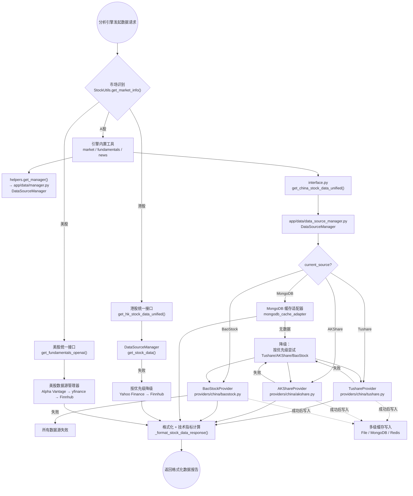
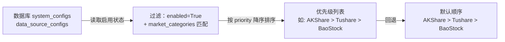
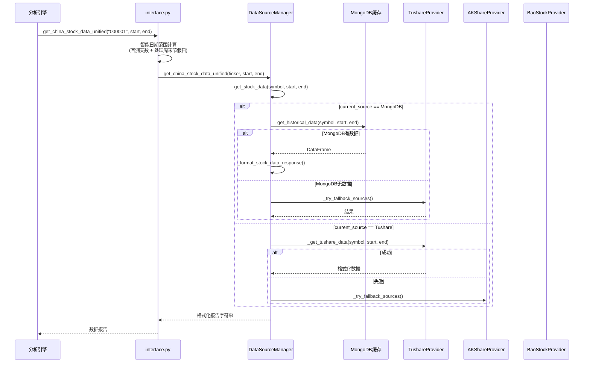
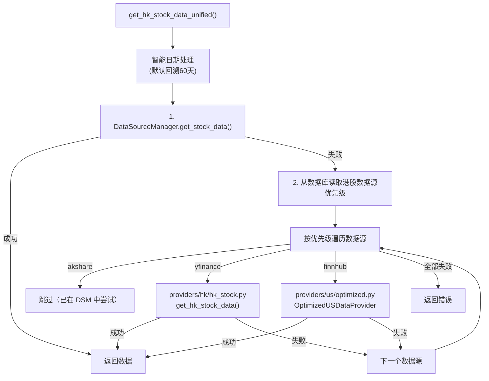
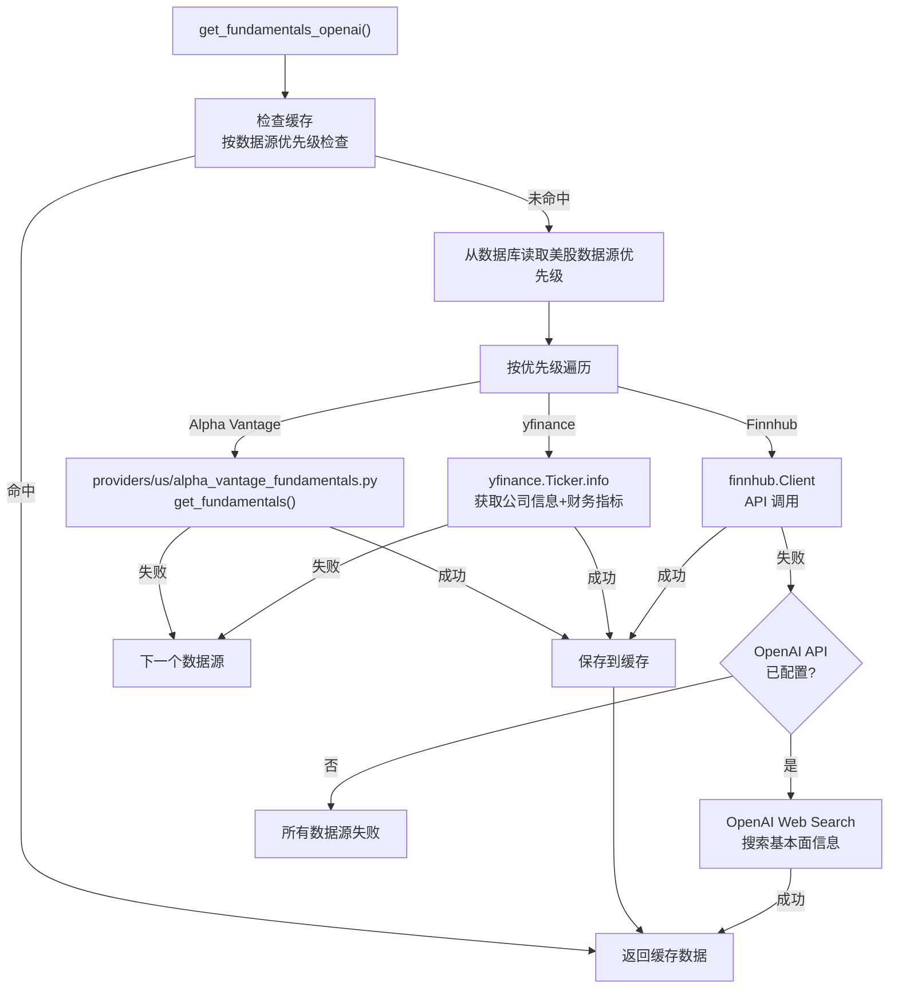
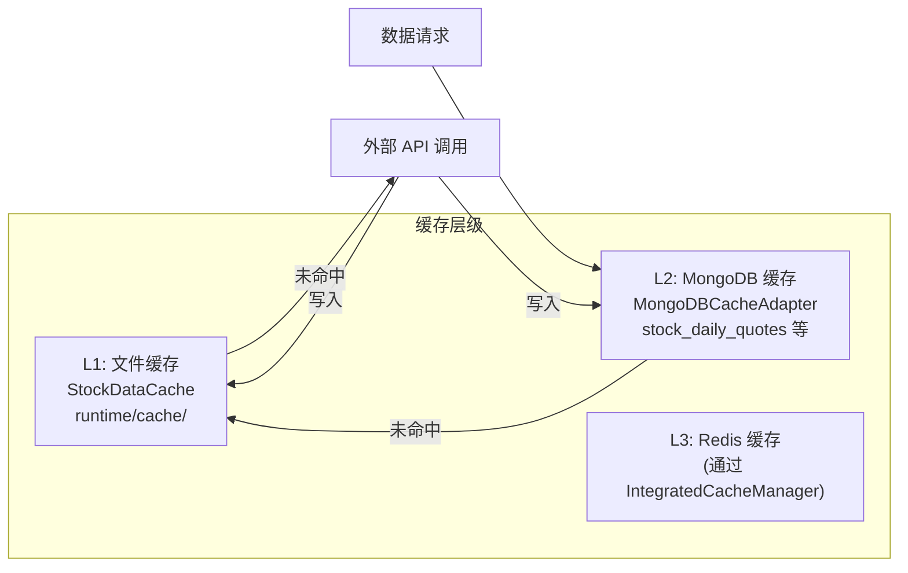
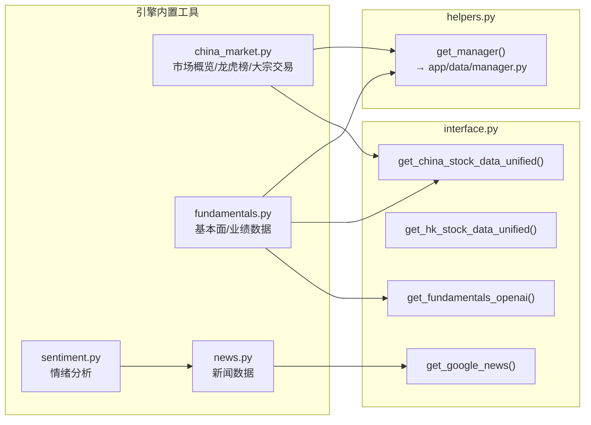
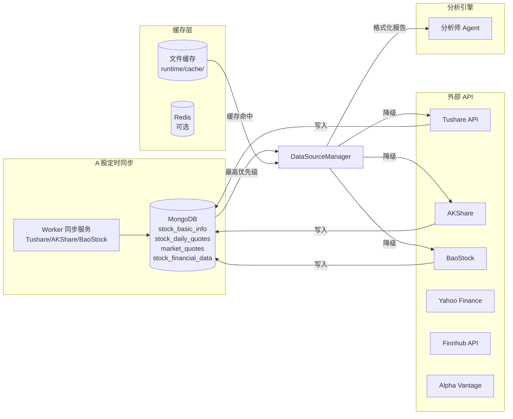

# TradingAgents-CN 数据获取流程

## 整体架构

数据获取系统是一条**多层级的调用链**，分为「引擎工具层 → 数据接口层 → 数据源管理器 → 数据源提供器 → 外部 API」五层。系统同时存在两套并行的数据源管理器（`app/data/data_source_manager.py` 和 `app/data/manager.py`），前者由 `interface.py` 直接使用，后者由引擎内置工具（`engine/tools/builtin/`）通过 `helpers.py` 使用。所有数据获取都支持**多数据源自动降级**：当前数据源失败时，按优先级顺序依次尝试下一个可用数据源。

数据通过三种模式获取：

| 市场 | 模式 | 触发方式 | 缓存 |
|------|------|---------|------|
| A 股 | Worker 定时全量同步 + 分析时实时获取 | APScheduler cron / 用户请求 | MongoDB 持久化 |
| 港股 | 按需获取 + 缓存 | 用户请求 | MongoDB 缓存（TTL） |
| 美股 | 按需获取 + 缓存 | 用户请求 | MongoDB 缓存（TTL） |

---

## 完整流程图



---

## 两套数据源管理器

系统中存在两套独立的 `DataSourceManager`，服务于不同的调用路径：

### 管理器 1：`app/data/data_source_manager.py` — `DataSourceManager`

- **调用方**：`interface.py` 中的统一接口（`get_china_stock_data_unified`、`get_china_stock_info_unified`、`get_hk_stock_data_unified` 等）
- **数据源枚举**：`ChinaDataSource`（MongoDB / Tushare / AKShare / BaoStock）
- **优先级来源**：从 `system_configs` 集合读取，按 `market_categories` 过滤，支持 A 股/港股/美股分别配置
- **降级策略**：`_try_fallback_sources()` — MongoDB 失败后内部已降级，不再重复降级；其他数据源失败则按优先级依次尝试
- **核心入口**：`get_stock_data(symbol, start_date, end_date)` → 根据当前数据源分发到 `_get_mongodb_data()` / `_get_tushare_data()` / `_get_akshare_data()` / `_get_baostock_data()`

### 管理器 2：`app/data/manager.py` — `DataSourceManager`

- **调用方**：`engine/tools/builtin/helpers.py` 的 `get_manager()` 函数，被所有引擎内置工具（龙虎榜、大宗交易、业绩数据等）使用
- **适配器列表**：`TushareAdapter` / `AKShareAdapter` / `BaoStockAdapter`（来自 `app/services/data_sources/`）
- **优先级来源**：从 `datasource_groupings` 集合读取 A 股市场的数据源分组配置
- **降级策略**：`get_kline_with_fallback()` — 按适配器优先级依次尝试
- **Write-Through**：成功获取数据后自动写入 MongoDB 的 `stock_daily_quotes` 集合

---

## 数据源优先级与降级机制

### 优先级读取流程



**优先级读取链**：
1. 从 `system_configs` 集合读取 `is_active=True` 的配置
2. 遍历 `data_source_configs`，过滤 `enabled=True` 且 `market_categories` 匹配的数据源
3. 按 `priority` 字段降序排序（数字越大优先级越高）
4. 若数据库读取失败或无配置，回退到默认顺序：AKShare > Tushare > BaoStock

### 可用性检查

系统启动时（`DataSourceManager.__init__`）会检查每个数据源的可用性：

| 数据源 | 检查条件 |
|--------|---------|
| MongoDB | `TA_USE_APP_CACHE=True` + 数据库连接成功 + `enabled_in_db=True` |
| Tushare | `tushare` 库已安装 + API Key 已配置（数据库或环境变量）+ `enabled_in_db=True` |
| AKShare | `akshare` 库已安装 + `enabled_in_db=True` |
| BaoStock | `baostock` 库已安装 + `enabled_in_db=True` |

### 降级流程

以 `get_stock_data()` 为例：

1. 使用当前数据源（`current_source`）尝试获取
2. 如果当前数据源是 MongoDB：
   - MongoDB 有数据 → 直接返回
   - MongoDB 无数据 → **内部自动降级**到 `_try_fallback_sources()`，依次尝试 Tushare/AKShare/BaoStock
   - MongoDB 内部降级后不再重复降级
3. 如果当前数据源是 Tushare/AKShare/BaoStock：
   - 成功 → 返回结果
   - 失败 → 进入 `_try_fallback_sources()`，按数据库配置的优先级尝试其他数据源
4. 所有数据源都失败 → 返回错误信息

---

## A 股数据获取

### 行情数据获取

**入口**：`interface.get_china_stock_data_unified(ticker, start_date, end_date)`



**智能日期处理**（在 `get_china_stock_data_unified` 中）：
- 从配置读取 `MARKET_ANALYST_LOOKBACK_DAYS`（默认 30 天）
- 调用 `get_trading_date_range(end_date, lookback_days)` 计算实际起止日期
- 自动扩展日期范围以处理周末、节假日和数据延迟

**技术指标计算**（在 `_format_stock_data_response` 中）：
- 移动平均线：MA5 / MA10 / MA20 / MA60
- RSI 指标：RSI6 / RSI12 / RSI24（同花顺风格 EMA）+ RSI14（国际标准 SMA）
- MACD：DIF / DEA / MACD 柱
- 布林带：上轨 / 中轨 / 下轨
- 最终展示最近 5 个交易日的数据摘要 + 最多 300 行历史数据明细表

### 基本面数据获取

**入口**：`interface.get_china_stock_fundamentals_tushare(ticker)` → `DataSourceManager.get_fundamentals_data(symbol)`

**降级路径**：MongoDB 财务数据 → Tushare 财务数据 → AKShare 财务数据 → 生成分析报告

- MongoDB 路径：从 `stock_financial_data` 集合读取，经 `OptimizedChinaDataProvider._format_financial_data_to_fundamentals()` 格式化
- Tushare/AKShare 路径：通过 Provider 获取，返回格式化的基本面报告

### 新闻数据获取

**引擎内置工具入口**：`engine/tools/builtin/tools/news.py` → 调用 `interface.get_google_news()` 或 `DataSourceManager.get_news_data()`

**新闻数据源**（按调用路径）：

| 函数 | 数据源 |
|------|--------|
| `get_google_news()` | Google News RSS 抓取（`news/google_news.py`） |
| `get_finnhub_news()` | Finnhub 本地离线文件（`data/market_data/news_data/`） |
| `get_news_data()` | DataSourceManager → MongoDB → Tushare → AKShare 降级 |
| `get_chinese_social_sentiment()` | 中文财经社交媒体情绪（`news/chinese_finance.py`） |

---

## 港股数据获取

### 行情数据

**入口**：`interface.get_hk_stock_data_unified(symbol, start_date, end_date)`



**港股数据源优先级**：从 `system_configs.data_source_configs` 中读取 `market_categories` 包含 `港股` 或 `hk_stocks` 的数据源，默认 `['akshare', 'yfinance']`。

### 股票信息

**入口**：`interface.get_hk_stock_info_unified(symbol)`

降级路径：DataSourceManager → Yahoo Finance（`providers/hk/hk_stock.py`）→ 返回基本信息

---

## 美股数据获取

### 基本面数据

**入口**：`interface.get_fundamentals_openai(ticker, curr_date)`



### 行情数据

- **离线模式**：`get_YFin_data()` — 从本地 CSV 文件读取（`data/market_data/price_data/`）
- **在线模式**：`get_YFin_data_online()` — 通过 `yfinance` 实时获取
- **技术指标**：`get_stock_stats_indicators_window()` — 基于 `stockstats` 库计算

---

## 缓存体系

### 多级缓存架构



### 缓存策略选择

由环境变量 `TA_CACHE_STRATEGY` 控制：

| 值 | 策略 | 实际类 |
|----|------|--------|
| `integrated`（默认） | 集成缓存 | `IntegratedCacheManager` → 自动选择 MongoDB/Redis/File |
| `adaptive` | 自适应缓存 | `AdaptiveCacheSystem` → 同 integrated |
| `file` | 文件缓存 | `StockDataCache` → 本地文件系统 |

### MongoDB 缓存适配器

`MongoDBCacheAdapter`（`cache/mongodb_cache_adapter.py`）：
- 由 `TA_USE_APP_CACHE` 配置启用
- 读取 MongoDB 中 Worker 定时同步写入的数据
- 查询时按数据源优先级查询（Tushare → AKShare → BaoStock）
- 主要集合：`stock_basic_info`、`stock_daily_quotes`、`market_quotes`、`stock_financial_data`

---

## 数据源提供器

所有数据源提供器继承自 `BaseStockDataProvider`（`providers/base_provider.py`），实现统一接口：

| 方法 | 说明 |
|------|------|
| `connect()` / `disconnect()` | 连接/断开数据源 |
| `get_stock_basic_info(symbol)` | 获取股票基本信息 |
| `get_historical_data(symbol, start, end, period)` | 获取历史行情 |
| `get_stock_data(symbol, start, end)` | 获取股票数据（简化版） |

### A 股提供器

| 提供器 | 文件 | 特点 |
|--------|------|------|
| `TushareProvider` | `providers/china/tushare.py` | Token 从数据库配置优先，其次环境变量；有频率限制保护 |
| `AKShareProvider` | `providers/china/akshare.py` | 集成反爬虫策略（curl_cffi + 随机 UA + 限速）；域名自动切换 |
| `BaoStockProvider` | `providers/china/baostock.py` | 免费数据源，需登录/登出管理 |

### 港股提供器

| 提供器 | 文件 | 说明 |
|--------|------|------|
| Yahoo Finance 港股 | `providers/hk/hk_stock.py` | `yfinance` 库，获取港股历史数据 |
| AKShare 港股 | `providers/hk/improved_hk.py` | 通过 AKShare 获取港股数据 |

### 美股提供器

| 提供器 | 文件 | 说明 |
|--------|------|------|
| `OptimizedUSDataProvider` | `providers/us/optimized.py` | 集成缓存的美股数据提供器 |
| `Alpha Vantage` | `providers/us/alpha_vantage_fundamentals.py` | 基本面和新闻数据 |
| `YFinanceUtils` | `providers/us/yfinance.py` | Yahoo Finance 工具集 |
| Finnhub | `providers/us/finnhub.py` | Finnhub API 客户端 |

---

## 数据同步服务（A 股）

A 股数据通过 Worker 层的定时同步服务预先写入 MongoDB。

### 同步入口

```
app/worker/cn/tushare_sync.py  → TushareSyncService
app/worker/cn/akshare_sync.py  → AKShareSyncService
app/worker/cn/baostock_sync.py → BaoStockSyncService
```

### 同步内容

| 同步类型 | 目标集合 | 说明 |
|---------|---------|------|
| 股票基础信息同步 | `stock_basic_info` | 股票代码、名称、行业、上市日期等 |
| 日线行情同步 | `stock_daily_quotes` | OHLCV + 涨跌幅 |
| 历史数据补全 | `stock_daily_quotes` | 补充缺失的历史交易日数据 |
| 财务数据同步 | `stock_financial_data` | 利润表、资产负债表、现金流量表 |
| 新闻数据同步 | `stock_news` | 公司新闻、市场新闻 |
| 实时行情快照 | `market_quotes` | 每只股票仅保留一条最新记录 |

### 触发方式

- **APScheduler** 定时任务，通过 `app/worker/scheduler_setup.py` 配置
- 不同同步任务的执行频率不同（基础信息每日、行情数据盘中、财务数据每季度等）
- 同步结果写入 MongoDB，供分析引擎通过 `MongoDBCacheAdapter` 读取

---

## 引擎工具层调用路径

引擎内置工具通过 `engine/tools/builtin/tools/` 下的模块发起数据请求：



**关键区别**：
- 龙虎榜、大宗交易、业绩数据等**结构化数据** → 通过 `get_manager()` 调用 `app/data/manager.py`
- 行情、基本面、新闻等**分析报告数据** → 通过 `interface.py` 调用 `data_source_manager.py`

---

## 数据流转总览



---

## 字段标准化

数据在各层之间流转时，会进行字段名标准化：

| 原始字段（各数据源不同） | 标准字段 | 说明 |
|------------------------|---------|------|
| `code` | `symbol` | 股票代码 |
| `source` | `data_source` | 数据来源 |
| `trade_date` | `date` | 交易日期 |
| `pct_chg` | `pct_change` | 涨跌幅 |
| `volume` / `vol` | `vol` | 成交量 |
| `amount` / `turnover` | `turnover` | 成交额 |
| `开盘` / `Open` | `open` | 开盘价 |
| `收盘` / `Close` | `close` | 收盘价 |

标准化逻辑位于 `DataSourceManager._standardize_dataframe()` 和 `_format_stock_data_response()` 的列名标准化阶段。

---

## 配置来源

| 配置项 | 来源 | 默认值 |
|--------|------|--------|
| 数据源优先级 | `system_configs.data_source_configs` | AKShare > Tushare > BaoStock |
| 数据源启用/禁用 | `system_configs.data_source_configs.enabled` | 全部启用 |
| API Key（Tushare） | 数据库配置 > 环境变量 `TUSHARE_TOKEN` | — |
| API Key（Finnhub） | 环境变量 `FINNHUB_API_KEY` | — |
| API Key（Alpha Vantage） | 环境变量 `ALPHA_VANTAGE_API_KEY` | — |
| 回溯天数 | `app.core.config.Settings.MARKET_ANALYST_LOOKBACK_DAYS` | 30 天 |
| MongoDB 缓存开关 | `TA_USE_APP_CACHE` | False |
| 缓存策略 | `TA_CACHE_STRATEGY` | `integrated` |
| AKShare 超时 | `TA_AKSHARE_TIMEOUT` | 30 秒 |
| API 频率限制 | `TA_CHINA_MIN_API_INTERVAL_SECONDS` | 0.5 秒 |
