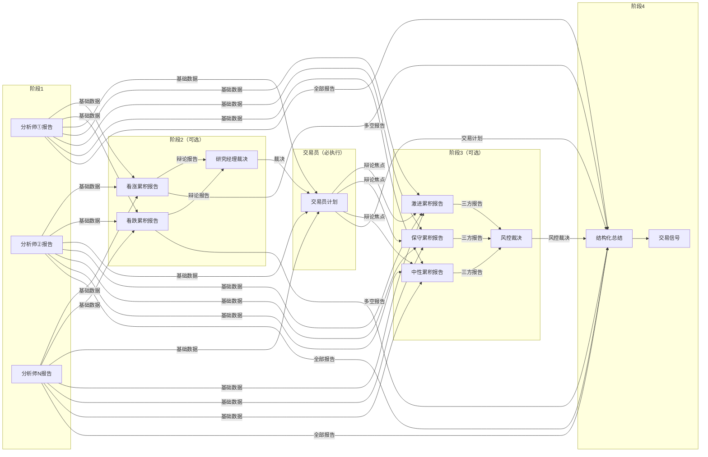

# TradingAgents-CN 智能体工作流程

## 整体架构

整个分析引擎是一条 **4 阶段串行管线**。阶段 1 必定执行，阶段 2（研究辩论）和阶段 3（风险辩论）可通过前端配置开关独立开启或关闭。**专业交易员始终执行**——当阶段 2 关闭时，交易员仅基于阶段 1 报告制定交易计划；当阶段 2 开启时，交易员基于阶段 1 报告和研究经理裁决制定交易计划。阶段 4 始终执行。数据通过全局共享的状态对象在阶段之间传递，每个智能体的输出都会写入状态，下游智能体从状态中读取所需的报告和历史。

## 完整流程图

```mermaid
flowchart TD
    START((开始分析)) --> INIT["初始化<br/>股票代码 · 交易日期<br/>阶段开关注入"]

    %% ===== 阶段1 =====
    INIT --> A1
    A1["📊 分析师①<br/>LLM推理 + 工具调用循环"] --> A2["📰 分析师②"]
    A2 --> AD["..."] --> AN["🤖 分析师N"]

    AN --> R1{"Phase 2<br/>开启?"}

    %% ===== 阶段2 =====
    subgraph P2["阶段2: 研究辩论（可选）"]
        BULL0["🐂 看涨初始报告<br/>输入: 阶段1全部报告"] --> BEAR0["🐻 看跌初始报告<br/>输入: 阶段1全部报告"]
        BEAR0 --> DEBATE_NOTE["辩论循环 · 共 N 轮"]
        DEBATE_NOTE --> BULL_D["🐂 看涨反驳<br/>输入: 对方上一轮报告<br/>+ 自己历史观点"]
        BULL_D --> BEAR_D["🐻 看跌反驳<br/>输入: 对方上一轮报告<br/>+ 自己历史观点"]
        BEAR_D --> D_CHECK{"达到最大轮次?"}
        D_CHECK -->|"否, 继续"| BULL_D
        D_CHECK -->|"是"| RM["👔 研究经理<br/>输入: 阶段1报告 + 多空累积报告<br/>输出: 投资裁决"]
    end

    R1 -->|"是"| BULL0

    %% ===== 交易员（始终执行） =====
    R1 -->|"否"| TRADER_NODE["💰 交易员（始终执行）<br/>输入: 阶段1报告 + 交易记忆<br/>（无裁决）"]
    RM --> TRADER_NODE2["💰 交易员（始终执行）<br/>输入: 阶段1报告 + 裁决 + 交易记忆<br/>输出: 交易计划"]

    TRADER_NODE --> R2{"Phase 3<br/>开启?"}
    TRADER_NODE2 --> R2B{"Phase 3<br/>开启?"}
    R2 -->|"否"| SUMMARY
    R2B -->|"否"| SUMMARY

    %% ===== 阶段3 =====
    subgraph P3["阶段3: 风险辩论（可选）"]
        RISKY_START["🔥 激进初始观点<br/>输入: 阶段1报告 + 交易计划"] --> SAFE_START["🛡️ 保守初始观点<br/>输入: 阶段1报告 + 交易计划"]
        SAFE_START --> NEUTRAL_START["⚖️ 中性初始观点<br/>输入: 阶段1报告 + 交易计划"]
        NEUTRAL_START --> RISK_NOTE["辩论循环 · 共 M 轮"]
        RISK_NOTE --> RISKY_D["🔥 激进反驳"]
        RISKY_D --> SAFE_D["🛡️ 保守反驳"]
        SAFE_D --> NEUTRAL_D["⚖️ 中性反驳"]
        NEUTRAL_D --> RK_CHECK{"达到最大轮次?"}
        RK_CHECK -->|"否, 继续"| RISKY_D
        RK_CHECK -->|"是"| RJ["🎯 首席风控官<br/>输入: 阶段1报告 + 交易计划<br/>+ 三方累积报告<br/>输出: 最终风控裁决"]
    end

    R2 -->|"是"| RISKY_START
    R2B -->|"是"| RISKY_START
    RJ --> SUMMARY

    %% ===== 阶段4 =====
    SUMMARY["📊 总结智能体（始终执行）<br/>输入: 全部阶段所有报告<br/>输出: 结构化JSON<br/>指标/置信度/风险/建议/信号"]
    SUMMARY --> SIGNAL["信号处理<br/>提取: 买入/卖出/持有<br/>目标价 · 置信度 · 风险评分"]
    SIGNAL --> RETURN["返回最终状态 + 决策"]
    RETURN --> END((结束))
```

## 阶段组合与路径

根据阶段开关的不同配置，存在 4 种执行路径。**专业交易员在所有路径中均会执行**：

| Phase 2 | Phase 3 | 实际路径 | 交易员输入 |
|---------|---------|----------|-----------|
| 关闭 | 关闭 | 阶段 1 → **交易员** → 阶段 4 | 仅阶段 1 报告 + 历史记忆 |
| 开启 | 关闭 | 阶段 1 → 阶段 2 → **交易员** → 阶段 4 | 阶段 1 报告 + 裁决 + 历史记忆 |
| 关闭 | 开启 | 阶段 1 → **交易员** → 阶段 3 → 阶段 4 | 仅阶段 1 报告 + 历史记忆 |
| 开启 | 开启 | 阶段 1 → 阶段 2 → **交易员** → 阶段 3 → 阶段 4（完整流程） | 阶段 1 报告 + 裁决 + 历史记忆 |

---

## 阶段 1：分析师团队

**配置来源**：`phase1_agents_config.yaml`

**分析师数量**：由前端选择决定，从配置文件动态加载。常见的分析师类型包括市场技术、基本面、新闻、资金流向、情绪分析等。

**执行方式**：串行执行，一个分析师完成后下一个分析师才开始。

### 单个分析师的工作流程

1. **加载配置**：从配置文件读取该分析师的系统提示词和工具白名单
2. **工具准备**：根据工具白名单筛选可用工具，包括内置数据工具（行情、基本面、新闻等）和可选的 MCP 外部工具
3. **数据预注入**：在 LLM 开始推理之前，系统自动调用部分内置工具（如行情数据、基本面数据），将获取到的真实市场数据预先注入到消息上下文中，使 LLM 在第一轮推理时就能看到基础数据
4. **LLM 推理循环**：LLM 基于系统提示词和预注入的数据进行分析，如果需要更多信息会主动调用工具，获取结果后继续推理。这个过程循环进行，直到 LLM 不再调用工具或达到最大工具调用次数上限。系统内置了循环检测和 Token 预算控制，防止无限调用
5. **输出报告**：LLM 生成最终分析报告，写入全局状态供后续阶段使用

### 数据流向

- **输入**：全局状态中的股票代码、交易日期、公司名称
- **输出**：每个分析师产出一篇分析报告，写入 `state.reports` 字典
- **下游消费者**：阶段 2、3、4 的所有智能体都从这里读取基础分析数据

---

## 阶段 2：研究辩论

**前提条件**：`phase2_enabled = true`。阶段 2 的开关仅控制看涨/看跌辩论和研究经理裁决是否执行，**交易员不受此开关影响**，始终会执行。

**可配置参数**：`phase2_debate_rounds` 控制辩论轮次（默认 1 轮）

### 辩论流程

辩论由 **看涨研究员** 和 **看跌研究员** 交替进行，分为初始观点和多轮辩论两个阶段。

#### 第一部分：初始观点

双方基于完全相同的数据源（阶段 1 的全部分析师报告）各自独立产出初始报告，互不干扰。

- **看涨初始报告**：阐述核心投资论点，构建完整的看涨逻辑框架
- **看跌初始报告**：阐述核心风险警示，构建完整的看跌逻辑框架

#### 第二部分：多轮辩论

假设配置了 N 轮辩论，则进行 N 轮交替反驳：

| 轮次 | 看涨研究员 | 看跌研究员 |
|------|-----------|-----------|
| 第 1 轮 | 看到看跌初始报告 → 针对性反驳 | 看到看涨初始报告 → 针对性反驳 |
| 第 2 轮 | 看到看跌第 1 轮反驳 → 再次反驳 | 看到看涨第 1 轮反驳 → 再次反驳 |
| ... | ... | ... |
| 第 N 轮 | 看到看跌第 N-1 轮反驳 → 最终反驳 | 看到看涨第 N-1 轮反驳 → 最终反驳 |

**辩论上下文的追加逻辑**：每一轮，智能体看到的历史上下文是累积的。以看涨研究员为例，在第 2 轮时，它能看到：

- 阶段 1 的全部分析师报告
- 自己的初始报告（以"我之前的发言"形式注入）
- 看跌研究员的初始报告（以"对手的观点"形式注入）
- 自己的第 1 轮反驳内容
- 看跌研究员的第 1 轮反驳内容

看跌研究员的上下文结构完全对称。

**同一轮次内的公平性**：在第 K 轮辩论中，看涨和看跌双方都只能看到对方的第 K-1 轮及更早的内容，互不看对方当前轮次的输出，确保辩论的对等性。

**前端展示**：看涨智能体的完整展示内容是其累积报告——初始报告、第 1 轮反驳、第 2 轮反驳……作为一个标签页显示。看跌智能体同理。

**辩论结束条件**：发言次数达到 `2 × (辩论轮次 + 1)` 次时（包含初始观点），辩论结束，进入研究经理环节。

### 研究经理

- **输入**：阶段 1 全部分析师报告 + 看涨累积报告 + 看跌累积报告
- **使用模型**：辩论推理模型
- **职责**：综合多空双方观点，权衡利弊，做出投资裁决
- **输出**：一份投资裁决报告

### 交易员（始终执行）

**交易员在整个管线中始终执行**，不受阶段 2 开关控制。阶段 2 的开关仅控制是否先进行看涨/看跌辩论。

- **输入**：
  - 阶段 1 全部分析师报告（始终可用，仅包含第一阶段的分析师报告，不包含阶段 2/3 的内部报告）
  - 研究经理的投资裁决（仅阶段 2 开启时有，阶段 2 关闭时显示"暂无研究部主管裁决"）
  - 历史交易记忆（如果启用了记忆系统，会检索相似场景下的过往交易记录）
- **使用模型**：辩论推理模型
- **职责**：基于第一阶段的分析师报告和研究经理的裁决，制定具体的交易计划
- **输出**：一份专业的交易计划

**交易计划的数据流向**：成为阶段 3 风险辩论的核心焦点（辩论靶子），同时作为阶段 4 总结和信号提取的重要输入。

---

## 阶段 3：风险辩论

**前提条件**：`phase3_enabled = true`

**可配置参数**：`phase3_debate_rounds` 控制辩论轮次（默认 1 轮）

**辩论焦点**：阶段 2 交易员生成的交易计划。三方围绕该计划的风险和收益展开辩论。

### 辩论流程

辩论由三方组成，按照固定顺序循环发言：

- **激进分析师**：倾向于高收益，指出计划中过于保守的部分
- **保守分析师**：注重风险控制，指出计划中忽视的风险
- **中性分析师**：平衡风险与收益，提出折中建议

#### 第一部分：初始观点

三方按固定顺序（激进 → 保守 → 中性）串行执行初始观点。**初始观点阶段严格隔离**——每个辩手只能看到阶段 1 报告和交易员计划，**无法看到其他辩手的初始观点**。隔离通过以下三重机制保障：

- `current_round_index=0` 门控：`if current_round_index > 0` 为 False，跳过所有历史辩论注入
- `_STAGE3_REPORT_KEYS` 过滤：阻止辩手通过基础报告路径看到彼此的累积报告
- 辩手只读取属于自己的 `_report_content` 字段（用于累积保存），从不注入到 LLM 消息中

三方独立产出的初始观点：

- **激进初始观点**：强调潜在的高增长机会
- **保守初始观点**：强调本金安全和风险控制
- **中性初始观点**：平衡风险与收益，提出折中建议

#### 第二部分：多轮辩论

假设配置了 M 轮辩论，则进行 M 轮循环反驳：

| 轮次 | 激进分析师 | 保守分析师 | 中性分析师 |
|------|-----------|-----------|-----------|
| 初始观点 | 仅阶段1报告+交易计划（独立产出） | 仅阶段1报告+交易计划（独立产出） | 仅阶段1报告+交易计划（独立产出） |
| 辩论第 1 轮 | 看到三方初始观点 → 反驳 | 看到三方初始观点 → 反驳 | 看到三方初始观点 → 反驳 |
| 辩论第 2 轮 | 看到三方初始观点 + 第 1 轮反驳 → 反驳 | 同左 | 同左 |
| ... | ... | ... | ... |
| 辩论第 M 轮 | 看到三方初始观点 + 第 1 至 M-1 轮反驳 → 最终反驳 | 同左 | 同左 |

**公平性保障**：同一辩论轮次内，三个辩手看到**完全相同的历史范围**（round 0 到 round K-1）。由于 `range(current_round_index)` 门控，后执行的辩手**不会**看到先执行辩手的当前轮次输出，确保辩论的对等性。

**辩论上下文的追加逻辑**：每一轮看到的历史上下文都是累积的。以激进分析师为例，在辩论第 2 轮时能看到：

- 阶段 1 的全部报告 + 交易员计划
- 三方的初始观点
- 三方第 1 轮的反驳

其中：
- **自己的历史**以 `AIMessage`（"我之前的发言"角色）注入
- **对手的历史**以 `HumanMessage`（"外部输入"角色）注入

这确保 LLM 能清晰区分立场，不会将自己的观点与对手的观点混淆。其他两方的上下文结构完全对称。

#### 上下文注入结构

阶段3每个辩手的 LLM 消息按以下顺序构建：

1. **SystemMessage**：从配置文件（`phase3_agents_config.yaml`）加载的角色提示词
2. **基础报告注入**：`all_reports` 中所有非阶段3的报告（阶段1分析师报告 + 阶段2看涨/看跌/裁决报告），通过 `_STAGE3_REPORT_KEYS` 过滤
3. **交易员计划注入**：显式注入为"本次辩论焦点"
4. **历史辩论注入**（仅辩论轮次，初始观点轮跳过）：
   - 自己的历史：`AIMessage`（以"我的观点"立场注入）
   - 对手的历史：`HumanMessage`（以"外部输入"立场注入）
   - 注入范围：`range(current_round_index)` — 只看到已完成的轮次
5. **触发消息**：本轮任务指令

**数据隔离机制**：
- `_STAGE3_REPORT_KEYS = {risky_analyst, safe_analyst, neutral_analyst}`：阻止辩手通过基础报告路径看到彼此的累积报告
- `current_round_index` 门控：`if current_round_index > 0` 确保初始轮不注入任何历史
- `rounds` 列表结构：`rounds[K] = {risky: ..., safe: ..., neutral: ...}`，每个辩手只读取 `range(current_round_index)` 范围内的数据

**前端展示**：每方各自的累积报告（初始观点 + 各轮反驳）作为一个标签页显示。

**辩论结束条件**：发言次数达到 `3 × (辩论轮次 + 1)` 次时（包含初始观点），辩论结束，进入首席风控官环节。例如配置 `phase3_debate_rounds=1` 时，`3 × (1+1) = 6` 次发言（初始观点 3 次 + 辩论 1 轮 3 次）。

### 首席风控官

- **输入**：
  - 阶段 1 的分析报告（排除阶段 3 自身的报告，避免冗余）
  - 交易员的交易计划
  - 激进、保守、中性的累积报告
- **使用模型**：辩论推理模型
- **职责**：综合三方辩论结果，权衡风险与收益，出具最终风控裁决
- **输出**：最终风控裁决报告。这是整个管线的核心决策输出

---

## 阶段 4：总结智能体

**始终执行**，不受任何开关控制。

- **输入**：
  - 阶段 1 所有动态发现的报告
  - 阶段 2 的交易计划、投资裁决
  - 阶段 3 的最终风控决策、风险辩论历史
- **使用模型**：辩论推理模型
- **职责**：从所有报告中提取关键指标，生成前端展示所需的结构化数据
- **输出**：一份严格格式的结构化 JSON 数据，包含以下字段：

| 字段 | 说明 |
|------|------|
| 关键指标 | 入场价、目标价、止损价、支撑位、阻力位 |
| 模型置信度 | 0-100 的整数 |
| 风险评估 | 等级（高/中/低）、评分（0-10）、描述 |
| 分析摘要 | 200 字以内的纯文本总结 |
| 投资建议 | 200 字以内的操作指令 |
| 最终信号 | Buy / Sell / Hold |

---

## 后处理：信号提取

图执行完毕后，系统进行最终的信号处理：

1. **决策信号提取**：从最终决策文本中通过 LLM 提取结构化数据——操作方向（买入/持有/卖出）、目标价格、置信度、风险评分、决策理由
2. **决策优先级**：依次尝试从以下字段获取决策——风控裁决（`final_trade_decision`，Phase 3 开启时有值）→ 研究经理裁决（`investment_plan`，Phase 2 开启时有值）→ 交易员计划（`trader_investment_plan`，始终有值）。如果所有后续阶段都未开启，则返回默认的"观望"决策
3. **返回结果**：包含所有阶段的完整状态数据和结构化交易决策的元组

---

## 数据流转总览

下图展示了各阶段之间的数据流转关系：

---

## LLM 模型分配

| 角色 | 使用模型 | 原因 |
|------|---------|------|
| 阶段 1 分析师 | 分析师模型 | 低幻觉、数据准确、工具调用可靠 |
| 看涨/看跌研究员 | 辩论推理模型 | 多轮辩论需要强逻辑推理 |
| 研究经理 | 辩论推理模型 | 综合裁决需要深度推理 |
| 交易员 | 辩论推理模型 | 基于多来源信息制定决策 |
| 激进/保守/中性分析师 | 辩论推理模型 | 多轮辩论需要强逻辑推理 |
| 首席风控官 | 辩论推理模型 | 最终裁决需要深度推理 |
| 总结智能体 | 辩论推理模型 | 综合全流程输出结构化总结 |
| 信号处理 | 辩论推理模型 | 从文本提取结构化数据 |
